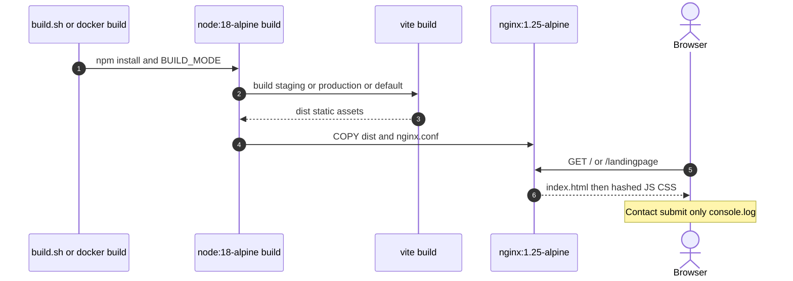
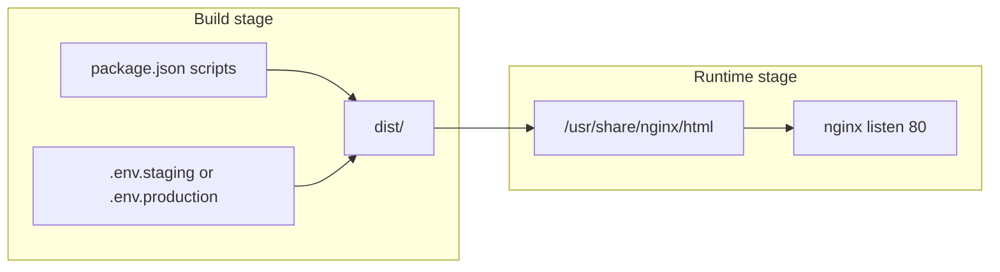

# 1. Overview & Business Intent

`TiMoto-AI-Web/frontend` is a **static marketing SPA**: Vite \+ React 18 \+ Tailwind, served by nginx after a multi-stage Docker build. The checked-in product surface is the landing page (`/` and `/landingpage`). Marketing copy mentions AI pricing and mobile download, but this repository **does not** implement an AI valuation engine, pricing API client, or waitlist POST from the UI.

**Actors:** Build agent (local `build.sh` or Docker), nginx container on port 80, browser on the public marketing host.

**Related but separate:** `infrastructure/waitlist/` ships a packaged Lambda for Android waitlist storage (documented in `docs-kb/ai-web/waitlist-lambda.mdx`). `LandingPage.tsx` does **not** call it.

| Artifact | Path |
| --- | --- |
| Dockerfile | `frontend/Dockerfile` |
| nginx | `frontend/nginx.conf` |
| Build script | `frontend/build.sh` |
| Env | `.env.staging`, `.env.production` (\+ Vite mode rules in `ENV_MANAGEMENT.md`) |
| UI | `frontend/src/pages/LandingPage/LandingPage.tsx` |
| Router | `frontend/src/App.tsx` |

---

# 2. End-to-End Flow & Sequence Diagram

Build and serve pipeline:

1. Choose mode: `development` | `staging` | `production` (`build.sh` arg or Docker `BUILD_MODE`).
2. TypeScript check (`tsc --noEmit` / package build scripts).
3. Vite build loads `.env.[mode]` automatically; only `VITE_*` keys embed in the client bundle.
4. Output lands in `dist/`.
5. Production image copies `dist/` to `/usr/share/nginx/html` and installs `nginx.conf` as `default.conf`.
6. Container listens on 80; SPA fallback `try_files` → `index.html`.





There is **no** nginx `location /api/` proxy in this frontend `nginx.conf` — unlike the dealer portal nginx that forwards `/api/` to Django. This landing image is static-only.

---

# 3. Detailed API Contracts

**HTTP surface of the container (static):**

| Method | Path behavior | Cache |
| --- | --- | --- |
| GET | Existing file under root | JS/CSS/images/fonts: `expires 1y`, `Cache-Control public, immutable` |
| GET | `*.html` | `expires -1`, no-store |
| GET | Unknown SPA route | `try_files $uri $uri/ /index.html` with no-cache headers on the location `/` block |

Dockerfile exposes port **80** only. No TLS termination inside this image (TLS expected at NLB/ALB or edge if deployed that way elsewhere).

**Env files present (Vite):**

| File | `VITE_API_BASE_URL` value |
| --- | --- |
| `.env.production` | `https://dealer.timoto.ai/api` |
| `.env.staging` | `https://staging.dealer.timoto.ai/api` |

Important: a search of `frontend/src` finds **no** `import.meta.env`, `fetch`, or `axios` usage. The `VITE_API_BASE_URL` values are therefore **build-time env inventory**, not a live client contract in the landing source. Do not document them as an active dealer-API integration from this SPA.

**Waitlist Lambda (exists under infrastructure, not called here):**

| Method | Intended body | Landing wiring |
| --- | --- | --- |
| OPTIONS / POST | phone and/or email JSON | **Not wired** — see waitlist-lambda doc |
| Contact form fields | name, phone, email, category, content | `handleContactSubmit` → `console.log` only |

No OTP, JWT, WebSocket, or valuation POST appears in `LandingPage.tsx`.

---

# 4. Database Schema & Ingestion

This frontend deploy path **writes no database**. Static files only.

The Android waitlist Lambda (separate package) would write DynamoDB items with partition key `id` and GSIs `phone-index` / `email-index` when called. Because the landing form never POSTs, that table is not part of the landing deploy success path.

Logical placeholder for operators who confuse marketing copy with backend:

```sql
-- NOT used by LandingPage.tsx. Documented only to prevent inventing a local SQLite/API.
-- Waitlist storage lives in infrastructure/waitlist Lambda + DynamoDB TABLE_NAME when wired.
CREATE TABLE android_waitlist (
    id UUID PRIMARY KEY,
    createdAt TIMESTAMPTZ NOT NULL,
    source VARCHAR(64) NOT NULL,
    phone VARCHAR(32) NULL,
    email VARCHAR(320) NULL
);
```

Do not invent a “valuation\_results” table for this repo’s frontend — there is no valuation writer in `frontend/src`.

---

# 5. Frontend & Hook Integration

`App.tsx` registers two routes, both to the same component:

| Path | Component |
| --- | --- |
| `/` | `LandingPage` |
| `/landingpage` | `LandingPage` |

`LandingPage.tsx` is a large presentational page: hero, services, benefits, four-step “how it works,” comparison, testimonials, news cards, contact form, footer App Store / Google Play imagery. Step titles include strings such as “Nhận giá đề xuất từ AI” — **copy only**.

Contact form state keys: `name`, `phone`, `email`, `category`, `content`. Submit handler:

1. `e.preventDefault()`
2. `console.log('Contact form submitted:', contactForm)`
3. No `fetch`, no Lambda URL, no toast success from server

`package.json` scripts:

| Script | Command |
| --- | --- |
| `dev` | `vite` |
| `build` | `tsc && vite build` |
| `build:staging` | `tsc && vite build --mode staging` |
| `build:production` | `tsc && vite build --mode production` |
| `preview` | `vite preview` |

Dependencies are React, react-dom, react-router-dom, Vite toolchain, Tailwind — **no** AWS SDK, **no** axios, **no** valuation ML client.

Dockerfile build args: `BUILD_MODE` default `production`; optional `VITE_BUILD_TIMESTAMP` for cache bust. Staging branch runs `npm run build:staging`; production runs `npm run build:production`; else `npm run build`.

`build.sh` validates mode regex, warns if `.env.$MODE` missing (except development), runs TypeScript check, then the matching npm script.

`ENV_MANAGEMENT.md` documents Vite load order (`.env` → `.env.local` → `.env.[mode]` → `.env.[mode].local`) and Docker `--build-arg BUILD_MODE=...` examples. Only `VITE_` prefixed keys are client-visible.

---

# 6. Edge Cases & Resilience

1. **Waitlist not wired.** Shipping the landing image does not enroll Android waitlist users. Wire-up would require a real POST from `handleContactSubmit` (or a dedicated waitlist section) to the API Gateway URL plus CORS origin allowlist — that change is not present in current LandingPage.
2. **No AI valuation engine in-repo.** Marketing claims about AI pricing describe the mobile product narrative; this SPA has no evaluate endpoint, no image upload pipeline, and no price calculation module under `frontend/src`.
3. **Dealer API env unused.** Production/staging `.env` point at dealer portal `/api` hosts, but without client code those URLs never leave the bundle as live calls from this page (and even if embedded by a future import, this nginx config would not proxy them).
4. **SPA deep links.** `try_files` ensures client routes resolve; only `/` and `/landingpage` are declared, so other paths still serve `index.html` but render the same landing tree unless routing expands.
5. **Cache asymmetry.** Fingerprinted assets get one-year immutable cache; HTML is no-cache so deploys pick up new asset names quickly.
6. **Node 18 build image.** Dockerfile uses `node:18-alpine` for build and `nginx:1.25-alpine` for runtime — platform must match the ECS/Fargate architecture used at deploy time (operators typically build `linux/amd64` for Fargate).
7. **Secrets.** Do not bake waitlist table names or API keys into this static bundle; the current form never needed them.

**Success criteria for a correct landing deploy:** container serves HTTP 200 for `/` with the React landing HTML/JS; contact submit only logs locally; no claim that waitlist DynamoDB or an AI valuation API was exercised by this frontend alone.