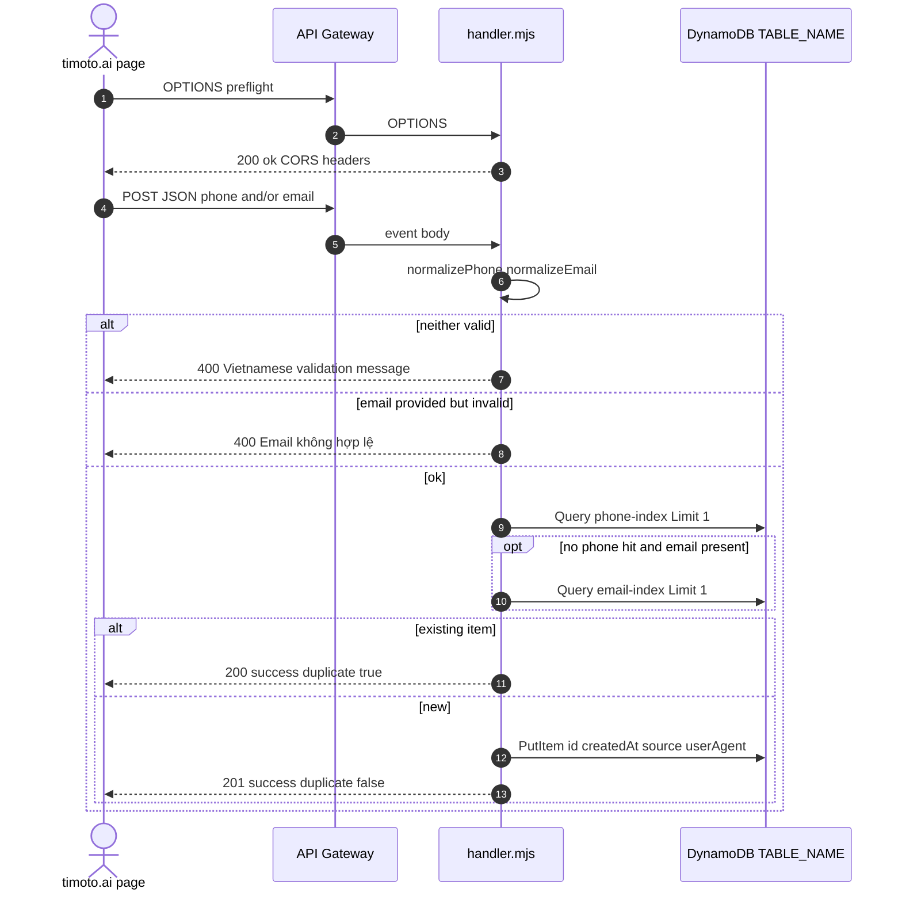
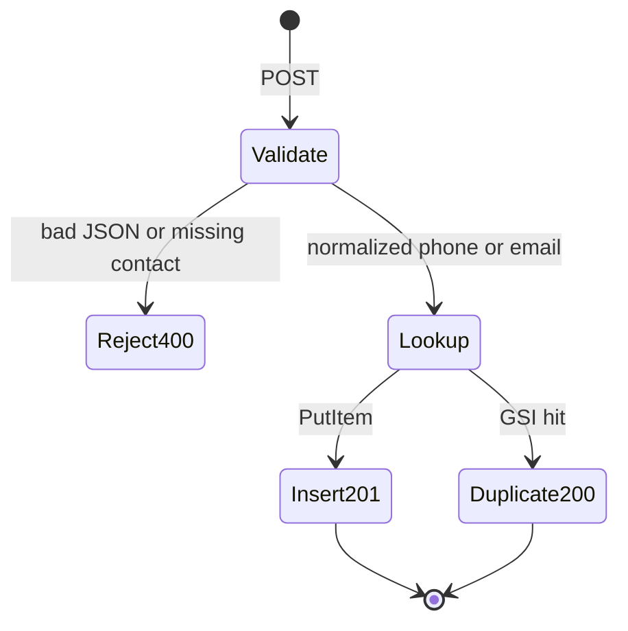

# 1. Overview and Business Intent

The Android waitlist Lambda captures early interest from the marketing site before the Android app ships. The only application source present in this monorepo is the packaged handler at `TiMoto-AI-Web/infrastructure/waitlist/.build/package/handler.mjs` (npm package name `timoto-android-waitlist-lambda`). There is no separate TypeScript source tree beside `.build`, and the landing React app does **not** call this API yet — `LandingPage.tsx` contact submit only `console.log`s the form.

**Business rules encoded in the handler:**

- Accept POST JSON with phone and/or email
- Normalize Vietnam phone numbers to `+84...`
- Deduplicate via DynamoDB GSIs `phone-index` and `email-index`
- On duplicate return HTTP 200 with `duplicate` true (not an error)
- On first insert return HTTP 201 with `duplicate` false
- CORS allowlist from `ALLOWED_ORIGINS` (default `https://timoto.ai` and `https://www.timoto.ai`)

**Actors:** Browser on timoto.ai (intended), API Gateway HTTP API or REST, Lambda, DynamoDB table named by `TABLE_NAME`.

There is **no** OTP, **no** JWT, **no** WebSocket, and **no** SMS send in this handler — storage and CORS only.

---

# 2. End-to-End Flow & Sequence Diagram



Method detection reads `event.requestContext.http.method` first (HTTP API payload v2) then falls back to `event.httpMethod` (REST). Origin is taken from `origin` or `Origin` request headers. Responses always set `Content-Type` `application/json` plus CORS allow headers for `Content-Type` and methods `POST,OPTIONS`.

---

# 3. Detailed API Contracts

| Method | Behavior |
| --- | --- |
| OPTIONS | 200 body `ok` true |
| POST | Create or duplicate acknowledgment |
| Other | 405 `Method not allowed` |

**POST body (JSON object)**

| Field | Required | Validation |
| --- | --- | --- |
| `phone` | One of phone or email | Digits only after strip; leading 84 → `+84...`; leading 0 → `+84` plus rest; else prefix `+84` |
| `email` | One of phone or email | Trim lower; must match simple `local@domain` regex |

If both normalize to null → 400 message `Vui lòng nhập Số điện thoại hoặc Email hợp lệ.`<br />If raw `email` was sent but normalize failed → 400 `Email không hợp lệ.` (even if phone alone would have been enough — order of checks: missing both first, then invalid email when email key present).

**Success bodies**

Duplicate (existing GSI hit):

```json
{
  "success": true,
  "duplicate": true,
  "message": "Bạn đã đăng ký trước đó. TiMoto sẽ thông báo khi Android app ra mắt."
}
```

Created:

```json
{
  "success": true,
  "duplicate": false,
  "message": "Cảm ơn bạn! TiMoto sẽ thông báo ngay khi Android app ra mắt."
}
```

HTTP status 200 for duplicate, 201 for create. Invalid JSON → 400 `Invalid JSON body`. Dynamo errors → 500 `Không thể lưu thông tin. Vui lòng thử lại sau.` with `console.error` of error name.

CORS: if request Origin is in `ALLOWED_ORIGINS` list (comma-split env), echo it; else use the first allowlist entry. Defaults split from `https://timoto.ai,https://www.timoto.ai`.

Logging masks PII: phone shows first four characters then `***`; email shows first two local characters then `***@domain`.

---

# 4. Database Schema & State Transitions

The handler expects a DynamoDB table with partition key `id` (UUID string) and two GSIs used only for equality queries:

```sql
-- Logical shape (DynamoDB, not Postgres). Documented as CREATE TABLE for KB parity.
CREATE TABLE android_waitlist (
    id UUID PRIMARY KEY,
    createdAt TIMESTAMPTZ NOT NULL,
    source VARCHAR(64) NOT NULL,
    userAgent TEXT NULL,
    phone VARCHAR(32) NULL,
    email VARCHAR(320) NULL
);

-- GSI phone-index: partition key phone
-- GSI email-index: partition key email
```

Item fields written on insert:

| Attribute | Value |
| --- | --- |
| `id` | `randomUUID()` |
| `createdAt` | `new Date().toISOString()` |
| `source` | constant `landing_android_waitlist` |
| `userAgent` | request `user-agent` / `User-Agent` or null |
| `phone` | only if normalized phone present |
| `email` | only if normalized email present |



There is no update path, no delete, no status field, and no email verification token. Dedup is first-match Query `Limit: 1` on phone then email — a second signup with a **new** phone but **same** email still hits email-index and returns duplicate.

Dependencies in `package.json`: `@aws-sdk/client-dynamodb` and `@aws-sdk/lib-dynamodb` (Document client `PutCommand` / `QueryCommand`). Region comes from the Lambda execution environment default credential chain — the handler does not hardcode a region.

---

# 5. Frontend & UI Logic

**In-repo frontend status:** `frontend/src/pages/LandingPage/LandingPage.tsx` maintains a contact form with `name`, `phone`, `email`, `category`, `content`. `handleContactSubmit` prevents default and logs to console only — it does **not** POST to the waitlist Lambda. Therefore production wiring (API URL, env, button copy for Android waitlist) must live outside this checked-in LandingPage path or in infrastructure not present beside `.build`.

Intended browser integration (derived from handler CORS and body, not from a FE module):

1. OPTIONS preflight from `https://timoto.ai` or `https://www.timoto.ai`
2. POST JSON with at least one of `phone` / `email`
3. Branch UI on `duplicate` boolean and show `message` string from the response
4. Do not send Authorization headers — none are checked

If a future page posts from another origin, operators must extend `ALLOWED_ORIGINS`; otherwise browsers see the fallback Allow-Origin of the first list entry which may fail credential-less CORS matching for that origin.

---

# 6. Edge Cases & Resilience

1. **Phone-only or email-only both valid.** Either field alone is enough after normalize.
2. **Email key present but garbage** fails even when phone is valid — check order after the neither-valid branch.
3. **Duplicate soft-success.** Callers must not treat 200\+duplicate as failure; analytics should key off `duplicate`.
4. **No conditional Put.** Dedup is Query-then-Put without a condition expression — two concurrent first inserts with the same phone can both Put distinct `id`s if both Queries miss; GSI uniqueness is not enforced by this code.
5. **TABLE\_NAME unset.** Put/Query throw → 500 path.
6. **Masking in logs only** — full phone/email still stored in DynamoDB plaintext attributes.
7. **Source constant fixed** — cannot tag iOS vs Android from the client; always `landing_android_waitlist`.
8. **No rate limiting** in the handler itself — rely on API Gateway / WAF if configured outside this file.
9. **Build artifact is source of truth today.** Editing behavior means changing `handler.mjs` under `.build/package` or restoring a proper src \+ package step; the repo currently ships only the built package contents under `infrastructure/waitlist/`.