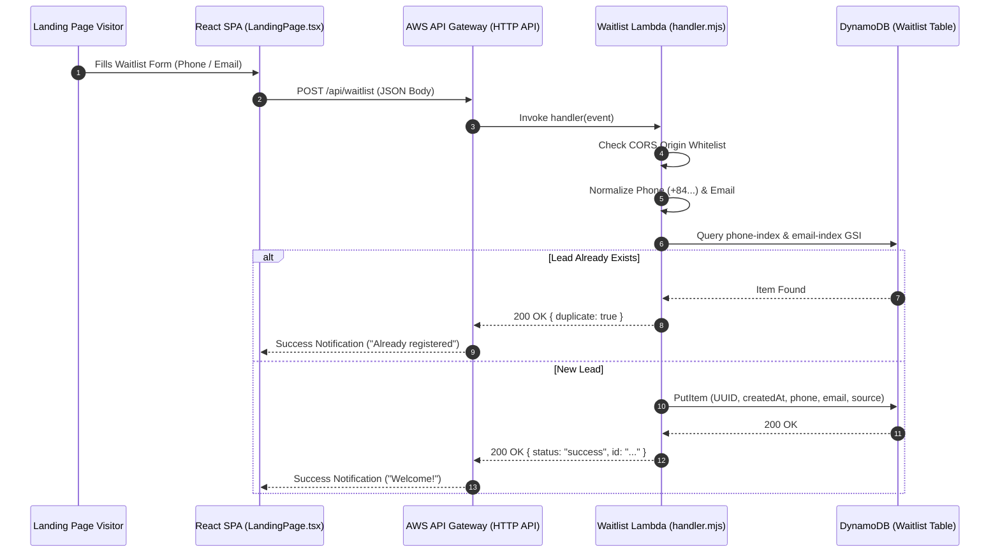

## 1. Overview & Business Intent

- **Business Role**: **TiMoto-AI-Web** captures customer early-access waitlist signups for AI motorcycle valuation. It runs as an isolated serverless microservice using AWS Lambda and DynamoDB.
- **Actors**: Public Landing Page visitors, AI Chatbot widget leads.
- **Target Repos**: `TiMoto-AI-Web` (`infrastructure/waitlist/handler.mjs`, `frontend/src/pages/LandingPage/LandingPage.tsx`).

---

## 2. End-to-End Flow & Sequence Diagram



---

## 3. Detailed API Contract

### `POST /api/waitlist`

- **Headers**: `Content-Type: application/json`, `Origin: https://timoto.ai`
- **Request Body**:
  ```json
  {
    "phone": "0901234567",
    "email": "user@example.com",
    "name": "Nguyen Van A",
    "source": "landing_page_hero"
  }
  ```
- **Success Response (200 OK)**:
  ```json
  {
    "status": "success",
    "id": "c7a8b9d0-1122-3344-5566-778899aabbcc",
    "duplicate": false
  }
  ```
- **Error Matrix**:
  | Code | Reason | Trigger |
  | --- | --- | --- |
  | 400 | `BAD_REQUEST` | Missing both phone AND email |
  | 403 | `CORS_FORBIDDEN` | Origin header not in `ALLOWED_ORIGINS` |

---

## 4. PII Security & DynamoDB Schema

### Data Sanitization Formulas

- **Phone Normalization**: `normalizePhone("0901234567")` $$\rightarrow$$ `+84901234567`.
- **Log Masking**: PII is masked in CloudWatch logs (`maskPhone("+84901234567")` $$\rightarrow$$ `+849*****567`).

### DynamoDB Table (`timoto-waitlist`)

- **Primary Key**: `id` (String UUID).
- **Global Secondary Indexes**:
  - `phone-index` (Partition Key: `phone`).
  - `email-index` (Partition Key: `email`).