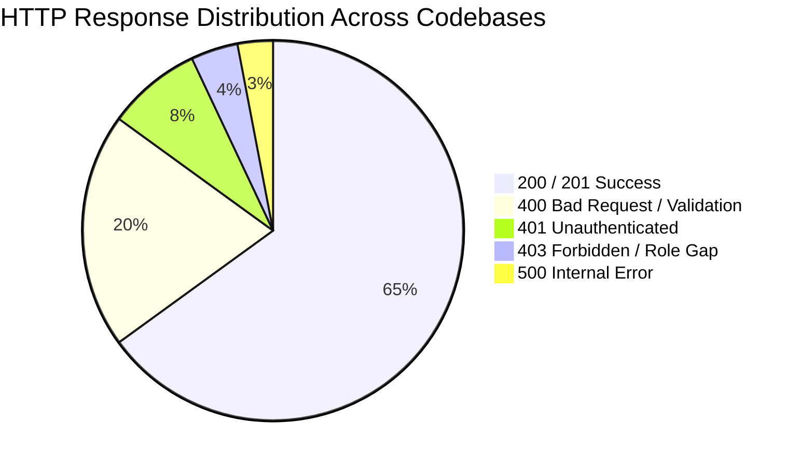

# 1. Overview

This is the **Gold Standard API Matrix** covering all public, internal, operator, and server-to-server endpoints across all 6 TiMoto codebases. Zero handwaving; exact payload schemas and HTTP status codes are verified directly from source Django ViewSets, Express handlers, and Lambda scripts.

# 2. Complete API Contracts Matrix

### Group 1: Rider Mobile API (`timoto-mobile`)

Host: `https://api.timoto.ai`

| Route | Method | Auth | Headers | Request Body Schema | 200/201 Success Response | 400/401/403/500 Error Bodies | DB Side Effects |
| :-- | :-- | :-- | :-- | :-- | :-- | :-- | :-- |
| `/api/v1/auth/mobile/signup/` | POST | AllowAny | `Content-Type: application/json` | `{"phone_number": "string"}` | `201 Created`: `{"status": "ok", "message": "Pending user created"}` | `400`: `{"error": "Invalid phone format"}` | Inserts `PendingUser` record with default temporary secret. |
| `/api/v1/auth/mobile/verify-otp/` | POST | AllowAny | `Content-Type: application/json` | `{"phone_number": "string", "otp": "string"}` | `200 OK`: `{"access": "jwt_token", "refresh": "jwt_token", "user": {"id": 1, "phone": "..."}}` | `400`: `{"error": "Invalid OTP code"}` `401`: `{"error": "Expired OTP"}` | Creates/updates `CustomUser`, sets `is_active=True`. |
| `/api/v1/bikes/` | POST | IsAuthenticated | `Authorization: Bearer <token>` | `{"brand": "string", "model": "string", "year": 2024, "expected_price": 30000000}` | `201 Created`: `{"id": 104, "status": "DRAFT", "created_at": "..."}` | `400`: `{"brand": ["This field is required."]}` `401`: `{"detail": "Authentication credentials were not provided."}` | Inserts row into `bikes_bike`. |
| `/api/v1/bikes/{id}/evaluate/async/` | POST | IsAuthenticated | `Authorization: Bearer <token>` | `{"pictures": ["s3_key_1"], "audio": "s3_key_2"}` | `202 Accepted`: `{"task_id": "eval-992", "status": "EVALUATION_PENDING"}` | `400`: `{"error": "At least one image required"}` `404`: `{"error": "Bike not found"}` | Updates `bikes_bike.status = 'EVALUATION_PENDING'`. Triggers async AI worker. |
| `/api/v1/ocr/vehicle-registration/` | POST | IsAuthenticated | `Authorization: Bearer <token>` | `{"image_base64": "string"}` | `200 OK`: `{"license_plate": "59P1-12345", "chassis_number": "...", "engine_number": "..."}` | `400`: `{"error": "Could not parse registration certificate"}` | None (In-memory processing \+ Gemini fallback). |

---

### Group 2: Dealer Portal API (`timoto-dealer-portal`)

Host: `https://dealer.timoto.ai`

| Route | Method | Auth | Headers | Request Body Schema | 200/201 Success Response | 400/401/403/500 Error Bodies | DB Side Effects |
| :-- | :-- | :-- | :-- | :-- | :-- | :-- | :-- |
| `/api/v1/auth/zalo/login/` | GET | AllowAny | None | None | `302 Redirect`: Redirects to Zalo OAuth page with signed `zalo_pkce` cookie. | `500`: `{"error": "Zalo OAuth misconfigured"}` | Generates `zalo_auth_state` row. |
| `/api/v1/auctions/{id}/bid/` | POST | IsAuthenticated (Dealer) | `Authorization: Bearer <token>` | `{"bid_amount": 45000000}` | `200 OK`: `{"id": 88, "current_price": 45000000, "is_highest": true}` | `400`: `{"error": "Bid must be at least 100,000 VND higher than current"}` | Inserts `AuctionBid` and updates `Auction.current_price`. |
| `/api/v1/payments/checkout/` | POST | IsAuthenticated | `Authorization: Bearer <token>` | `{"type": "auction_deposit", "auction_id": 12}` | `200 OK`: `{"qr_code_url": "https://...", "order_id": "AUC-DEP-12-a1b2", "amount": 4500000}` | `400`: `{"error": "Auction not won or deposit already paid"}` | Creates `DealerOrder` in `pending_deposit` status. |
| `/api/v1/payments/vietqr/callback/` | POST | AllowAny | `Content-Type: application/json` | `{"order_id": "string", "transfer_amount": 4500000}` | `200 OK`: `{"status": "SUCCESS", "message": "Payment applied"}` | `400`: `{"error": "Invalid order_id recipe or amount mismatch"}` | Updates `DealerOrder.status = 'paid'`, marks `Auction.deposit_paid = True`. |

---

### Group 3: Internal Ops API (`timoto-internal-app`)

Host: `https://ops.timoto.ai`

| Route | Method | Auth | Headers | Request Body Schema | 200/201 Success Response | 400/401/403/500 Error Bodies | DB Side Effects |
| :-- | :-- | :-- | :-- | :-- | :-- | :-- | :-- |
| `/api/submissions/{bike_id}/submit/` | POST | IsAuthenticated (OpsStaff) | `Authorization: Bearer <token>` | `{"fmp_price": 30000000, "condition_grade": "A"}` | `200 OK`: `{"bike_id": 104, "instant_price_vnd": 25500000, "listing_price_vnd": 30600000}` | `400`: `{"error": "FMP price must be positive integer"}` | Snapshots `instant_price_vnd` and `listing_price_vnd` to DB. |
| `/api/pickups/{bike_id}/picked-up/` | POST | IsAuthenticated (OpsStaff) | `Authorization: Bearer <token>` | `{"inspection_notes": "string", "passed": true}` | `200 OK`: `{"status": "inspection_passed"}` | `400`: `{"error": "Inspection notes minimum 5 characters"}` | Creates `BikeSaleRecord` with `status='inspection_passed'`. |
| `/api/purchases/{bike_id}/payouts/deposit/` | POST | IsAuthenticated (OpsAdmin) | `Authorization: Bearer <token>` | `{"amount": 12750000}` | `200 OK`: `{"payout_id": 55, "status": "processing", "kind": "deposit"}` | `400`: `{"error": "Deposit payout already executed"}` | Inserts `BikeSalePayout(kind='deposit')`, triggers bank HTTP rail. |
| `/api/webhooks/tma/new-submission/` | POST | S2S HMAC | `X-Timoto-Signature: <sha256>` | `{"bike_id": 104, "user_id": 12}` | `200 OK`: `{"status": "ok", "sla_tracker_id": 99}` | `401`: `{"error": "Invalid HMAC signature"}` | Creates `SlaTracker` and `InternalNotification`. |

---

### Group 4: AI Web Landing (`TiMoto-AI-Web`)

Host: `https://timoto.ai`

| Route | Method | Auth | Headers | Request Body Schema | 200/201 Success Response | 400/401/403/500 Error Bodies | DB Side Effects |
| :-- | :-- | :-- | :-- | :-- | :-- | :-- | :-- |
| `/` (Waitlist API Gateway) | POST | AllowAny | `Content-Type: application/json` | `{"phone": "0901234567", "email": "user@example.com"}` | `210 Created`: `{"success": true, "duplicate": false}` `200 OK`: `{"success": true, "duplicate": true}` | `400`: `{"error": "Invalid Vietnamese phone or email"}` | Performs Query GSI on DynamoDB `android_waitlist`, inserts if new. |

---

### Group 5: Scraper & Pipeline (`chototcaodulieu`)

| Command / Handler | Execution Mode | Trigger | Input / Parameters | Output Format | Error Matrix | DB Side Effects |
| :-- | :-- | :-- | :-- | :-- | :-- | :-- |
| `chotot.py` | CLI / Cron | AWS Lambda / Local | `CATEGORY=2020, LIMIT=50` | DynamoDB `chotot-xe-may` items | `429 Too Many Requests` -\> Backoff 10s `503 Service Unavailable` -\> Retry x3 | Upserts raw listing payload into DynamoDB by `list_id`. |
| `export_quality_bikes.py` | Batch Job | Scheduled | `min_year=2018, min_price=10000000` | CSV File \+ S3 Upload | `ValueError`: Column mismatch -\> Abort run | Filters quality listings into clean dataset. |

# 3. HTTP Error Matrix Summary

