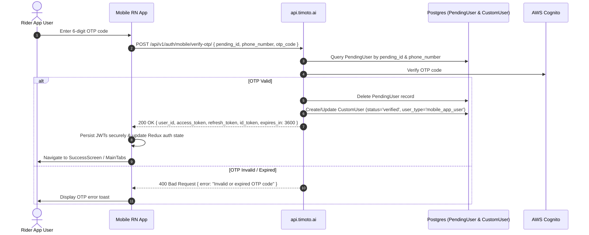

## Overview

The **Verify Mobile OTP** endpoint (`POST /api/v1/auth/mobile/verify-otp/`) validates the 6-digit OTP code sent to the customer's phone during mobile onboarding or login. Upon successful verification, it registers the user in AWS Cognito / Django DB and returns Bearer access, refresh, and ID tokens.

---

## Endpoint Details

- **HTTP Method**: `POST`
- **URL Path**: `/api/v1/auth/mobile/verify-otp/`
- **Authentication**: `AllowAny` (Public)
- **Content-Type**: `application/json`

---

## Sequence Diagram



---

## Request Specification

### Headers

| Header Name | Value | Required | Description |
| --- | --- | --- | --- |
| `Content-Type` | `application/json` | Yes | Request payload format |

### Body Parameters

```json
{
  "pending_id": "a1b2c3d4-e5f6-7a8b-9c0d-1e2f3a4b5c6d",
  "phone_number": "+84984550729",
  "otp_code": "123456"
}
```

| Field Name | Type | Required | Validation Rules | Description |
| --- | --- | --- | --- | --- |
| `pending_id` | `UUID` | Yes | Valid active pending registration ID | Returned from `/auth/mobile/signup/` |
| `phone_number` | `String` | Yes | E.164 format (`+84...`) | Customer's phone number |
| `otp_code` | `String` | Yes | Exactly 6 numeric digits | OTP code received via SMS |

---

## Response Specification

### Success Response (200 OK)

```json
{
  "message": "Registration verified successfully",
  "user_id": "8f2b18e6-b233-47a8-8f2b-18e6b23347a8",
  "phone_number": "+84984550729",
  "username": "8f2b18e6-b233-47a8-8f2b-18e6b23347a8",
  "access_token": "eyJhbGciOiJIUzI1NiIsInR5cCI6IkpXVCJ9...",
  "refresh_token": "eyJhbGciOiJIUzI1NiIsInR5cCI6IkpXVCJ9...",
  "id_token": "eyJhbGciOiJIUzI1NiIsInR5cCI6IkpXVCJ9...",
  "token_type": "Bearer",
  "expires_in": 3600
}
```

### Error Responses

#### 400 Bad Request (Invalid OTP)

```json
{
  "error": "Invalid or expired OTP code"
}
```

#### 404 Not Found (Expired Session)

```json
{
  "error": "Pending registration not found or session expired"
}
```

---

## Database Operations

- **Tables Read**: `bikes_pendinguser` (`pending_id`, `phone_number`, `expires_at`).
- **Tables Deleted**: `bikes_pendinguser` (row deleted upon successful verification).
- **Tables Written/Updated**: `bikes_customuser`
  - `user_id`: Generated UUID PK.
  - `phone_number`: Cleaned phone string.
  - `status`: Set to `'verified'`.
  - `user_type`: Set to `'mobile_app_user'`.
  - `created_at`: Set to current timestamp.

---

## Client Integration Code (`timoto-mobile`)

Caller Component: `apps/src/pages/OTPScreen.tsx`

```typescript
import { verifyOtp } from '../api/endpoints';
import { setTokens } from '../utils/keychain';

const handleVerify = async (code: string) => {
  try {
    const res = await verifyOtp({
      pending_id: pendingId,
      phone_number: phoneNumber,
      otp_code: code,
    });
    await setTokens(res.access_token, res.refresh_token, res.id_token);
    navigation.navigate('MainTabs');
  } catch (err) {
    Toast.show({ type: 'error', text1: err.response?.data?.error || 'Xác thực OTP thất bại' });
  }
};
```