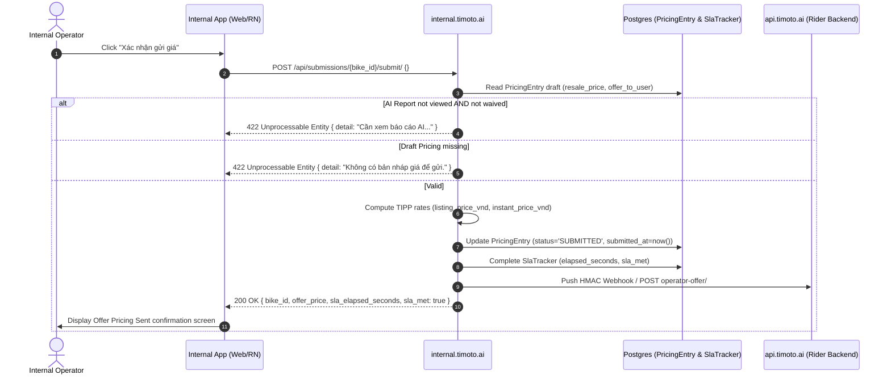

## Overview

The **Submit Operator Pricing** endpoint (`POST /api/submissions/{bike_id}/submit/`) is used by human operators in `timoto-internal-app` to finalize a vehicle valuation. It takes the operator's entered Fair Market Price (FMP), snapshots discount/fee rates into `PricingEntry`, calculates SLA compliance, and pushes an HMAC-signed webhook to `timoto-mobile`.

---

## Endpoint Details

- **HTTP Method**: `POST`
- **URL Path**: `/api/submissions/{bike_id}/submit/`
- **Authentication**: `OPS JWT Bearer` (Required)
- **Content-Type**: `application/json`

---

## Sequence Diagram



---

## Request Specification

### Headers

| Header Name | Value | Required | Description |
| --- | --- | --- | --- |
| `Authorization` | `Bearer <access_token>` | Yes | OPS Operator JWT Token |
| `Content-Type` | `application/json` | Yes | Request payload format |

### Body Parameters

```json
{}
```

_(No body parameters required. Operates on the active draft `PricingEntry` record for `{bike_id}`)._

---

## Response Specification

### Success Response (200 OK)

```json
{
  "bike_id": "8f8832a8-084d-4c7b-b384-5f50fa5f9104",
  "masked_bike_id": "AB1234",
  "offer_price": 26500000,
  "sla_elapsed_seconds": 240,
  "sla_met": true,
  "tma_offer_push_ok": true,
  "completion_event_id": "a9b8c7d6-e5f4-3210-9876-54321fedcba0"
}
```

### Error Responses

#### 422 Unprocessable Entity (AI Report Not Viewed)

```json
{
  "detail": "Cần xem báo cáo AI (mở tab Phân tích AI) hoặc chọn bỏ qua trên bước trước khi xác nhận."
}
```

#### 422 Unprocessable Entity (No Draft Pricing)

```json
{
  "detail": "Không có bản nháp giá để gửi."
}
```

---

## Database Operations

- **Tables Read**: `ops_auth_pricingentry`, `bikes_bike`, `ops_auth_slatracker`.
- **Tables Written/Updated**: `ops_auth_pricingentry`
  - `status`: Updated to `'SUBMITTED'`.
  - `submitted_at`: Current timestamp.
  - `instant_price_vnd`: Snapshotted calculation (`FMP * 0.75`).
  - `listing_price_vnd`: Snapshotted calculation (`FMP * 0.95 * 0.90`).
  - `instant_purchase_discount_rate`: `0.75`.
  - `market_multiplier_rate`: `0.95`.
  - `timoto_fee_rate`: `0.90`.
- **Tables Written**: `ops_auth_usercompletionoutbox` (Queues async outbox notification).

---

## Client Integration Code (`timoto-internal-app`)

Caller Component: `apps/src/pages/PricingConfirm.tsx` / `frontend_web_version/src/pages/ConfirmPage.tsx`

```typescript
import { submitPricing } from '../api/submissions';

const handleConfirmSubmit = async (bikeId: string) => {
  try {
    const res = await submitPricing(bikeId);
    console.log('Submission success:', res.sla_elapsed_seconds);
    navigation.navigate('OfferPricingSent', { bikeId });
  } catch (err) {
    Alert.alert('Lỗi gửi giá', err.response?.data?.detail || 'Không thể gửi giá');
  }
};
```