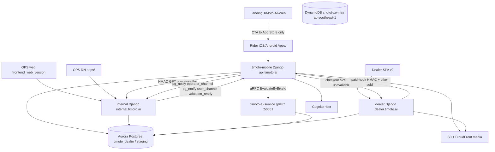

## Summary

TiMoto is six codebases, not one app. Riders sell and buy on **timoto-mobile**. Operators price and pick up on **timoto-internal-app**. Dealers buy inventory on **dealer.timoto.ai** (nginx FE in `timoto_dealer_portal_v2` \+ Django in `timoto-dealer-portal`). **TiMoto-AI-Web** is the public landing (`timoto.ai`), not the evaluate engine. **chototcaodulieu** scrapes Chotot into DynamoDB for market research — it does **not** write Aurora.

Word specs (IA-73, IA-79, TMA-79, TMA-109, TMA-168, TMA-169, TMA-176) were **not on disk** at `/Users/toannguyen/Downloads/drive-download-20260817*` when this page was written. Product pages below are grounded in **git** (`docs/api/*`, `docs/pr/*`, Django `urls.py`). Re-upload the `.docx` if a Figma rule disagrees with code — **code \+ this KB win** until you say otherwise.

## Who reads what

| Role | Start |
| --- | --- |
| CEO / CTO | This page \+ [Data, AI, infra](/architecture/data-ai-infra) |
| PM | [Product tickets](/product/ticket-index) |
| Engineer | [APIs](/apis/overview) then the system page for your repo |
| Agent | [How agents use this](/how-agents-use-this) then cite slugs |

## How the companies connect

## Environments (hosts)

| Surface | Staging | Production |
| --- | --- | --- |
| Rider API | `https://api-staging.timoto.ai` | `https://api.timoto.ai` |
| Rider WS | NLB `:8443` | `wss://api.timoto.ai:8443` |
| OPS | `https://internal.timoto.ai` | `https://prod-internal.timoto.ai` |
| Dealer | `https://staging.dealer.timoto.ai` | `https://dealer.timoto.ai` |
| Landing | — | `https://timoto.ai` |
| Chotot dashboard | — | CloudFront `d1cwchl0xo05n0.cloudfront.net` |

## Money path (one paragraph)

Seller photographs cavet → OCR Gemini → photos → `POST /bikes/{id}/evaluate/` → gRPC AI pod writes `BikeEvaluationResult` → OPS gets `operator_channel` / webhook → OPS types **FMP only** → server snapshots listing = FMP×0.95×0.90 and TIPP = FMP×0.75 → `user_channel` `valuation_ready` → app shows two prices from HMAC operator-offer → seller picks listing or instant → pickup schedule → if listing, later buyer on marketplace/dealer checkout → VietQR → dealer paid-hook HMAC into mobile.

## Do not

- Do not treat landing `VITE_API_BASE_URL=dealer.timoto.ai` as a live evaluate client. The landing UI does not call it.
- Do not feed Chotot DynamoDB into pricing. Isolated pipeline.
- Do not assume `CLAUDE.md` ECS names match `CURRENT_INFRASTRUCTURE.md`. Verify AWS. Live dealer entry is **NLB** `timoto-dealer-portal-nlb`, not the leftover ALB as primary.
- Do not put HMAC secrets in the mobile binary. Only mobile **backend** signs operator-offer.