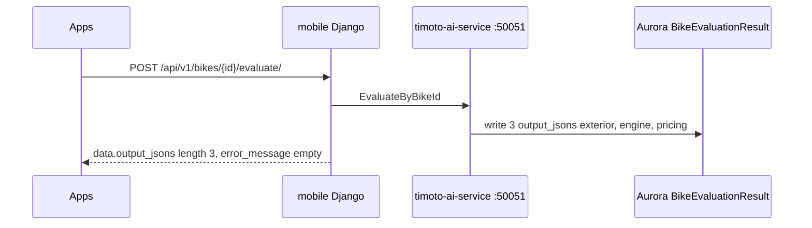

## Summary

Shared **Aurora Postgres** is the system of record for bikes, evaluations, pickups, and dealer orders. Redis is optional cache. Rider identity is **Cognito**. OPS identity is **internal JWT** (phone/password), not Cognito. AI evaluate is a **separate ECS gRPC service**, not TiMoto-AI-Web. OCR cavet is **Gemini** on the mobile Django API.

## Seven-project boundary

The application/data plane is six repositories. The seventh root, `AI_infra_timoto`, is an incident-repair and read-only operations control plane. It consumes CloudWatch evidence from six registered backend targets, stores bounded incident state in DynamoDB/S3, and may produce a signed GitHub draft PR. It does not own Aurora business rows, does not receive customer media as model context, and does not merge or deploy production.

The Chotot pipeline is intentionally separate: `chotot-xe-may` and its S3 exports are research data, not an implicit FMP/TIPP source and not a transactional mirror. The nested `chototcaodulieu/ai-infra` decision selects ECS/Fargate plus n8n Cloud for future agent orchestration; the historical `openclaw/` Terraform is not an active application dependency.

## Region and deployment truth

The repair-control Terraform uses `ap-southeast-1` for its control plane and registers application targets in `ap-southeast-7`. Repository docs contain conflicting ECS/NLB/ALB names and historical EKS instructions. Treat those as hypotheses until the exact AWS task definition, service, target group and release SHA are re-queried for the incident.

## Databases

| Store | Who writes | Who reads |
| --- | --- | --- |
| Aurora `timoto-dealer-production-new` / staging cluster | mobile, internal (`tma_db` \+ `user_db_write`), dealer, AI service | all of the above |
| Internal `default` DB | OPS users, `PricingEntry`, notifications, outbox | OPS web/app |
| DynamoDB `chotot-xe-may` | chotot Lambda `ap-southeast-1` | chotot dashboard API only |
| Waitlist DynamoDB | waitlist Lambda (built, **landing UI not wired**) | — |

Internal uses a **DB router**: `default` (ops\_auth), `tma_db` (unmanaged TMA mirrors), `user_db_write` (`pg_notify` into the mobile user DB).

## AI path (evaluate)

- Client: `backend/apps/bikes/grpc_client.py`, flow `bike_evaluate_flow.py`.
- Staging DNS: `ai-service.timoto.local:50051` (Cloud Map).
- **Do not** call live OpenAI/Gemini from PR CI. Mock gRPC. Staging schema script uses `--iterations 1` only.
- Legacy AllowAny HTTP `/api/v1/evaluation/exterior|engine|pricing|full/` still exists — not the production Apps path.

## OCR

`POST /api/v1/ocr/vehicle-registration/` → Gemini 1.5 Flash → `Apps/src/utils/ocrCatalogMatch.ts` → Step01. Simulator has no camera. See [Cavet OCR](/features/cavet-ocr).

## Realtime

| Channel | Direction | Events |
| --- | --- | --- |
| `operator_channel` | mobile → internal `listen_operator_channel` | `valuation_requested`, `valuation_cancelled`, `pickup_scheduled` |
| `user_channel` | internal `realtime_bridge` → mobile WS | `valuation_ready`, `valuation_rejected` |
| Rider WS | `serve_realtime_ws` / API GW | Cognito token on connect, port **8443** |

## Object storage

S3 upload buckets \+ CloudFront CDN. Presign: `POST /api/v1/upload/presigned-url` (**AllowAny** today — cost/abuse risk).

## Dealer traffic (live)

Route53 `dealer.timoto.ai` → **NLB** `timoto-dealer-portal-nlb` → nginx ECS → Cloud Map `backend.timoto-dealer-portal.local:8000` → Django. ALB `timoto-frontend-alb` is secondary. Docs disagree on ECS cluster names (`timoto-dealer-fargate` vs `timoto-dealer-portal-fargate`) — verify AWS before changing infra.

## Do not

- Do not point evaluate at the landing repo.
- Do not auto-rollback ECS on first smoke flake.
