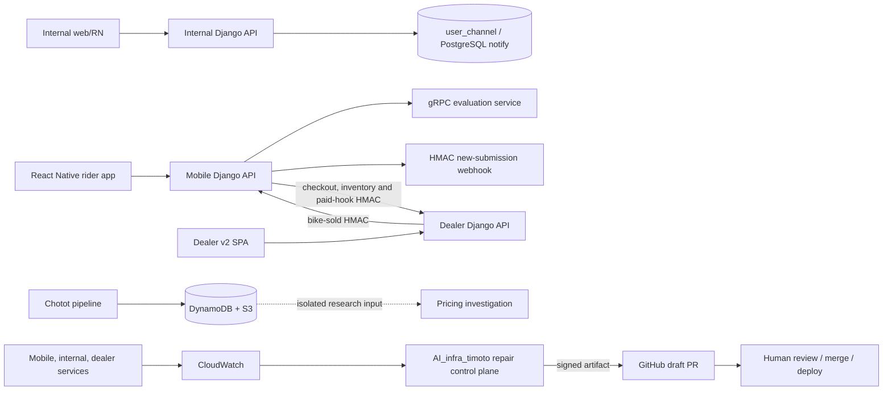

# TiMoto seven-project system specification

> Review date: 2026-09-23. This page is a source review of the seven local project roots listed below. It is not a claim that every AWS service, domain, task definition, webhook, or external provider is currently healthy. The source snapshot, working-tree status, and verification limits are recorded at the end.

## What this page fixes

The earlier architecture pages described the product ecosystem as six codebases. That is true for the six application/data repositories, but the workspace contains a seventh project: `AI_infra_timoto`, the incident-repair and operations control plane. This page treats it as a first-class system boundary.

It also corrects three common documentation errors:

- `TiMoto-AI-Web` is a Vite + React landing SPA. It is not the valuation engine and it is not a Next.js application.
- `timoto-mobile` and `timoto-internal-app` contain Django backends, even where older README text uses a different framework label.
- The repair platform can observe and prepare a draft PR, but it does not have authority to merge application code or deploy production.

## Seven project roots

| Project root | Primary responsibility | Main implementation | Durable data / external boundaries | Runtime and deployment notes |
| --- | --- | --- | --- | --- |
| `AI_infra_timoto` | Incident intake, evidence, guarded repair execution, signed artifacts, draft PRs, read-only operations console | Python 3.12, boto3, pytest, Terraform, browser console | CloudWatch, SQS, DynamoDB, S3, ECS/Fargate, GitHub, Jira, Cognito/API Gateway | Control-plane resources are in Singapore (`ap-southeast-1`); application targets are registered in Bangkok (`ap-southeast-7`). |
| `timoto-mobile` | Consumer rider app and rider API: account, bike intake, media, OCR, evaluation, pickup, listing and marketplace | React Native/TypeScript plus Django/DRF backend | Aurora/PostgreSQL, S3/CloudFront, Cognito, SNS, gRPC AI service, PostgreSQL notifications | Backend and realtime paths are deployed through ECS/Fargate documentation; active task definitions must be verified before repair. |
| `timoto-internal-app` | Operator web/mobile workflows: queue, pricing, pickup, inspection, instant sell, payout and completion | React Native operator app, Django/DRF backend, Vite web app | Own operational database plus unmanaged TMA mirrors, `user_db_write`, Redis/locmem refresh state, FCM, HMAC webhooks | The database router is part of the contract. Shared image deployments can affect HTTP and worker processes together. |
| `timoto-dealer-portal` | Dealer API: users, catalog, orders, auctions, payments, evaluations and notifications | Django/DRF, PostgreSQL, Cognito/Zalo, OneSignal | Aurora/PostgreSQL, S3 media, VietQR/VNPay, Cloud Map, NLB/ALB, ECS | Repository documents contain both EKS and ECS-era instructions. Resolve the active target by AWS task definition and host before deployment. |
| `timoto_dealer_portal_v2` | Dealer browser experience for auth, catalog, orders, auction, payment and AI report views | Vite + React 18 + TypeScript, Axios, React Router, Ant Design/Tailwind | Calls the dealer backend; build-time `VITE_*` configuration; nginx static serving | This is a separate frontend repository, not a second dealer backend. |
| `TiMoto-AI-Web` | Public TiMoto marketing/landing site and platform narrative | Vite + React 18 + TypeScript, React Router, Tailwind, PostHog | Browser-only assets and links; current waitlist modal has no backend write | Routes are `/` and `/landingpage`. Contact/waitlist submission currently shows UI feedback only. |
| `chototcaodulieu` | Chotot market-data scraper, refresh, image sync, quality export, dashboard, and AI-infra history | Python 3.12, Requests/BeautifulSoup, Lambda/EC2 scripts, Terraform | DynamoDB `chotot-xe-may`, S3 CSV/checkpoints, SQS image jobs, CloudFront dashboard | It must remain isolated from Aurora and product transaction state. Its nested `ai-infra/` is the accepted ECS/Fargate + n8n Cloud platform decision; `openclaw/` is historical audit material. |

## System boundary and ownership

Ownership rules:

1. Mobile owns rider-facing bike, media, evaluation-request and seller-listing records.
2. Internal owns operator users, SLA tracking, pricing snapshots, pickup/inspection and payout workflow records. Its TMA mirror models are `managed=False`; they do not make Internal the owner of those tables.
3. Dealer owns dealer-facing orders, auctions, catalog projections, payment reconciliation and dealer notifications.
4. Chotot owns only its market-data dataset and exports. It does not write product Aurora.
5. AI infrastructure owns incident evidence and repair lifecycle metadata. It does not own application business records and does not silently change them.
6. Human reviewers own merge/deploy approval. A green test, signed artifact, Jira issue, or PR URL is not approval.

## End-to-end vehicle lifecycle

### Phase 1 — consumer intake and evaluation

1. The rider authenticates through mobile phone/SNS OTP or native Zalo/Apple paths.
2. The app creates a bike draft, uploads media with presigned S3 URLs, and may run on-device Cavet OCR.
3. The app requests asynchronous evaluation through the bikes API. The backend marks the bike pending and calls the gRPC AI service.
4. Evaluation output is persisted as structured result JSON. The current production path is gRPC evaluation; legacy HTTP evaluation endpoints remain in source and must not be confused with the app path.
5. Internal receives a signed new-submission webhook and/or `operator_channel` event for review.

### Phase 2 — operator pricing, pickup and instant sell

1. OPS authenticates with phone/password JWT; this is separate from rider Cognito.
2. An operator records the Fair Market Price (FMP). On submit, the backend snapshots listing and instant prices; the mobile client reads the snapshot through an HMAC-protected operator-offer path.
3. Pickup schedules move through the waiting/scheduled/confirmed and inspection flow. Pickup writes can use a separate database alias and PostgreSQL notification.
4. Instant-sell progress is checklist-driven: inspection, bank details, deposit, pickup, notary, remaining payout, completion or rejection.
5. Payout callbacks require HMAC verification and idempotent state checks. The repository contains stub/async-stub/http payout modes; the active mode must be confirmed per environment.

### Phase 3 — dealer inventory and payment

1. A completed/listable bike becomes eligible for dealer catalog or auction only when the required internal pricing and marketplace predicates are satisfied.
2. Dealer v2 calls the Django dealer API through Axios. Build-time API bases are not proof of a live route.
3. Dealer orders have independent delivery and payment axes. A paid order is not automatically delivered; a COD receive does not necessarily mark a payment as paid.
4. Auction bidding requires the minimum increment. Finalization may set a deposit deadline, fail over to another bidder, or restart an auction cycle.
5. VietQR callbacks reconcile exact order recipes and amounts. Shared checkout uses row locking in the code path; inventory helpers and some auction paths have weaker concurrency guarantees and need explicit testing.

### Phase 4 — settlement and observability

1. The dealer payment/callback path notifies the mobile backend through the documented HMAC contract.
2. ECS/CloudWatch observations feed the repair intake only when the source identity, log group, service and release evidence match the registry.
3. AI infrastructure creates bounded evidence, runs only approved test contracts, verifies a signed artifact, and may publish a GitHub draft PR.
4. Merge, staging deployment, production deployment, and rollback remain separate human-approved actions.

## Cross-project contracts

| Boundary | Contract | Authentication / integrity | Source of truth | Failure interpretation |
| --- | --- | --- | --- | --- |
| Mobile → Internal new submission | `POST /api/webhooks/tma/new-submission/` with `bike_id` and signed body | `X-Timoto-Signature` HMAC with `TMA_WEBHOOK_SECRET` | Internal `SlaTracker` and notification row | Invalid signature is rejected; valid HTTP does not prove FCM delivery. |
| Mobile → Internal operator offer | Mobile reads dual-price snapshot through an HMAC-protected internal endpoint | Backend-held secret; never embed the secret in the app | Internal submitted pricing snapshot | Empty/misconfigured secret is a security blocker, not a successful offer. |
| Mobile → Dealer checkout/inventory | S2S checkout and bike-unavailable requests | Service key / HMAC allowlist | Dealer checkout/order and catalog rows | A 2xx response does not prove downstream inventory or payment settlement. |
| Dealer → Mobile paid hook | Payment/paid-hook and bike-sold callbacks | HMAC and request allowlists | Mobile payment/listing state | Verify idempotency and exact bike/order binding before replay. |
| Internal → Mobile realtime | `operator_channel` and `user_channel` PostgreSQL notification paths plus WebSocket | DB connection and rider token on WebSocket | Outbox/processed-event state and consumer rows | HTTP success is insufficient evidence of notification delivery. |
| CloudWatch → AI infrastructure | Normalized 5xx evidence envelope | Registry-derived account/region/log group/service identity | DynamoDB incident row plus S3 evidence | Unknown source, missing release, or ambiguous task state becomes blocked/result-pending. |
| AI infrastructure → GitHub | Signed, source-bound artifact to branch and draft PR | KMS signature, repository allowlist, exact source SHA | Publication receipt in private S3 | Draft PR does not authorize merge or deploy. |

## State machines that must not be collapsed

### Mobile seller flow

`text DRAFT -> EVALUATION_PENDING -> evaluation result / operator review -> price choice -> LISTED or INSTANT / pickup workflow -> COMPLETED, REJECTED, or cancellation-specific state `

The code distinguishes a valuation result, operator result, seller choice, and marketplace listing. Do not treat those as one status field.

### Internal instant sell

`text WAITING/REVIEW -> PRICING_SUBMITTED -> INSPECTION / BANK_READY -> DEPOSIT -> PICKED_UP -> NOTARY -> REMAINING_PAYOUT -> COMPLETED `

Rejection and failure are explicit branches. A notary confirmation currently updates checklist flags; it does not prove that an external e-signature provider or PDF engine exists.

### Dealer order and auction

Dealer order delivery and payment are independent axes:

`text delivery: delivering -> delivered | cancelled payment: pending -> paid cancel: allowed only before paid invoice: requires delivered AND paid reorder: allowed from cancelled `

Auction behavior includes active bidding, finalization, deposit window, deposit, full-payment window, failover/restart, and terminal delivery/payment records. The repository documents a minimum bid increment and time-bounded deposit/full-payment windows. The GET list path can finalize expired auctions and write notifications; treat it as a mutating read until this is redesigned.

### Repair lifecycle

`text QUEUED -> RUNNING -> RESULT_PENDING -> ARTIFACT_READY -> PR_PENDING -> AWAITING_APPROVAL -> DEPLOYED -> VERIFYING -> RESOLVED | ROLLBACK_REQUIRED | BLOCKED `

Lease expiry, task disappearance, missing receipts, invalid evidence, or failed provenance do not mean success. They require reconciliation or `BLOCKED`.

## API surface map

This page intentionally links to the detailed references instead of inventing one giant route list.

| Project | Runtime host(s) | Main API families | Detailed reference |
| --- | --- | --- | --- |
| `timoto-mobile` | `api-staging.timoto.ai`, `api.timoto.ai` | auth, options, bikes, upload, evaluation, pickup, marketplace, feedback, realtime | [Mobile API deep reference](/apis/mobile-full-reference) |
| `timoto-internal-app` | `internal.timoto.ai`, `prod-internal.timoto.ai` | auth/FCM, submissions/pricing, pickups, purchases/payouts, webhooks, operator offer | [Internal API deep reference](/apis/internal-full-reference) |
| `timoto-dealer-portal` | `staging.dealer.timoto.ai`, `dealer.timoto.ai` | users, catalog, orders, auctions, checkout, payments, evaluations, notifications | [Dealer API deep reference](/apis/dealer-full-reference) |
| `timoto_dealer_portal_v2` | browser SPA served from dealer surfaces | Axios client for auth, catalog, bike, order, payment and AI-report calls | [Dealer v1/v2 split](/dealer-portal/migration-v1-to-v2) |
| `TiMoto-AI-Web` | `timoto.ai` | browser routes only; waitlist API is not called by current form code | [Landing static deploy](/ai-web/landing-static-deploy) and [waitlist Lambda](/ai-web/waitlist-lambda) |
| `chototcaodulieu` | Chotot gateway, Lambda/EC2, S3/CloudFront | listing/detail scrape, DynamoDB upsert, CSV export, refresh checkpoint, image sync | [Scraper pipeline](/scraper/chotot-pipeline-constants) |
| `AI_infra_timoto` | internal control plane | CloudWatch intake, incident evidence, dispatcher, verifier, source broker, publisher, read-only console | [AI Repair Foundation](/architecture/timoto-ai-repair-foundation) |

The prior matrix page included placeholder routes and a nonstandard `210 Created` status. Use the deep references and source-linked pages above as the contract; do not copy placeholder examples into clients.

## Data and infrastructure topology

| Data/service | Owning project(s) | Access pattern | Boundary |
| --- | --- | --- | --- |
| Aurora/PostgreSQL TMA tables | Mobile; Internal reads through unmanaged mirrors and writes through explicit alias; AI service | Django ORM, raw SQL, gRPC/worker writes, PostgreSQL `NOTIFY` | Schema ownership and migration history remain with the owner; SQLite tests do not prove PostgreSQL locks/notifications. |
| Internal operational DB | Internal | Django ORM/router | Stores staff, pricing, SLA, pickup, payout and notification state. |
| Dealer DB/catalog | Dealer backend | Django ORM and transaction helpers | Catalog/order/auction/payment state is not interchangeable with TMA bike rows. |
| S3 media | Mobile and Dealer | Presigned upload/read URLs and CDN | Protect presign endpoints and do not expose customer media in repair/model context. |
| Cognito | Mobile and Dealer | Backend-mediated auth; JWT at APIs | Rider and dealer identities are separate domains. |
| DynamoDB `chotot-xe-may` | Chotot pipeline | Lambda/CLI batch writes and scans | Research dataset only; no automatic pricing or Aurora writes. |
| Incident DynamoDB/S3 | AI infrastructure | Lambda/ECS with least-privilege IAM | Incident state is authoritative for repair lifecycle; S3 holds bounded evidence/receipts. |
| n8n Cloud | Nested `chototcaodulieu/ai-infra` platform | Authenticated webhooks and outbound handoffs | n8n is the workflow/approval plane, not the privileged container runtime. |

## Deployment and environment rules

- Primary application/runtime material in the app repositories references `ap-southeast-7`; the repair intake/control-plane Terraform is deliberately in `ap-southeast-1`. Never infer one region from the other.
- Dealer documentation contains EKS, ALB, NLB and ECS-era material. The source review identifies the NLB/Cloud Map path as the intended dealer route, but the active cluster/task definition must be checked in AWS before a deployment or rollback.
- The mobile and internal repositories contain separate app, backend, and infrastructure surfaces. Confirm the exact image digest, task definition, migration mode, and worker targets for the incident.
- Static frontends require the correct build-time environment. A `VITE_*` value in a file is not evidence that the browser made a request.
- Chotot daily and weekly jobs are bounded and checkpointed. They use DynamoDB/S3 and must not be used as an implicit production data migration.
- OpenClaw Terraform is retained as historical audit material in the nested `chototcaodulieu/openclaw` directory. Do not destroy or recreate anything from that history without fresh AWS/Terraform verification.

## Security and correctness findings

| Finding | Affected project | Required treatment |
| --- | --- | --- |
| Fixed/development confirmation-code path is documented in dealer auth | Dealer backend | Remove or isolate from production; never treat the code as real SMS verification. |
| Mobile signup/OTP and social auth have multiple Cognito/password bridges | Mobile | Keep temporary secrets and provider tokens server-side; test expiry, replay and account binding. |
| Current landing Android waitlist submit is UI-only | AI Web | Either wire the API Gateway/Lambda contract with CORS/rate limiting and conditional deduplication, or remove the backend claim. |
| Waitlist handler Query-then-Put has a concurrent duplicate race | Waitlist Lambda | Add a conditional write or explicit idempotency key before calling it production-grade. |
| Auction GET can finalize/write notifications; bid path needs concurrency proof | Dealer backend | Add integration tests with PostgreSQL row locks and concurrent bidders. |
| Internal mirror fields and pickup status writers can diverge from database constraints | Internal | Verify migrations and database aliases before changing state transitions. |
| Presigned upload is broadly reachable in the current reference | Mobile | Add authentication, object-key ownership and abuse limits before expanding exposure. |
| Scraper overview previously implied proxy rotation | Chotot | Current source shows standard headers/retries and no proxy pool/rotation. Document that limitation. |
| Repair dispatcher and model/test contract are not autonomous production deployment | AI infra | Keep human approval and exact target/revision binding mandatory. |

## Source evidence and verification status

### Source snapshots reviewed

| Root | Git evidence |
| --- | --- |
| `timoto-dealer-portal` | `04025eb13d27971920973ba6b524e7736f7cf86a` |
| `chototcaodulieu` | `9e95104199540bcaabdb717ef0c82e2834fbc856` |
| `TiMoto-AI-Web` | `b2c47c61d630d4d9ec5fa22026572e1150cea9f8` |
| `timoto-internal-app` | `25e51585266ce08b93bff428892246728bb8e2ca` |
| `timoto_dealer_portal_v2` | `ea57edaa45134bd7010b5324d06d96554ff2fee0` |
| `timoto-mobile` | `5d1bf6f44a88e4e80f3b4391de2bc9027a23c9cd` |
| `AI_infra_timoto` | No Git repository; reviewed local files and Terraform/state artifacts. |

Several repositories have dirty or untracked working-tree files. Those changes belong to their owners and were not modified by this documentation update.

### What was verified locally

- `AI_infra_timoto`: `PYTEST_DISABLE_PLUGIN_AUTOLOAD=1 .venv/bin/python -m pytest -q` — 161 passed, 11 skipped.
- `AI_infra_timoto/infra`: `terraform validate -no-color` passed with deprecation warnings for legacy DynamoDB attribute arguments.
- `AI_infra_timoto/platform/web/app.js`: `node --check` passed.
- Source inspection covered route declarations, deployment files, state transitions, authentication boundaries, service entrypoints, test maps, and the existing docs-kb pages.

### Not freshly verified in this review

- Current AWS task definitions, ECS service health, CloudWatch subscriptions, NLB/ALB routing, Cloud Map records, Cognito pools, payment-provider callbacks, gRPC availability, and deployed release SHAs.
- Production database contents or migrations.
- End-to-end mobile, internal, dealer, or frontend builds.
- Actual waitlist API deployment or browser wiring.
- Whether historical OpenClaw resources remain destroyed in the live account.

## Change-control rule

When a cross-project payload, state transition, database owner, route, auth scheme, deployment target, or rollback procedure changes, update the relevant detailed page and this specification in the same change. Record:

1. source repository and commit;
2. environment and exact deployed SHA/image digest;
3. test command and exit code;
4. external side effects performed;
5. remaining uncertainty and operator approval required.
