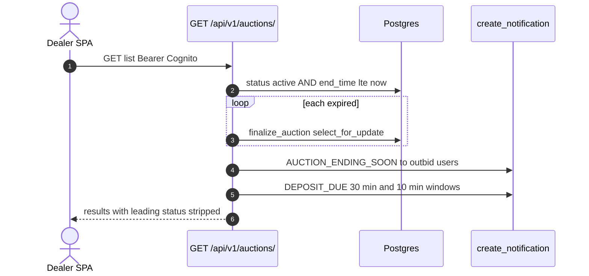
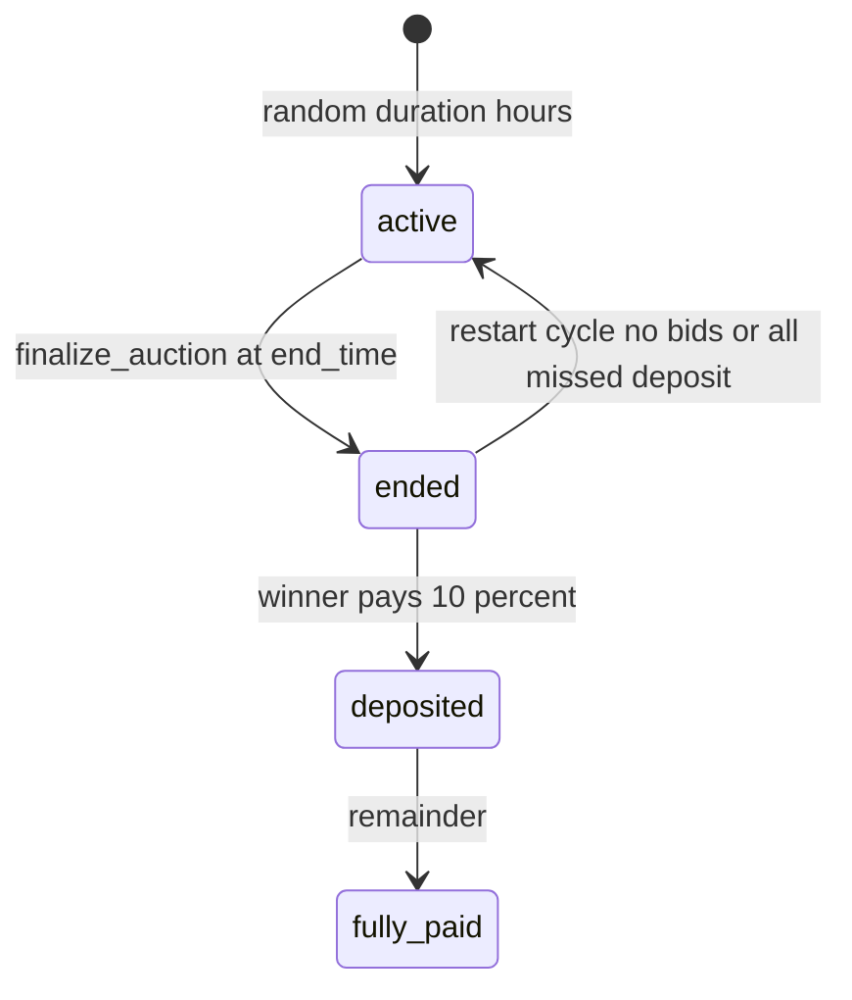

# 1. Overview and Business Intent

Dealers bid on auctions\_auction rows. Duration at create is random from 4, 3, 2, 1, or 0.5 hours. Deposit is 10 percent of winning price with a 4 hour deadline on the model. There is no auction WebSocket. Near-real-time is GET /auctions/updates/?since= documented as a 30 second poll.

**Target files:** backend/auctions/views.py, serializers.py PlaceBidSerializer, models.py. Dual /api/v1/ and /api/. Auth IsAuthenticated. Lookup auction\_id. Page size 20, max 100.

---

# 2. End-to-End Flow and Sequence Diagram





list, create, update, partial\_update, destroy, head on the collection all call \_handle\_auction\_list. DELETE /api/v1/auctions/ does not delete auctions; it returns the list JSON.

---

# 3. Detailed API Contracts

GET list writes: finalize\_auction for active and end\_time in the past. Then notification scans. Dedup uses Notification filters on metadata auction\_id and type plus a sent\_at window.

After serialize, items with status leading are dropped. That status is a computed serializer field. Outbidded items move to the front. Fetch cap max\_fetch 500 so count can be wrong above 500.

POST place\_bid body bid\_amount integer. If now past end\_time, view finalizes then 400 Auction has ended. PlaceBidSerializer.create has no select\_for\_update. Requires bid\_amount at least current plus 100000, INSERTs Bid with date.today, then auction.current\_price save. Concurrent bids can both pass the increment check. Leading notify is commented out. Outbid notify still runs.

POST place\_fast\_bid adds 100000 to max of current\_price and start\_price. Fast-bid path does not finalize-if-expired before serializer.

GET updates/?since= unix int required. Bids filter created\_at gt datetime.fromtimestamp naive. distinct auction\_id needs PostgreSQL.

| HTTP Code | Error | Trigger |
| --- | --- | --- |
| 400 | Auction has ended | place\_bid after finalize |
| 400 | Gia dau gia phai cao hon | increment 100000 |
| 400 | Missing since parameter | updates |
| 404 | Auction not in watch list | unwatch |
| 500 | Invalid bid amount calculated | fast bid math |

Other actions: retrieve, my\_bids, watched, watch, unwatch, bids, filter\_options, my\_auctions, bid\_history.

---

# 4. Database Schema and Locks

finalize\_auction uses Auction.objects.select\_for\_update. place\_bid does not.

```sql
CREATE TABLE auctions_auction (
    auction_id UUID PRIMARY KEY,
    bike_id UUID NOT NULL,
    start_price INTEGER,
    current_price INTEGER,
    start_time TIMESTAMPTZ,
    end_time TIMESTAMPTZ,
    status VARCHAR(32),
    deposit_status VARCHAR(32),
    payment_status VARCHAR(32),
    delivery_status VARCHAR(32),
    deposit_deadline TIMESTAMPTZ,
    payment_deadline TIMESTAMPTZ,
    event_timestamp BIGINT,
    winning_bid_id UUID
);
CREATE TABLE auctions_bid (
    bid_id UUID PRIMARY KEY,
    auction_id UUID NOT NULL,
    user_id UUID,
    bid_amount INTEGER,
    is_winner BOOLEAN,
    date DATE,
    created_at TIMESTAMPTZ
);
```

Restart: no bids then new random duration; all missed deposit then restart 4 hours.

---

# 5. Frontend and UI Logic

SPA must not treat GET list as read-only. autoReminderService.ts independently timers at 5s / 30 min / 10 min / 24h. Push action\_url uses /home/auction/ which is not a SPA route.

---

# 6. Edge Cases and Resilience

1. Collection DELETE/PUT/PATCH equal GET.
2. Dropping serializer leading hides auctions the current user is winning from the main list.
3. 500 cap means page count lies for large catalogs.
4. Bid races without FOR UPDATE: two increments can both commit.
5. print debug lines in PlaceBidSerializer go to container logs.
6. bid\_history declared pk=None while lookup is auction\_id.
7. Naive fromtimestamp on updates bids filter is timezone-unsafe.