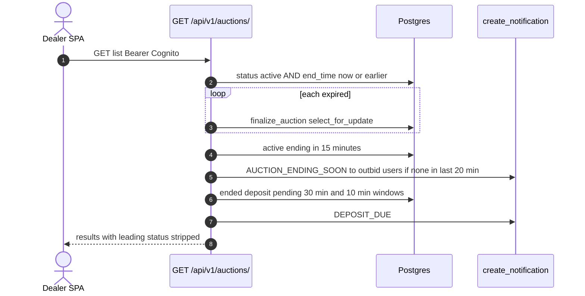
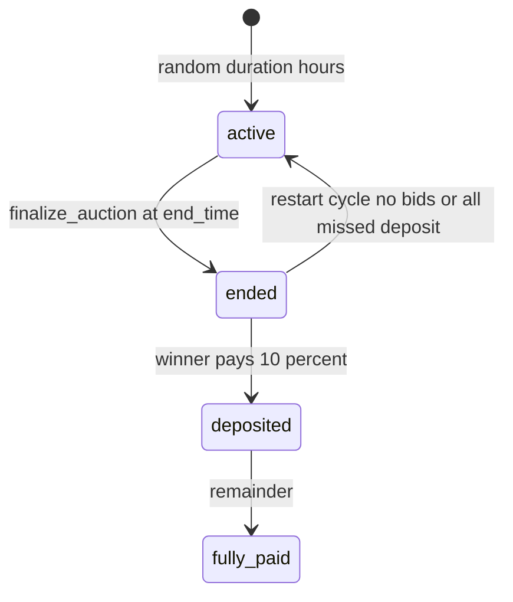

# 1. Overview and Business Intent

Dealers bid on `auctions_auction` rows. Duration at create is random from 4, 3, 2, 1, or 0.5 hours (`get_random_auction_duration`). Deposit is 10 percent of winning price with a 4 hour deadline (model). Remainder payment uses `payment_deadline`. There is **no** auction WebSocket in this ViewSet. Near-real-time is `GET /auctions/updates/?since=` documented as a 30 second poll.

**Actors:** SPA auction pages; `finalize_auction` on the model (SELECT FOR UPDATE); `create_notification`.

**Target files:** `backend/auctions/views.py`, `serializers.py` (`PlaceBidSerializer`), `models.py`, `urls.py` router `auctions`. Dual `/api/v1/` and `/api/`.

Auth: `IsAuthenticated`. Lookup `auction_id`. Page size 20, max 100.

---

# 2. End-to-End Flow and Sequence Diagram





`list`, `create`, `update`, `partial_update`, `destroy`, `head` on the **collection** all call `_handle_auction_list`. DELETE `/api/v1/auctions/` does **not** delete auctions; it returns the list JSON.

---

# 3. Detailed API Contracts

### GET `/api/v1/auctions/`

`get_queryset` **writes**: `finalize_auction()` for `status=active` and `end_time` less than or equal now. Then notification scans (15 min ending, 30 min deposit, 10 min deposit). Dedup uses Notification filters on `metadata__auction_id` and `metadata__type` plus a sent\_at window (20 min / 45 min).

After serialize, items with `status == 'leading'` are **dropped** from the page. That `status` is a **computed serializer field** (user is currently highest), not DB `Auction.status`. Outbidded items are moved to the front (`_prioritize_outbidded`). Fetch cap `max_fetch = 500`. Count is `len(filtered_data)` after that cap, so total can be wrong above 500.

Filters live in `_apply_filters` (brand, model, location, price, search, etc.). Sort in `_apply_sorting`.

### POST `/api/v1/auctions/:id/place_bid/`

Body `bid_amount` integer. If auction active but `now >= end_time`, view calls `finalize_auction` then 400 `Auction has ended`. Serializer `PlaceBidSerializer.create` has **no** `select_for_update`. It reads `current_price` (or `start_price` if 0/None), requires `bid_amount >= current + 100000`, INSERTs `Bid` with `date=date.today()`, then `auction.current_price = bid_amount; auction.save()`. Concurrent bids can both pass the increment check.

201 body: BidSummary plus `current_price` string, `is_leading`, message. Leading notify `create_notification` is **commented out**. Outbid notify still runs in the serializer.

### POST `/api/v1/auctions/:id/place_fast_bid/`

No body amount. `base_price = max(current_price, start_price)` then plus **100000**. Reuses PlaceBidSerializer. Fast-bid path does not call finalize-if-expired before serializer (place\_bid does). 500 if computed amount is not positive.

### Other actions

| Method | Path | Notes |
| --- | --- | --- |
| GET | `/api/v1/auctions/:id/` | retrieve even if expired |
| GET | `.../my_bids/` | auctions the user bid on |
| GET | `.../watched/` | WatchedAuction |
| POST | `.../:id/watch/` | add watch |
| DELETE | `.../:id/unwatch/` | 200 removed or 404 not in list |
| GET | `.../:id/bids/` | all bids |
| GET | `.../filter_options/` | brands models etc. |
| GET | `.../my_auctions/` | user-centric statuses |
| GET | `.../updates/?since=` | unix int required |
| GET | `.../:id/bid_history/` | action `pk=None` while lookup is auction\_id |

`updates`: missing `since` 400 `Missing "since" parameter`. Non-int 400 `Invalid timestamp format`. Auctions `event_timestamp__gt` since. Bids `created_at__gt` `datetime.fromtimestamp(since)` (**naive**, compared to aware `created_at` can 500 or miss rows). `distinct('auction_id')` needs PostgreSQL.

Watch 404 body is `message: Auction not in watch list` not DRF detail.

| HTTP Code | Error | Trigger |
| --- | --- | --- |
| 400 | Auction has ended | place\_bid after finalize |
| 400 | Gia dau gia phai cao hon... | increment 100000 |
| 400 | Phien dau gia khong con hoat dong | serializer create |
| 404 | Auction not in watch list | unwatch |
| 500 | Invalid bid amount calculated | fast bid math |

---

# 4. Database Schema and Locks

`finalize_auction` (models.py) uses `Auction.objects.select_for_update().get(auction_id=...)`. **place\_bid does not.** GET list finalize is per-row method calls (lock inside finalize).

```sql
CREATE TABLE auctions_auction (
    auction_id UUID PRIMARY KEY,
    bike_id UUID NOT NULL,
    start_price INTEGER,
    current_price INTEGER,
    start_time TIMESTAMPTZ,
    end_time TIMESTAMPTZ,
    status VARCHAR(32),
    deposit_status VARCHAR(32),
    payment_status VARCHAR(32),
    delivery_status VARCHAR(32),
    deposit_deadline TIMESTAMPTZ,
    payment_deadline TIMESTAMPTZ,
    event_timestamp BIGINT,
    winning_bid_id UUID
);

CREATE TABLE auctions_bid (
    bid_id UUID PRIMARY KEY,
    auction_id UUID NOT NULL,
    user_id UUID,
    bid_amount INTEGER,
    is_winner BOOLEAN,
    date DATE,
    created_at TIMESTAMPTZ
);
```

Bid.date default elsewhere is the literal `2024-01-01` on the model; PlaceBidSerializer overrides with `date.today()`.

Restart: no bids then new random duration; all missed deposit then `_restart_new_cycle(duration_hours=4)`.

---

# 5. Frontend and UI Logic

SPA must not treat GET list as read-only. Opening the auction tab can expire auctions and push OneSignal.

`autoReminderService.ts` independently timers: winning popup after 5s, deposit at 30 min and 10 min, payment at 24h, persisted in localStorage keys `autoReminder_*`. Backend GET list also sends deposit 30/10 notifications. Duplicate UX is possible.

Push `action_url` uses `/home/auction/` which is **not** a SPA route (`/homepage/...`).

Polling `updates` every 30s is the documented live sync, not a stream.

---

# 6. Edge Cases and Resilience

1. Collection DELETE/PUT/PATCH equal GET. A misissued DELETE will not remove data; it lists.
2. Dropping serializer `leading` hides auctions the current user is winning from the main list.
3. 500 cap means page `count` lies for large catalogs.
4. Bid races without FOR UPDATE: two 100000 increments can both commit; last `auction.save()` wins current\_price; both Bid rows remain.
5. `print` debug lines in PlaceBidSerializer and views go to container logs.
6. `bid_history` declared `pk=None`; if DRF does not bind `auction_id`, get\_object can 404.
7. Naive fromtimestamp on `updates` bids filter is timezone-unsafe on Aurora with USE\_TZ.