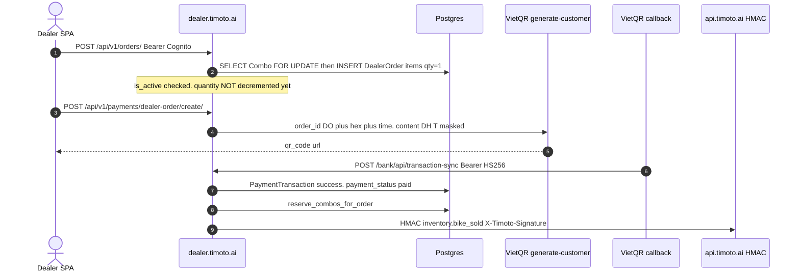

# 1. Overview & Business Intent

Dealer SPA browses Combo inventory and pays via VietQR. Mobile can create a shared Checkout on the dealer backend (S2S) so one QR engine serves both channels. Inventory is **not** reserved at `POST /orders/`. Combos hide only after VietQR marks the dealer order paid.

**Actors:** Dealer SPA (Cognito JWT), TMA mobile (`X-Timoto-Service-Key`), VietQR bank callback (HS256 Bearer), outbound HMAC `X-Timoto-Signature` to TMA.

**Target files:** `backend/catalog/views.py`, `backend/payments/views.py`, `checkout_views.py`, `checkout_service.py`, `orders/inventory_views.py`, `orders/combo_inventory.py`. Dual mount `/api/v1/` and `/api/`.

Auth is AWS Cognito JWT (`users.authentication.CognitoAuthentication`, RS256, audience `APP_CLIENT_ID`). It is not SIMPLE\_JWT. Missing `kid` is skipped so VietQR HS256 tokens are not treated as Cognito.

---

# 2. End-to-End Flow and Sequence Diagram




---

# 3. Detailed API Contracts

S2S secret: `TIMOTO_CHECKOUT_S2S_SECRET` or `TIMOTO_CHECKOUT_HMAC_SECRET`. Empty secret always deny. 401 exact: Invalid or missing X-Timoto-Service-Key.

HMAC outbound body uses `json.dumps` with separators comma-colon, then `hmac.new` sha256 hexdigest. Header `X-Timoto-Signature`.

### Catalog (JWT except PublicCatalogViewSet AllowAny)

Lookup `combo_id`. Pagination `page_size=20`, max 100. List: `is_active=True` AND `bikes__isnull=False`.

| Method | Path | Notes |
| --- | --- | --- |
| GET | `/api/v1/catalog/bikes/` | filters brand/model/category/location/price |
| POST | `/api/v1/catalog/bikes/` | 400 Combo must have at least one bike |
| GET | `/api/v1/catalog/bikes/` plus combo\_id | 404 Combo not found. |
| GET | similar | max 4 |
| POST | media | media\_url plus items array |
| GET | `/api/v1/catalog/filter-options/` | brands/models/categories |

Public twins: `/api/v1/catalog/public/bikes/` AllowAny including write.

### Checkout S2S

POST `/api/v1/payments/checkouts/` 201. Fields: channel mobile or dealer; listing\_type bike, combo, auction; payment\_purpose deposit, remaining, full, dealer\_order; listing\_id UUID; amount int greater than 0; mobile requires `ref.mobile_order_id`. TTL default 30 minutes. `paid_hook_url` is not in the HTTP response.

POST qr extra `payment_method` vietqr. 400 Checkout is already paid.

### Dealer VietQR create

POST `/api/v1/payments/dealer-order/create/` body `dealer_order_id` UUID. Content `DH` plus masked\_order\_code, max 23 chars. `order_id` is `DO` plus uuid hex 7 plus time last 4, max 13. `qr_type=0`. Auction deposit is `int(round(winning_price * 0.1))`.

### VietQR callback

POST `/bank/api/transaction-sync` AllowAny plus Bearer HS256 `SECRET_KEY`. Required: amount, content, bankaccount, transType, transactionid, transactiontime, referencenumber, orderId. transType must be C else 200 ignore debit. Callback does not use `select_for_update`.

| HTTP Code | Error | Trigger |
| --- | --- | --- |
| 401 | Invalid or missing X-Timoto-Service-Key. | S2S |
| 400 | paid\_hook\_url not in allowlist | checkout create |
| 400 | Order already has a pending payment | pending txn exists |
| 403 | You are not the auction winner | deposit or full |
| 400 | INVALID\_AMOUNT | amount mismatch |

Allowlist default: `https://api.timoto.ai/api/v1/internal/payments/checkout-paid/` and staging twin. POST `/api/v1/internal/inventory/bike-unavailable/` v1 only. No FOR UPDATE.

---

# 4. Database Schema and Locks

| Location | Query |
| --- | --- |
| ensure\_checkout\_qr | Checkout.objects.select\_for\_update().get |
| mark\_checkout\_paid | same |
| orders.views.create | Combo.objects.select\_for\_update().get |
| finalize\_auction | Auction.objects.select\_for\_update().get |
| payments views / inventory / catalog | none |

`reserve_combo`: if quantity is 1 or less then `is_active=False` and `quantity=0`; else decrement quantity by 1. Held when delivery\_status is delivering or delivered AND payment\_status is paid.

```sql
UPDATE catalog_combo SET is_active = false, quantity = 0
WHERE combo_id = $1;
```

Checkout `order_id` is `MO` plus uuid hex 7 plus time last 4. VietQR generate POST `https://dev.vietqr.org/vqr/api/qr/generate-customer`. Bank default MB account `0369053640`.

---

# 5. Frontend and UI Logic

SPA `timoto_dealer_portal_v2` uses server `can_*` flags on orders. PublicCatalogViewSet AllowAny means unauthenticated clients can POST or DELETE if that route is exposed.

Notify mobile paid event `checkout.paid` only when channel is mobile and `hook_notified_at` is null. Timeout 10s. No retry queue.

---

# 6. Edge Cases and Resilience

1. Dual prefix `/api/` and `/api/v1/`.
2. Combo reservation happens after pay, so two dealers can create orders on the same combo until first VietQR success.
3. Callback without row lock can double-process unless status already success.
4. HMAC is outbound only. Inbound S2S is a shared static key compared with `hmac.compare_digest`.
5. `validate_callback` in `vietqr.py` is not called by `vietqr_callback`.
6. Settings contain default VietQR callback username and password in source. Override in prod env.