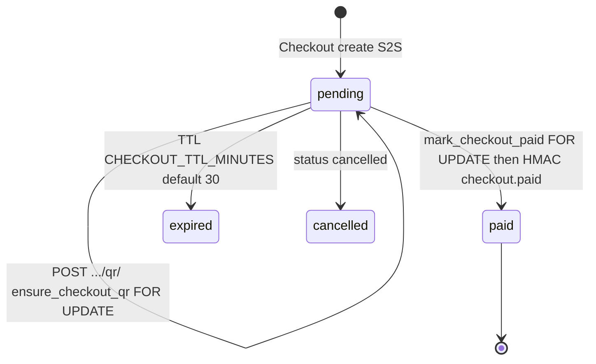

# 1. Overview & Business Intent

Dealer SPA browses `Combo` inventory and pays via VietQR. Mobile can create a **shared Checkout** on the dealer backend (S2S) so one QR engine serves both channels. Inventory is **not** reserved at `POST /orders/`. Combos hide only after VietQR marks the dealer order **paid**.

**Actors:** Dealer SPA (Cognito JWT), TMA mobile (S2S `X-Timoto-Service-Key`), VietQR bank callback (HS256 Bearer), outbound HMAC `X-Timoto-Signature` to TMA.

**Target files:** `backend/catalog/views.py`, `backend/payments/views.py`, `checkout_views.py`, `checkout_service.py`, `orders/inventory_views.py`, `orders/combo_inventory.py`, dual mount `/api/v1/` and `/api/`.

Auth is **AWS Cognito JWT** (`users.authentication.CognitoAuthentication`, RS256, audience `APP_CLIENT_ID`). It is **not** SIMPLE\_JWT. Missing `kid` is skipped so VietQR HS256 tokens are not treated as Cognito.

---

# 2. End-to-End Flow & Sequence Diagram

```mermaid
sequenceDiagram
  autonumber
  actor Dealer as Dealer SPA
  participant API as dealer.timoto.ai
  participant DB as Postgres
  participant VQR as VietQR generate-customer
  participant Bank as VietQR callback
  participant TMA as api.timoto.ai HMAC

  Dealer->>API: POST /api/v1/orders/ Bearer Cognito
  API->>DB: SELECT Combo FOR UPDATE; INSERT DealerOrder items qty=1
  Note over API: is_active checked; quantity NOT decremented yet
  Dealer->>API: POST /api/v1/payments/dealer-order/create/ {dealer_order_id}
  API->>VQR: order_id DO+7hex+time content DH T#####
  VQR-->>Dealer: qr_code url
  Bank->>API: POST /bank/api/transaction-sync Bearer HS256
  API->>DB: PaymentTransaction success; payment_status=paid
  API->>DB: reserve_combos_for_order
  API->>TMA: HMAC inventory.bike_sold X-Timoto-Signature
```



---

# 3. Detailed API Contracts

S2S secret: `TIMOTO_CHECKOUT_S2S_SECRET` or `TIMOTO_CHECKOUT_HMAC_SECRET`. Empty secret → always deny. 401 exact: `("detail"  "Invalid or missing X-Timoto-Service-Key.")`

HMAC outbound body: `json.dumps(payload, separators=(',', ':'), ensure_ascii=False).encode('utf-8')` then `hmac.new(secret, body, sha256).hexdigest()`. Header `X-Timoto-Signature`. Secret `TIMOTO_CHECKOUT_HMAC_SECRET`.

### Catalog (JWT except PublicCatalogViewSet AllowAny)

Lookup `combo_id`. Pagination `page_size=20`, max 100. List: `is_active=True` AND `bikes__isnull=False`.

| Method | Path | Notes |
| --- | --- | --- |
| GET | `/api/v1/catalog/bikes/` | filters brand/model/category/location/price\_min/max/search/condition/warranty/ordering |
| POST | `/api/v1/catalog/bikes/` | 400 `Combo phải có ít nhất một xe (bike_ids không được rỗng).` |
| GET | `/api/v1/catalog/bikes/<combo_id>/` | 404 `Combo not found.` |
| GET | `.../similar/` | max 4 |
| POST | `.../media/` | `(media_url, media_type, sort_order)` or `(items [...])` |
| GET | `/api/v1/catalog/filter-options/` | brands/models/categories/locations/price\_range/conditions |

`ordering_map`: `price_low` → `price`; `newest` → `-created_at`. Invalid ordering → `-created_at`.

Warranty display: `Còn bảo hành` / `Hết bảo hành` / `Không rõ`. Condition display: `Như mới` / `Khá mới` / `Tốt` / `Khá tốt` / `Cũ` / `Rất cũ`. `delivery_fee` JSON is `"Miễn phí"` if 0 else integer.

Public twins: `/api/v1/catalog/public/bikes/` **AllowAny including write**.

### Checkout S2S

POST `/api/v1/payments/checkouts/` 201. Fields: `channel` mobile|dealer; `listing_type` bike|combo|auction; `payment_purpose` deposit|remaining|full|dealer\_order; `listing_id` UUID; `amount` int \> 0; mobile requires `ref.mobile_order_id`. Created `expires_at=now+CHECKOUT_TTL_MINUTES` (default 30). Serialize keys: `checkout_id, channel, listing_type, listing_id, payment_purpose, amount, currency, status, ref, buyer_user_id, qr_code, vietqr_order_id, order_id, transaction_id, expires_at, created_at, paid_at`. **`paid_hook_url` is not in the HTTP response.**

POST `.../qr/`: extra `"payment_method": "vietqr"`. 400 `"Checkout is already paid."` / `"Checkout cannot create QR in status=:status."`

### Dealer VietQR create

POST `/api/v1/payments/dealer-order/create/` body `("dealer_order_id"  "<uuid>")`. 400 `Đơn hàng không thể thanh toán ở trạng thái hiện tại.` if `payment_status != pending`. Content `DH :masked_order_code` max 23. `order_id = 'DO' + uuid_hex[:7] + time[-4:]` max 13. `qr_type=0`.

Auction deposit: `int(round(winning_price * 0.1))`; full: remainder. VNPay IPN `RspCode=00` Confirm Success; `04` Invalid amount.

### VietQR callback

POST `/bank/api/transaction-sync` AllowAny \+ Bearer HS256 (`SECRET_KEY`). Required: `amount, content, bankaccount, transType, transactionid, transactiontime, referencenumber, orderId`. `transType` must be `'C'` else 200 ignore debit. **Callback does not use `select_for_update`.** Missing `orderId` still 400 `MISSING_FIELDS` even if regex extracts 13 chars from content.

| HTTP Code | Error | Trigger |
| --- | --- | --- |
| 401 | `Invalid or missing X-Timoto-Service-Key.` | S2S |
| 400 | `paid_hook_url` not in allowlist | checkout create |
| 400 | `Order này đã có payment đang xử lý.` | pending txn exists |
| 403 | `Bạn không phải người thắng đấu giá` | deposit/full |
| 401 | callback `UNAUTHORIZED` | missing/invalid Bearer |
| 400 | `INVALID_AMOUNT` | amount mismatch |

Allowlist default (if env empty): `https://api.timoto.ai/api/v1/internal/payments/checkout-paid/` and staging twin, plus `MOBILE_CHECKOUT_PAID_URL`. Normalize `strip().rstrip('/') + '/'`.

POST `/api/v1/internal/inventory/bike-unavailable/` **v1 only**. Body `bike_id`. Sets matching combos `is_active=False`, `quantity=0`. **No FOR UPDATE.**

---

# 4. Database Schema & Locks

| Location | Query |
| --- | --- |
| `ensure_checkout_qr` | `Checkout.objects.select_for_update().get(pk=checkout.pk)` |
| `mark_checkout_paid` | same |
| `orders.views.create` | `Combo.objects.select_for_update().get(pk=d['combo'].pk)` |
| `finalize_auction` | `Auction.objects.select_for_update().get(auction_id=...)` |
| payments views / inventory / catalog | **none** |

`reserve_combo`: if `quantity <= 1` then `is_active=False`, `quantity=0`; else `quantity -= 1`. Held when parent `delivery_status IN ('delivering','delivered')` AND `payment_status='paid'`. Cancel `release_combos_for_order` inside `transaction.atomic()`.

VietQR generate POST `https://dev.vietqr.org/vqr/api/qr/generate-customer` (prod `api.vietqr.org`). Defaults: bank `MB`, account `0369053640`, name `LE THI MAI HUONG`. Token cache `vietqr_access_token`. Local EMV if `VIETQR_USE_LOCAL_QR=True`.

Checkout `order_id = 'MO' + uuid_hex[:7] + time[-4:]`.

```sql
-- Checkout lock is ORM select_for_update, not a DB trigger
-- Combo hide: UPDATE catalog_combo SET is_active=false, quantity=0 WHERE ...
```

---

# 5. Frontend & UI Logic

SPA `timoto_dealer_portal_v2`: catalog list uses server `can_*` on orders. `PublicCatalogViewSet` AllowAny means unauthenticated clients can POST/DELETE if that route is exposed — treat as a threat model, not a feature flag.

Notify mobile paid payload `event: checkout.paid` only when `channel=='mobile'` and `hook_notified_at` is null. Timeout 10s. 2xx sets `hook_notified_at`. **No retry queue.**

---

# 6. Edge Cases & Resilience

1. Dual prefix `/api/` and `/api/v1/` — clients must not assume one.
2. Combo reservation **after pay**, so two dealers can create orders on the same combo until first VietQR success.
3. Callback without row lock can double-process unless `status` already success (`Order already processed`).
4. HMAC is outbound only; inbound S2S is a shared static key compared with `hmac.compare_digest`.
5. `validate_callback` in `vietqr.py` is **not called** by `vietqr_callback`.
6. Settings contain default VietQR callback username/password in source (`TiMotoAI` / `TiMotoDev2025`) — override in prod env.