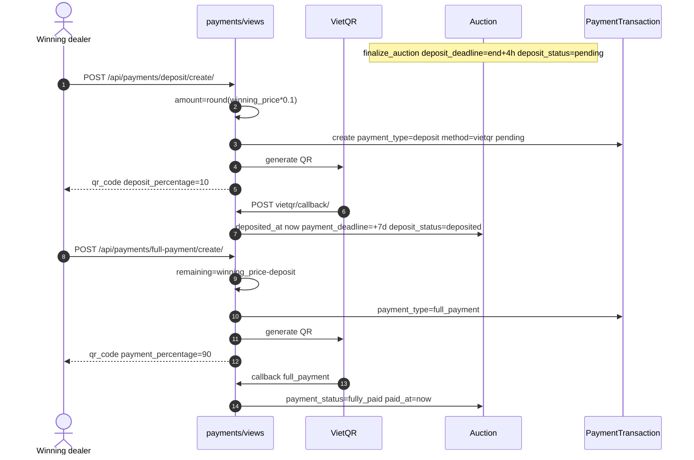
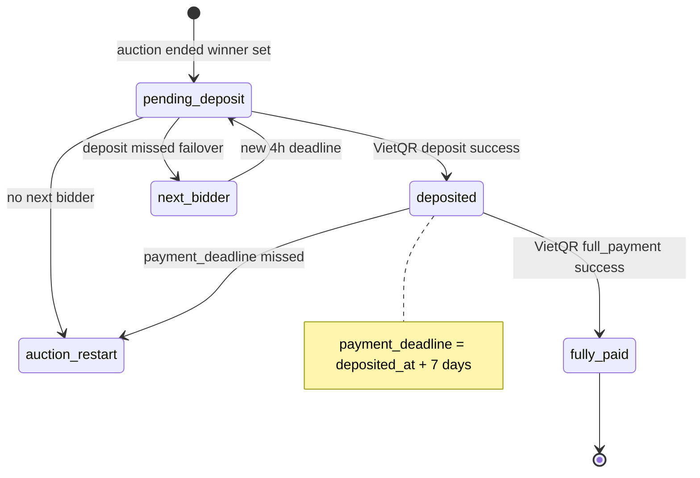

## 1. Overview & Business Intent

Dealer Portal backend implements auction **deposit (10%)** then **remainder / full payment (90%)** as ordinary VietQR bank transfers into TiMoto’s configured account, with auction status flags updated on callback. This is **not** an escrow hold/release trust-account product.

**Escrow absence (evidence)**

- `rg -i escrow` across `/Users/toannguyen/timoto-dealer-portal` → **0 matches**.
- No escrow table, no hold/release API, no trustee state machine.
- Title of this page uses “deposit flow” because product language often says “escrow”; code truth is VietQR `PaymentTransaction` with `payment_type` `deposit` | `full_payment`.

**Business intent**

1. Winner pays 10% within deposit deadline (code: **4 hours** after auction end / failover).
2. On VietQR success → `deposit_status=deposited`, start **7-day** full-payment window.
3. Winner pays remaining 90% via second VietQR; callback sets `payment_status=fully_paid`.
4. Missed deposit → mark bid `deposit_failed`, promote next bidder or restart cycle. Missed full payment → notify and restart (deposit treated as forfeited in copy; no refund API).

**Core paths**

| Role | Path |
| --- | --- |
| Deposit / full create \+ callback | `backend/payments/views.py` |
| VietQR client | `backend/payments/vietqr.py` |
| Models | `backend/payments/models.py`, `backend/auctions/models.py` |
| Routes | `backend/payments/urls.py` mounted at `/api/payments/` and `/api/v1/payments/` |
| Auction finalize / deadlines | `backend/auctions/models.py`, `backend/auctions/views.py` |

**Frontend gap**

- `timoto-dealer-portal/frontend/` is empty (no SPA source).
- `timoto_dealer_portal_v2` `paymentApi` only calls dealer-order create — **no** `deposit/create` or `full-payment/create` callers found. Reminders in `autoReminderService.ts` are client timers only.

---

## 2. End-to-End Flow & Sequence Diagram

Deposit amount: `int(round(auction.winning_price * 0.1))`. Remainder: `int(auction.winning_price - deposit_amount)` to avoid rounding drift. Response fields: `deposit_percentage: 10`, `payment_percentage: 90`.





Timers (code of record, not stale docs): deposit window `end_time + 4 hours`; next-winner deposit `now + 4 hours`; full payment `deposited_at + 7 days`. Lifecycle docs that say 2h deposit are **stale**.

---

## 3. Detailed API Contracts

Bases: `/api/payments/` and `/api/v1/payments/` (same urls module).

| Method | Path | Auth | Purpose |
| --- | --- | --- | --- |
| POST | `deposit/create/` | JWT | 10% VietQR \+ optional delivery fields |
| POST | `full-payment/create/` | JWT | 90% VietQR |
| GET | `status/<auction_id>/` | JWT | deposit/payment/delivery \+ txs |
| GET | `delivery/<auction_id>/` | JWT | delivery info |
| GET | `deposit/confirmation/<auction_id>/` (\+ `/pdf/`) | JWT | after deposited |
| GET | `full-payment/confirmation/<auction_id>/` (\+ `/pdf/`) | JWT | after fully\_paid |
| POST | `vietqr/callback/` | VietQR Basic | mark paid \+ update auction |
| POST | `token_generate/` | VietQR Basic | VietQR dashboard token |
| GET | `vnpay/return/`, `vnpay/ipn/` | AllowAny | legacy VNPay |

**Deposit request fields:** `auction_id`, optional `contact_person`, `contact_phone`, `delivery_address`, `delivery_notes`, `scheduled_pickup_date` (DD/MM/YYYY or YYYY-MM-DD), `scheduled_pickup_time` (HH:MM). Delivery writes `DeliveryInformation` only — explicitly does **not** mutate user profile address fields.

**Deposit success (live shape):** `payment_method=vietqr`, `qr_code` data-URL, `order_id` (≤13 chars), `amount`, `deposit_percentage=10`, `auction_id`, `payment_deadline` (deposit deadline ISO), `transaction_id`, `bike`, `winning_price`, `pickup_schedule`.

**Full-payment success:** `payment_percentage=90`, remaining amount, prior deposit total.

Shared Checkout (`POST checkouts/`) can store `listing_type=auction` and `payment_purpose=deposit|remaining`, but the **auction FSM is driven by** deposit/full-payment create \+ VietQR callback — not Checkout paid-hooks.

**Error matrix — deposit create**

| Condition | HTTP | Payload (VN / EN) |
| --- | --- | --- |
| Not winner | 403 | Bạn không phải người thắng đấu giá |
| Already deposited | 400 | Đã thanh toán đặt cọc |
| Past deposit\_deadline | 400 | Hết hạn thanh toán đặt cọc |
| Auction missing | 404 | Không tìm thấy đấu giá |
| VietQR generate fail | 500 | Không thể tạo mã thanh toán \+ message |
| Other | 500 | Không thể tạo thanh toán |

**Error matrix — full-payment create**

| Condition | HTTP | Note |
| --- | --- | --- |
| Not winner | 403 |  |
| `deposit_status` ≠ deposited | 400 | Chưa thanh toán đặt cọc |
| already fully\_paid | 400 | Đã thanh toán đầy đủ |
| Auction missing | 404 |  |
| VietQR fail | 500 | same family as deposit |

**VietQR callback `errorReason` codes:** `UNAUTHORIZED`, `MISSING_FIELDS`, `INVALID_AMOUNT`, `INVALID_TRANSACTION`, `TRANSACTION_FAILED`. Soft success paths exist for non-credit `transType`, unknown tx, already processed.

Legacy VNPay return/IPN codes remain in views for old clients; deposit **create** always uses `payment_method='vietqr'` and returns `qr_code`, not VNPay `payment_url`.

---

## 4. Database Schema & State Transitions

Logical auction payment fields (`auctions.Auction`):

```sql
-- Excerpt of auction payment-related columns
ALTER TABLE auctions_auction ADD COLUMN IF NOT EXISTS deposit_deadline TIMESTAMP NULL;
ALTER TABLE auctions_auction ADD COLUMN IF NOT EXISTS deposit_status VARCHAR(32);
  -- pending | deposited | no_deposit (choice); live miss path rarely persists no_deposit
ALTER TABLE auctions_auction ADD COLUMN IF NOT EXISTS deposited_at TIMESTAMP NULL;
ALTER TABLE auctions_auction ADD COLUMN IF NOT EXISTS payment_deadline TIMESTAMP NULL;
ALTER TABLE auctions_auction ADD COLUMN IF NOT EXISTS payment_status VARCHAR(32);
  -- pending | no_payment | fully_paid
ALTER TABLE auctions_auction ADD COLUMN IF NOT EXISTS paid_at TIMESTAMP NULL;
ALTER TABLE auctions_auction ADD COLUMN IF NOT EXISTS delivery_status VARCHAR(32);
  -- pending | delivery_waiting | delivered
ALTER TABLE auctions_auction ADD COLUMN IF NOT EXISTS delivered_at TIMESTAMP NULL;
ALTER TABLE auctions_auction ADD COLUMN IF NOT EXISTS winning_price NUMERIC NULL;
```

`auctions.Bid`: `is_winner`, `deposit_failed`, `deposit_deadline`.

`payments.PaymentTransaction`: FK `auction` (nullable), `payment_type` in `deposit`, `full_payment`, `dealer_order`, `checkout`, `refund`; `payment_method` in `vietqr`, `vnpay`; integer VND `amount`; VietQR fields `vietqr_order_id`, `vietqr_qr_code`, `vietqr_content`; status pending→success via callback.

`payments.DeliveryInformation`: OneToOne → Auction; contact/address/pickup schedule saved at deposit create.

**Important transition notes**

- Choice `deposit_status=no_deposit` exists, but `check_deposit_deadline` primarily sets `deposit_failed` on bids and failover/restarts rather than leaving the auction parked at `no_deposit`.
- VietQR full-payment success sets `fully_paid` but **does not** set `delivery_waiting` / `delivered`.
- `refund` appears in `PAYMENT_TYPE_CHOICES` only — no refund view/function found for auction deposit.
- Migration help\_text may still say payment deadline “\+ 4 hours”; **runtime uses 7 days**.

---

## 5. Frontend & UI Logic (if applicable)

| Location | Finding |
| --- | --- |
| `timoto-dealer-portal/frontend/` | Empty — no UI source in this repo |
| v2 `APIs.ts` / `paymentApi` | Dealer-order VietQR/COD only |
| v2 `PaymentQRCode.tsx`, `ConfirmationPay.tsx` | Combo checkout, not auction deposit |
| v2 `autoReminderService.ts` | Client-side reminder timers for winning / deposit / payment windows |
| v2 `messages.ts` | Orphaned `depositSuccess` / `depositFailed` strings vs current pages |
| Backend notification deep links | May still mention `/home/auction/id` or `/payment` — not v2 `/homepage/bikes` routes |

**Conclusion for implementers:** backend deposit/full-payment APIs are production-capable; shipping a dealer-facing auction pay UI requires a new SPA integration (or revive orphaned strings). Do not document a live escrow UI that does not exist.

Combo/catalog VietQR is a **separate** flow (`catalog-checkout-vietqr.mdx`); do not merge it with auction deposit FSM.

---

## 6. Edge Cases & Resilience

1. **No escrow** — funds are bank transfers; “forfeit deposit” on miss is product copy \+ auction restart, not an escrow release API.
2. **Rounding** — deposit uses `round(* 0.1)`; remainder subtracts deposit from winning price.
3. **Order ID length** — VietQR order ids capped at 13 chars (deposit vs full-payment `FP` suffix scheme in views).
4. **Delivery vs profile** — deposit create defensively restores user profile address if somehow mutated.
5. **Duplicate pay** — already deposited / fully\_paid → 400.
6. **Deadline race** — create checks `now > deposit_deadline` before QR generation.
7. **Callback idempotency** — already-processed transactions soft-succeed without double-applying.
8. **Amount mismatch** — callback `INVALID_AMOUNT` when amount ≠ pending tx.
9. **Doc drift** — ignore 2h deposit and VNPay-only guides when coding against `payments/views.py`.
10. **Checkout parallel** — storing `auction_id` on Checkout does not advance auction deposit\_status by itself.
11. **OTP** — dealer Cognito/OTP login exists under `users/` for auth; it is **not** part of the auction deposit payment machine (do not invent OTP confirm for VietQR success — callback is authoritative).
12. **SELECT FOR UPDATE** — not part of the documented deposit create path in the escrow-absent payment flow; do not invent row locks here.

**Bottom line:** document and integrate **10% VietQR deposit \+ 90% full-payment**, cite `payments/views.py` lines computing `* 0.1`, and state clearly that **escrow does not exist in this codebase**.