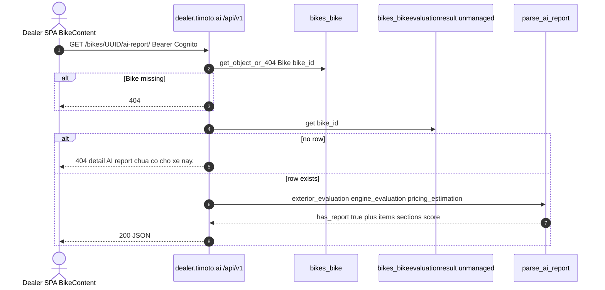
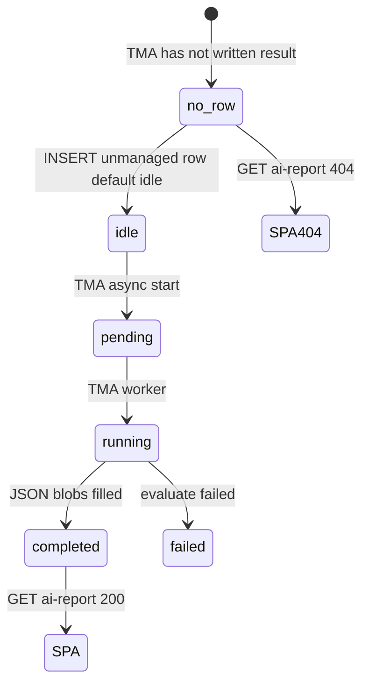

# 1. Overview and Business Intent

Dealer SPA bike detail (`BikeContent.tsx`) shows **Bao cao dinh gia AI**. That UI does **not** read `evaluations.BikeEvaluation`. It calls `GET /api/v1/bikes/:bike_id/ai-report/`, which loads `bikes.BikeEvaluationResult` (unmanaged table `bikes_bikeevaluationresult`, comment: written by the TMA AI pipeline) and maps JSON through `evaluations.parsers.parse_ai_report`.

**Actors:** Dealer SPA Cognito JWT; TMA evaluate worker that writes the unmanaged row; Django admin / dummy populate for the unused SCD table.

**Target files:** `backend/evaluations/views.py`, `parsers.py`, `models.py`, `serializers.py`, `urls.py`, `backend/bikes/models.py` (`BikeEvaluationResult`), `backend/bikes/views.py` (`BikeAssessmentViewSet`), FE `frontend/src/api/APIs.ts` `evaluationApi`, `pages/v2/BikeContent.tsx`, `components/AiReportSection.tsx`.

Mount: `timoto/urls.py` includes `evaluations.urls` **only** under `/api/v1/`. There is **no** `/api/bikes/:id/ai-report/` twin. Catalog combos live under `/api/v1/catalog/bikes/`. Assessment ViewSet lives under `/api/v1/bikes/` from `bikes.urls`.

Auth: `IsAuthenticated` plus default `CognitoAuthentication`. Missing JWT is 403/401 from DRF, not a custom Vietnamese body.

---

# 2. End-to-End Flow and Sequence Diagram





The GET handler **does not read** `evaluate_async_status`. A `failed` or `pending` row still 200s if the ORM row exists. `has_report` is hardcoded `True` inside the parser whenever a row is parsed.

`evaluations.BikeEvaluation` status machine (`price_offered`, `rejected_by_user`, `price_accepted`) is **not** on this HTTP path. Production writers of that table in this repo: `populate_dummy_data`, `clear_production_data`, Django admin, `sync_aurora_to_local.py` sample data. **No REST view creates SCD rows.**

---

# 3. Detailed API Contracts

### GET `/api/v1/bikes/:bike_id/ai-report/`

- Method GET only. `bike_id` UUID.
- 200 body keys from `parse_ai_report`: `bike_id`, `has_report`, `final_price_vnd`, `price_range`, `justification`, `condition_score`, `sections`, `items`, `raw`, `evaluated_at`.
- `final_price_vnd` = `pricing_estimation.final_buyback_price_vnd` cast to int, else null.
- `price_range` is an object with min and max from `pricing_estimation.market_anchor`, or null if both min and max are missing.
- `justification` = `pricing_estimation.justification`.
- `evaluated_at` = `result.updated_at.isoformat()` (Django `auto_now=True` on the unmanaged model; TMA must populate `updated_at` on the real table).
- `sections.exterior` and `sections.engine` are lists of objects with keys component, status, description.
- `status` mapping: `major_issues` to `error`, `minor_issues` to `warning`, `positive_aspects` to `good`.
- Dedup key is `(component_name, text)`. Empty text is dropped.
- Issue entries may be string or dict; dict prefers keys `issue`, `aspect`, `description`, `text`, `note`.
- JSON path for components: `section.technical_data.components_evaluation[]`.
- Fields **not parsed**: `engine_stage1_result`, `exhaust_smoke_evaluation`, `evaluate_client_payload`, `evaluate_client_http_status`, `evaluate_async_status`, `evaluate_async_started_at`.
- FE type `AiReportData` **omits** `raw`. Extra key is ignored by TS at compile time; UI never renders `raw`.

`condition_score`: average of `component_condition_score` across both sections. If **every** score is in range -1.0 to 1.0 inclusive, map with `int((avg + 1) / 2 * 100)` then clamp 0-100. Otherwise `int(avg)` clamped 0-100. No scores yields null.

| HTTP Code | Body | Trigger |
| --- | --- | --- |
| 200 | parser dict, has\_report true | Bike exists and result row exists |
| 404 | DRF NotFound for missing Bike | UUID not in bikes\_bike |
| 404 | detail: AI report chua co cho xe nay. | Bike exists, no BikeEvaluationResult |
| 401/403 | DRF default | missing or invalid Cognito JWT |

There is **no** 200 with `has_report: false`. FE comment "404 hoac has\_report=false deu xu ly giong nhau" is defensive; the backend never returns false.

### Unused serializer

`BikeEvaluationSerializer` exposes `valuation_price` as int from `final_price` else `estimated_highest_price_by_ai` else `estimated_lowest_price_by_ai`. **No view imports it.**

### BikeAssessmentViewSet `/api/v1/bikes/`

DRF `DefaultRouter` register `bikes`. Auth required. Pagination `page_size=20`, max 100. Lookup `bike_id`.

| Method | Path | Notes |
| --- | --- | --- |
| GET | `/api/v1/bikes/` | all Bike rows, optional `severity` good/warning/error, `search` on description/brand/model |
| GET | `/api/v1/bikes/:bike_id/` | full assessments ordered good then warning then error |
| GET | `/api/v1/bikes/:bike_id/assessments/` | bike\_id, bike\_name, assessments |
| POST | `/api/v1/bikes/:bike_id/create_assessment/` | body severity, description, category |
| GET | `/api/v1/bikes/summary/` | total\_bikes, bikes\_with\_assessments, assessment\_counts |
| DELETE | `/api/v1/bikes/:bike_id/` | ModelViewSet destroy **deletes the Bike row** |
| POST | `/api/v1/bikes/` | ModelViewSet create Bike |

Docstring mentions `update_assessment`; **that action is not implemented**. SPA catalog does not call this ViewSet (`evaluationApi` and `catalog` APIs only). Treat destroy-on-Bike as a live authenticated capability.

Assessment 404 body is error: Bike not found (not DRF `detail`). Create 400 is serializer errors.

---

# 4. Database Schema and Locks

No `select_for_update` on GET ai-report. Read-only.

Dealer `DATABASES['default']` when `USE_AURORA=True` uses `DB_NAME` default `timoto_dealer`. There is **no** `tma_db` router in this repo. Unmanaged `BikeEvaluationResult` therefore requires table `bikes_bikeevaluationresult` **in the same Postgres the dealer app uses**, with FK-compatible `bike_id` values that exist in dealer `bikes_bike`. Cross-cluster reads are not implemented here.

```sql
-- Unmanaged; TMA pipeline owns writes. Dealer GET only.
-- PK is bike_id (OneToOne).
CREATE TABLE bikes_bikeevaluationresult (
    bike_id UUID PRIMARY KEY REFERENCES bikes_bike(bike_id) ON DELETE CASCADE,
    exterior_evaluation JSONB,
    engine_stage1_result JSONB,
    exhaust_smoke_evaluation JSONB,
    engine_evaluation JSONB,
    pricing_estimation JSONB,
    evaluate_client_payload JSONB,
    evaluate_client_http_status INTEGER,
    evaluate_async_status VARCHAR(20) NOT NULL DEFAULT 'idle',
    evaluate_async_started_at TIMESTAMPTZ,
    updated_at TIMESTAMPTZ NOT NULL
);

-- Type-2 SCD table. PK is Django BigAutoField id, NOT (eval_id, event_timestamp).
CREATE TABLE evaluations_bikeevaluation (
    id BIGSERIAL PRIMARY KEY,
    eval_id UUID NOT NULL,
    event_timestamp BIGINT NOT NULL,
    date DATE NOT NULL,
    bike_id UUID NOT NULL REFERENCES bikes_bike(bike_id) ON DELETE CASCADE,
    user_id UUID NULL,
    estimated_lowest_price_by_ai NUMERIC(12,2),
    estimated_highest_price_by_ai NUMERIC(12,2),
    estimated_price_by_human NUMERIC(12,2),
    final_price NUMERIC(12,2),
    expires_at TIMESTAMPTZ,
    evaluation_details_by_ai JSONB NOT NULL DEFAULT '{}',
    evaluation_details_by_human JSONB NOT NULL DEFAULT '{}',
    step1_start_time TIMESTAMPTZ,
    step2_start_time TIMESTAMPTZ,
    step3_start_time TIMESTAMPTZ,
    step4_start_time TIMESTAMPTZ,
    submitted_time TIMESTAMPTZ,
    status VARCHAR(30) NOT NULL,
    rejected_reason VARCHAR(500),
    old_or_new VARCHAR(20),
    bike_type VARCHAR(20),
    under_warranty BOOLEAN,
    UNIQUE (eval_id, event_timestamp)
);

CREATE TABLE bikes_bikeassessment (
    assessment_id UUID PRIMARY KEY,
    bike_id UUID NOT NULL REFERENCES bikes_bike(bike_id) ON DELETE CASCADE,
    severity VARCHAR(20) NOT NULL,
    description TEXT NOT NULL,
    category VARCHAR(100),
    created_at TIMESTAMPTZ NOT NULL,
    updated_at TIMESTAMPTZ NOT NULL
);
```

SCD unique pair does **not** prevent `instance.save()` from updating the same `id` in place. True Type-2 requires INSERT of a new row with a new `event_timestamp`. No API enforces that.

`BikeAssessment.SEVERITY_CHOICES`: `good`, `warning`, `error`. Parser item `status` uses the same three strings, but assessments are **manual rows**, not derived from AI JSON.

Media type on dealer `BikeMedia` still includes `'picture'` (TMA dropped picture in favor of image). Unrelated to this GET but same `bikes` app.

---

# 5. Frontend and UI Logic

`evaluationApi.getAiReport` uses axios `baseURL` `/api/v1` (staging relative) plus path `/bikes/:id/ai-report/` with `skipAuth: false`.

`BikeContent.tsx` walks `bikeDetail.bikes[].bike_id` then `bike_ids`. First 200 with `has_report` wins. Catch-all on any throw (including 404) tries the next UUID. If none succeed, `aiReport` is null and the section is omitted.

`AiReportSection` colors: score null gray; score 80 and above green; 60 and above yellow; below 60 red. Labels: Tot / Can luu y / Can sua. Header copy **Bao cao dinh gia AI**. Justification in gray box. Footer date `dd/mm/yyyy` from `evaluated_at`. Does not display `final_price_vnd` or `price_range`.

CONTRACT.md in `timoto_dealer_portal_v2` has **no** `ai-report` section. SPA and backend are coupled only by this TypeScript interface.

---

# 6. Edge Cases and Resilience

1. Combo with multiple `bike_id`s: first bike that has a result hides later bikes' reports.
2. Empty JSON blobs still 200 `has_report` true with empty items and null score/price. UI shows header with no rows.
3. Mixed score scales: if one component is 0.8 and another is 75, the -1..1 branch is skipped and `int(avg)` can be a nonsense mid-range.
4. `get_object_or_404(Bike)` then a missing result is a different 404 shape than missing Bike (DRF default vs Vietnamese `detail`).
5. `/api/v1/bikes/` assessment list is **not dealer-scoped**. Any authenticated Cognito user can list every Bike and DELETE a Bike if they hit destroy.
6. `BikeEvaluationSerializer` and SCD statuses will mislead anyone grepping `evaluations` without reading `views.py` line 16: the import is `bikes.models.BikeEvaluationResult`.
7. Django `auto_now=True` on an unmanaged model does nothing unless dealer code calls `.save()`. TMA writers must set `updated_at` themselves or the column default does.
8. ai-report is v1-only. A client using legacy `/api/` prefix will not find this route (404 from auctions/notifications includes, not this view).