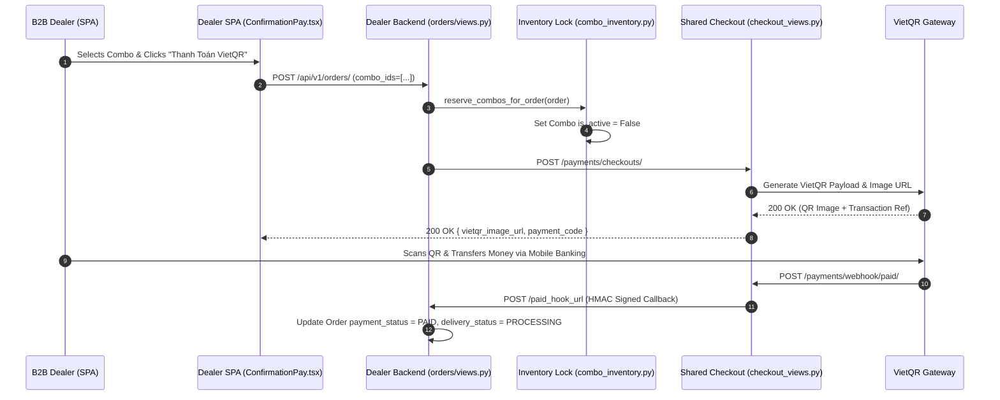
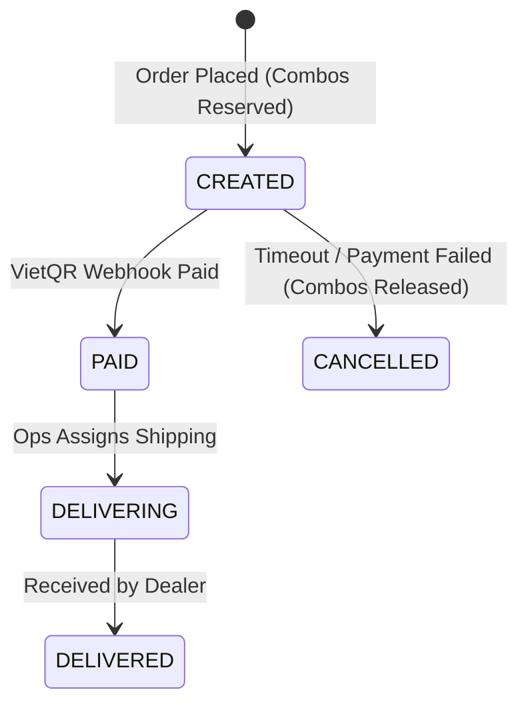

## 1. Overview & Business Intent

- **Business Role**: **timoto\_dealer\_portal\_v2** (SPA) & **timoto-dealer-portal** (Backend) allow authorized motorcycle dealers to browse curated multi-bike combos, verify AI inspection reports, and purchase inventory via automated VietQR payments.
- **Actors**: Authorized B2B Dealers, Dealer Ops Admin, Payment Gateway (VietQR), S2S Shared Checkout Service.
- **Target Repos**: `timoto_dealer_portal_v2` (`frontend/src/pages/HomePage.tsx`, `BikeContent.tsx`, `YourOrder.tsx`), `timoto-dealer-portal` (`backend/orders/combo_inventory.py`, `backend/payments/checkout_views.py`).

---

## 2. End-to-End Flow & Sequence Diagram



---

## 3. Detailed API Contracts

### A. Create Checkout Payment Session

- **HTTP Method & Route**: `POST /api/v1/payments/checkouts/`
- **Auth & Headers**: Bearer JWT (`Authorization: Bearer <IdToken>`).
- **Request Body**:
  ```json
  {
    "order_id": "11223344-5566-7788-9900-aabbccddeeff",
    "payment_method": "VIETQR",
    "amount_vnd": 65000000,
    "paid_hook_url": "https://dealer.timoto.ai/api/v1/orders/webhook/paid/"
  }
  ```
- **Success Response (200 OK)**:
  ```json
  {
    "checkout_id": "chk_8f9e0d1c2b3a",
    "vietqr_image_url": "https://img.vietqr.io/image/970407-19038475629011-compact.png?amount=65000000&addInfo=TIMOTO6ZMJ63",
    "payment_code": "TIMOTO6ZMJ63",
    "expires_at": "2026-08-18T18:30:00Z"
  }
  ```

---

## 4. Database Schema & State Machine

### Models (`combos`, `dealer_orders`, `checkouts`)



- **Safety Guard**: `reserve_combos_for_order` marks referenced combos as `is_active=False` within a `transaction.atomic()` block to prevent double-purchasing by competing dealers.