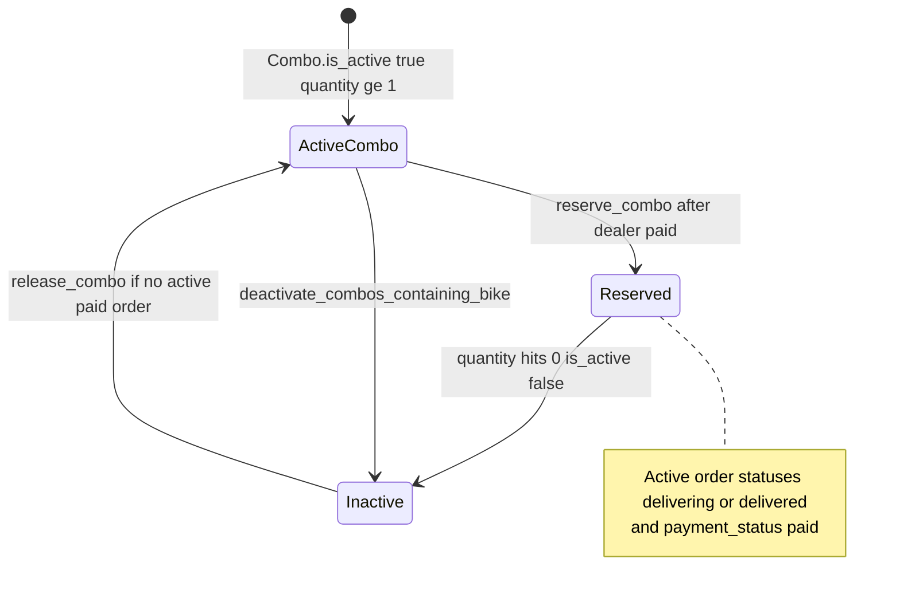

# 1. Overview and Business Intent

Dealers Hub catalogs bikes as `Combo` rows (many-to-many to `bikes.Bike`). When a dealer order is paid, Hub **reserves** combos (decrement quantity / deactivate). Separately, cross-channel Phase 2 S2S keeps Hub and mobile Buy-tab inventory aligned:

1. Mobile deposit paid → caller POSTs dealer ` /api/v1/internal/inventory/bike-unavailable/` with service key → Hub deactivates every active combo containing that `bike_id`.
2. Dealer combo paid → Hub POSTs mobile `MOBILE_BIKE_SOLD_URL` with HMAC body so Buy tab can soft-remove the same bikes.

**Actors:** Dealer payment webhook / VietQR success path, mobile checkout S2S (external caller), Hub Django `orders` \+ `catalog` apps.

**Target files:**

- `backend/orders/combo_inventory.py` — reserve/release/deactivate helpers
- `backend/orders/inventory_sync.py` — `verify_s2s_key`, `notify_mobile_bikes_sold`
- `backend/orders/inventory_views.py` — `bike_unavailable_view`
- `backend/timoto/urls.py` — route registration
- `backend/payments/views.py` — on dealer\_order paid: `reserve_combos_for_order` \+ `notify_mobile_bikes_sold`
- `backend/orders/views.py` — `release_combos_for_order` on cancel paths
- `backend/catalog/models.py` — `Combo`
- `backend/orders/tests_inventory.py`
- Settings: `MOBILE_BIKE_SOLD_URL`, `TIMOTO_CHECKOUT_S2S_SECRET`, `TIMOTO_CHECKOUT_HMAC_SECRET`

**Not found in code:** Redis inventory locks; `SELECT FOR UPDATE` in these modules; WebSocket stock push to SPA; proxy involvement.

---

# 2. End-to-End Flow and Sequence Diagram

```mermaid
sequenceDiagram
  autonumber
  participant Mobile as Mobile checkout S2S
  participant Hub as dealer inventory_views
  participant Combos as combo_inventory
  participant Pay as payments.views paid hook
  participant TMA as MOBILE_BIKE_SOLD_URL

  Mobile->>Hub: POST /api/v1/internal/inventory/bike-unavailable/
  Note over Mobile,Hub: Header X-Timoto-Service-Key
  Hub->>Hub: verify_s2s_key
  Hub->>Combos: deactivate_combos_containing_bike
  Combos-->>Hub: deactivated_count combo_ids
  Hub-->>Mobile: 200 ok

  Pay->>Combos: reserve_combos_for_order
  Pay->>TMA: notify_mobile_bikes_sold HMAC body
  Note over Pay,TMA: Best-effort; payment already succeeded
```



---

# 3. Detailed API Contracts

### `POST /api/v1/internal/inventory/bike-unavailable/`

- **Auth:** `AllowAny` \+ header `X-Timoto-Service-Key` must match `TIMOTO_CHECKOUT_S2S_SECRET` or fallback `TIMOTO_CHECKOUT_HMAC_SECRET` via `hmac.compare_digest`.
- **Body:** `bike_id` (required string), optional `source` (e.g. `mobile_deposit`), optional `ref` object.
- **Success 200:** JSON with `ok` true plus `bike_id`, `deactivated_count`, and `combo_ids`.
- **Errors:**

| HTTP | Body detail |
| --- | --- |
| 401 | Invalid or missing X-Timoto-Service-Key. |
| 400 | bike\_id is required. |

Idempotent: already-inactive combos are left alone; count reflects rows updated to inactive.

### Outbound `notify_mobile_bikes_sold`

- URL: `settings.MOBILE_BIKE_SOLD_URL` (default in settings points at staging `.../api/v1/internal/inventory/bike-sold/`).
- HMAC secret: `TIMOTO_CHECKOUT_HMAC_SECRET`.
- Body JSON compact UTF-8:

```json
{
  "event": "inventory.bike_sold",
  "bike_ids": ["..."],
  "source": "dealer_order",
  "ref": {"dealer_order_id": "..."}
}
```

Header `X-Timoto-Signature` set to the hex digest (note: **no** `sha256=` prefix here — hex digest only) and `Content-Type: application/json`. Timeout 10s. Returns False on missing config, non-2xx, or exception; **does not raise**.

**Receiver note:** settings and tests assume a mobile `bike-sold` URL; **no matching view was found under `timoto-mobile/backend` in this scan**. Treat outbound as best-effort until the mobile handler is confirmed elsewhere.

### Combo reserve / release (internal Python, not public REST)

| Function | Effect |
| --- | --- |
| `reserve_combo` | If active and quantity ≤ 1 → inactive quantity 0; else quantity -= 1 |
| `release_combo` | If no other active paid order holds combo → `is_active=True`, `quantity=1` |
| `reserve_combos_for_order` / `release_combos_for_order` | map over order items |
| `deactivate_combos_containing_bike` | all active combos M2M-linked to bike\_id → inactive quantity 0 |
| `bike_ids_for_order` | unique bike ids across order combo.bikes |
| `deactivate_combos_with_active_orders` | backfill helper |

Active order definition: `delivery_status in ('delivering', 'delivered')` and `payment_status == 'paid'`.

### Paid dealer order hook

In `payments/views.py`, when a linked `dealer_order` is marked `payment_status = 'paid'`, code calls `reserve_combos_for_order` then `notify_mobile_bikes_sold(...)`.

### HTTP error matrix (Hub inventory surface)

| Call | HTTP | Meaning |
| --- | --- | --- |
| bike-unavailable bad key | 401 | S2S reject |
| bike-unavailable no bike\_id | 400 | validation |
| bike-unavailable ok | 200 | deactivate result |
| notify mobile | n/a to dealer client | logged failure only |

Catalog list APIs filter `is_active` for Hub SPA (see catalog serializers / views — inventory flag is the visibility switch).

---

# 4. Data Model and State Machine

```sql
CREATE TABLE catalog_combo (
  combo_id UUID PRIMARY KEY,
  masked_combo_id VARCHAR(120) UNIQUE NULL,
  name VARCHAR(255) NOT NULL,
  brand VARCHAR(100) NOT NULL,
  model VARCHAR(100) NOT NULL,
  year VARCHAR(20) NULL,
  quantity INTEGER NOT NULL DEFAULT 1,
  price BIGINT NOT NULL,
  location VARCHAR(100) NOT NULL,
  warranty VARCHAR(50) NOT NULL,
  condition VARCHAR(50) NOT NULL,
  colors VARCHAR(255) NULL,
  category VARCHAR(50) NULL,
  general_evaluation TEXT NULL,
  additional_info TEXT NULL,
  delivery_days INTEGER NOT NULL DEFAULT 2,
  delivery_fee BIGINT NOT NULL DEFAULT 0,
  warehouse_location VARCHAR(100) NOT NULL,
  thumbnail_url VARCHAR(500) NULL,
  is_active BOOLEAN NOT NULL DEFAULT TRUE,
  created_at TIMESTAMPTZ NOT NULL,
  updated_at TIMESTAMPTZ NOT NULL
);

-- M2M catalog_combo_bikes(combo_id, bike_id)
```

Django model name `Combo` (`catalog.models`). Inventory mutations update `is_active`, `quantity`, `updated_at` only.

Dealer order items reference `combo_id`; release checks other items before reactivating.

State summary:

1. **Visible:** `is_active` true and quantity positive.
2. **Reserved after Hub purchase:** quantity reduced; may become invisible.
3. **Cross-channel sold:** forced inactive even if quantity remained.
4. **Release:** only if no competing active paid order.

---

# 5. Frontend Integration Guide

Hub SPA (`timoto_dealer_portal_v2`) consumes catalog list/detail; it does **not** call internal inventory S2S routes. Those are server-to-server.

When documenting FE:

- Catalog cards disappear when `is_active` flips false after pay or mobile unavailable hook.
- Order confirm / pay-qr flows eventually hit payment success which triggers reserve \+ notify on the backend.
- Do not invent a dealer UI button for `bike-unavailable` — that is mobile→Hub S2S.

Cross-links: [Catalog checkout VietQR](./catalog-checkout-vietqr), [Orders dealer lifecycle](./orders-dealer-lifecycle), mobile [Sell flow](../mobile/sell-flow-customer).

Tests to run: `backend/orders/tests_inventory.py` (S2S 401/200, notify post mock).

---

# 6. Edge Cases and Known Pitfalls

- **Signature header formats differ:** inbound Hub uses `X-Timoto-Service-Key` (shared secret compare). Outbound mobile notify uses `X-Timoto-Signature` hex HMAC of body. Do not interchange them.
- **Best-effort notify:** failed mobile call does not roll back `payment_status=paid` or combo reserve.
- **release\_combo sets quantity=1** always when reactivating — not restoring prior multi-quantity.
- **Multiple combos per bike:** unavailable deactivates **all** active combos listing that bike.
- **No lock:** concurrent pay \+ unavailable can race; last writer wins on `is_active`/`quantity`.
- **Backfill** `deactivate_combos_with_active_orders` exists for ops repair of stale active flags.
- Mobile receiver for bike-sold: **not found in timoto-mobile backend** during this pass — confirm deployment separately before relying on Buy-tab soft-remove.

**Not found in code:** Kafka inventory topic; GraphQL stock subscription; per-dealer warehouse reservation beyond combo flags.