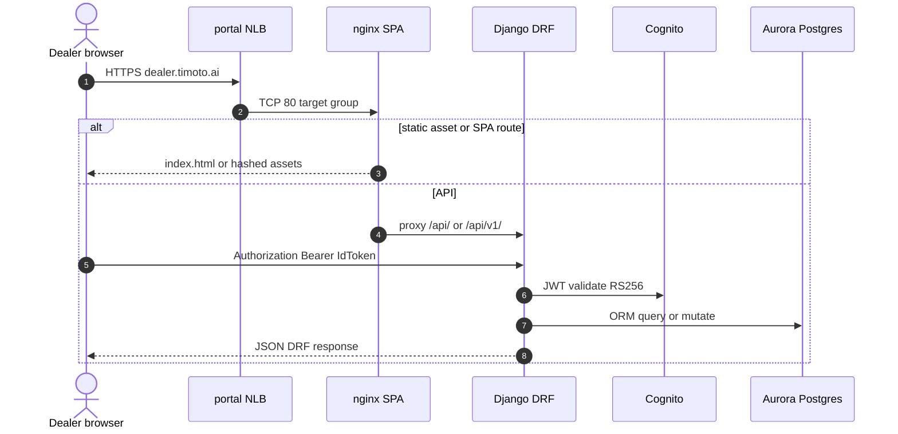
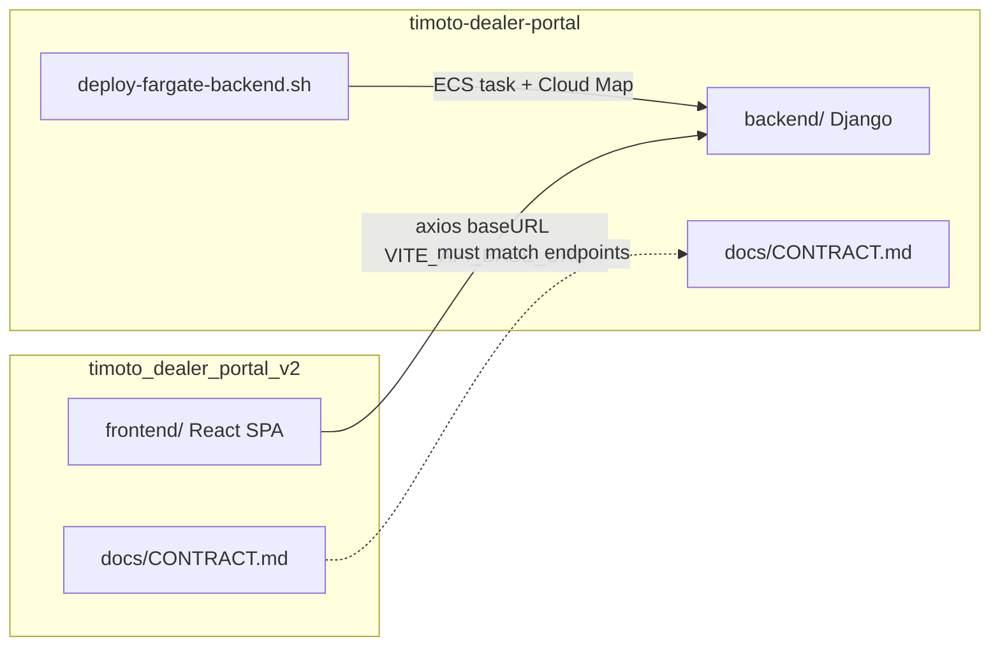

# 1. Overview & Business Intent

“Migration v1 → v2” in this codebase is **not** a database cutover script. It is an **architectural split**: Django REST stays in `timoto-dealer-portal`, while the dealer UI lives as a Vite/React SPA in `timoto_dealer_portal_v2`. There is **no** `backend/` tree under the v2 repo, and a workspace search for a dedicated “migrate portal v1 to v2” ETL/script returns nothing beyond ordinary Django `migrations/` for Postgres schema.

| Repo | Role | Source of truth for FE↔BE |
| --- | --- | --- |
| `timoto-dealer-portal` | Django 4.2 \+ DRF, Aurora, Cognito JWT, VietQR, catalog/orders | `docs/CONTRACT.md` (backend-oriented; points FE to v2 GitHub) |
| `timoto_dealer_portal_v2` | React 18 \+ TypeScript SPA only | `docs/CONTRACT.md` (session contract: auth IdToken, endpoints, OPEN ISSUES) |

**Actors:** Dealer browser on `dealer.timoto.ai`, nginx frontend task, Django backend task, Cognito, Aurora PostgreSQL.

**What operators should not expect:** a one-shot data-migration CLI, dual-write bridge, or feature-flag flip documented as “run migrate\_v1\_v2.py”. The live product path is: deploy Django from the backend repo; deploy SPA from the v2 frontend repo; keep both `CONTRACT.md` files aligned when endpoints change.

---

# 2. End-to-End Flow & Sequence Diagram

Production browser traffic (from `timoto-dealer-portal/docs/ARCHITECTURE.md` and `CLAUDE.md`, also summarized in `docs/deployment/CURRENT_INFRASTRUCTURE.md`):

```text
dealer.timoto.ai (Route53)
  → timoto-dealer-portal-nlb (NLB)
  → timoto-dealer-portal-nlb-tg (nginx :80)
  → timoto-frontend (static SPA + reverse proxy)
  → Cloud Map backend.timoto-dealer-portal.local:8000
  → timoto-backend (Django :8000)
```

NLB TG ARN documented in repo: `arn:aws:elasticloadbalancing:ap-southeast-7:404850807717:targetgroup/timoto-dealer-portal-nlb-tg/b38f11d087e81760`. nginx re-resolves Cloud Map with `resolver 169.254.169.253 valid=10s` and proxies `/api/` and `/health/` to Django; `/` serves React `index.html`. ALB `timoto-frontend-alb` / `timoto-dealer-backend-tg` exist as a secondary path; docs mark NLB→nginx→Cloud Map as the critical path for `dealer.timoto.ai`.





Staging twin (from `CURRENT_INFRASTRUCTURE.md`): `staging.dealer.timoto.ai` → `timoto-dealer-portal-stg-nlb` → staging nginx → `backend.timoto-dealer-portal-staging.local`.

---

# 3. Detailed API Contracts

v2 SPA (`frontend/src/api/APIs.ts` \+ `axiosClient.ts`) uses `baseURL = env.apiBaseUrl` from `VITE_API_BASE_URL`, then relative paths **without** repeating the `/api/v1` prefix in each method.

| Env file (v2) | `VITE_API_BASE_URL` |
| --- | --- |
| `.env.production` | `https://dealer.timoto.ai/api/v1` |
| `.env.staging` | `/api/v1` (same-origin nginx proxy; do not bake prod host) |

Auth header: `Authorization: Bearer <idToken>` from `localStorage` when call sets `skipAuth: false`. Default interceptor treats skipAuth as true unless explicitly false.

| Method | Path under base | Auth | SPA module |
| --- | --- | --- | --- |
| POST | `/auth/check-user/` | no | `authApi` |
| POST | `/auth/signup/` | no | `authApi` |
| POST | `/auth/confirm-signup/` | no | `authApi` |
| POST | `/auth/resend-code/` | no | `authApi` |
| POST | `/auth/login/` | no | OTP step1 phone / step2 phone\+code |
| PATCH | `/auth/update-store-info/` | yes | `authApi` |
| GET | `/auth/me/` | yes | `authApi.getMe` |
| GET | `/auth/zalo/login/` | no | full page redirect via `env.apiBaseUrl` |
| GET | `/bikes/` | yes | `bikeApi.getAllBikes` |
| GET | `/bikes/:bikeId/` | yes | `bikeApi.getBikeDetail` |
| GET | `/bikes/:bikeId/ai-report/` | yes | `evaluationApi.getAiReport` |
| GET | `/catalog/bikes/` | yes | `bikeApi.getCatalogBikes` |
| GET | `/catalog/bikes/:comboId/` | yes | detail |
| GET | `/catalog/bikes/:comboId/similar/` | yes | similar |
| GET/POST | `/orders/` | yes | list / create |
| GET | `/orders/:dealerOrderId/` | yes | detail |
| POST | \`/orders/:dealerOrderId/cancel | receive | reorder/\` | yes | lifecycle |
| POST | `/payments/dealer-order/create/` | yes | `paymentApi` |

Django mounts both prefixes (`backend/timoto/urls.py`): `api/v1/` (primary) and legacy `api/` for several apps. CONTRACT in v2 documents paths as `/api/auth/...` without `v1`; production SPA env uses `/api/v1`. Treat **deployed URL \+ SPA env** as what browsers call; treat CONTRACT tables as the negotiated payload shapes.

Create order body (CONTRACT \+ SPA types): `items` is a list of objects with only `combo_id` (no `quantity`); `payment_method` is `vietqr` or `cod`; `delivery_location` string. UI must honor response `can_cancel`, `can_receive`, `can_pay`, `can_get_invoice`, `can_reorder` rather than re-deriving from status strings.

Zalo callback (both CONTRACT files): tokens arrive in the **URL fragment** (`#IdToken=...&AccessToken=...&RefreshToken=...`), not query string. SPA page `/auth/zalo/callback` parses the hash and stores tokens.

OPEN ISSUE still listed in v2 CONTRACT: after Zalo login on an existing account, `GET /auth/me/` may return `full_name` and `avatar_url` null.

---

# 4. Database Schema & Ingestion

Schema ownership stays on the **v1 Django** repo. Aurora tables (`users`, `catalog.Combo`, `orders.DealerOrder`, payments, evaluations SCD, etc.) are evolved via Django migrations under `backend/*/migrations/`. The v2 SPA does not run migrations and does not speak SQL.

Logical dealer order surface used by the SPA (from CONTRACT order object — not a separate v2 schema):

```sql
-- Logical shape of DealerOrder as consumed by SPA (Postgres via Django).
CREATE TABLE dealer_order (
    dealer_order_id UUID PRIMARY KEY,
    masked_order_code VARCHAR(32) NOT NULL,
    total_price BIGINT NOT NULL,
    delivery_location TEXT,
    order_date DATE,
    delivery_status VARCHAR(32),  -- delivering | delivered | cancelled
    payment_status VARCHAR(32),   -- pending | paid
    payment_method VARCHAR(32)    -- vietqr | cod
);
```

There is **no** “v2 shadow database” and **no** dual-write migration table in either CONTRACT. Inventory reservation timing, VietQR callbacks, and combo `is_active` rules live in Django services; the SPA only posts order/payment HTTP and renders `can_*` flags.

Deploy ownership split (scripts present in repos; do not paste secrets into docs):

| Concern | Repo / script |
| --- | --- |
| Backend image \+ Cloud Map \+ NLB TG hygiene | `timoto-dealer-portal` `infrastructure/ecs-fargate/deploy-fargate-backend.sh` |
| Frontend SPA image | `timoto_dealer_portal_v2` `infrastructure/ecs-fargate/deploy-fargate-frontend.sh` (\+ staging twin) |
| Smoke | `GET /health/` JSON ok; unauthenticated `GET /api/v1/auth/me/` expect 403 |

---

# 5. Frontend & Hook Integration

v2 `frontend/` is the dealer UI: Vite, React Router, Figma-derived auth pages, `pages/v2/*` for catalog/orders, OneSignal helper under `utils/oneSignal.ts`. API access is centralized in `api/APIs.ts` and `api/axiosClient.ts`. On 401/403 for authenticated calls, the client clears Cognito tokens from `localStorage` and sends the browser to `/auth`.

CONTRACT.md rules for FE sessions (v2 `CLAUDE.md`):

1. Read CONTRACT before any API change.
2. On mismatch, update CONTRACT CHANGELOG; open bugs go to OPEN ISSUES.
3. Run `frontend && node_modules/.bin/tsc --noEmit` before deploy.

v1 repo still contains its own `frontend/` tree historically used for dealer UI; production dealer.timoto.ai SPA deployment is driven from the **v2** frontend deploy scripts and ECR frontend images described in architecture docs. Do not assume both frontends are live simultaneously without checking the ECS service image.

Pages that matter for contract adherence: `ConfirmationPay` (order create without quantity), `YourOrder` (`can_*` buttons), `ZaloCallback` (hash tokens), `BikeContent` (catalog \+ AI report GET).

---

# 6. Edge Cases & Resilience

1. **No migration script.** If someone asks for “run the v1→v2 migration,” the accurate answer is: align CONTRACT, deploy SPA, deploy Django; migrate **data** only via normal Django migrations / ops runbooks — not a portal-version migrator.
2. **Path prefix drift.** CONTRACT tables often omit `v1` while SPA production env includes `/api/v1`. Staging relative `/api/v1` relies on nginx proxy; absolute prod URL does not.
3. **IdToken vs AccessToken.** Both CONTRACT files insist Bearer uses Cognito **IdToken**. Sending AccessToken fails JWT audience checks.
4. **502/504 HTML.** CONTRACT warns NLB/ALB errors may return HTML; SPA must guard `content-type` before JSON parse.
5. **Stale nginx targets.** Architecture docs: portal NLB TG can hold dead nginx IPs after restart → intermittent 504; deploy Step 12b deregisters stale targets. Resolver `valid=10s` limits Cloud Map cache staleness.
6. **Cluster naming docs disagree.** `ARCHITECTURE.md` / `CLAUDE.md` use cluster `timoto-dealer-fargate` and services `timoto-backend` / `timoto-frontend`; `CURRENT_INFRASTRUCTURE.md` (verified 2026-07-16) lists `timoto-dealer-portal-fargate` and longer service names. Prefer live AWS describe-services over copying a single doc when debugging — but the **NLB → nginx → Cloud Map → Django** hop order is consistent across those repo docs.
7. **Payments path in SPA.** CONTRACT order “pay” historically documented as `POST /orders/:id/pay/`; SPA `paymentApi` calls `POST /payments/dealer-order/create/`. Use the SPA path as what v2 actually ships; reconcile CONTRACT when editing either side.

**Success criteria for “migrated”:** dealers load the SPA from the NLB, authenticate with IdToken, and complete catalog → order → VietQR against Django `/api/v1` without inventing a parallel backend inside the v2 repo.