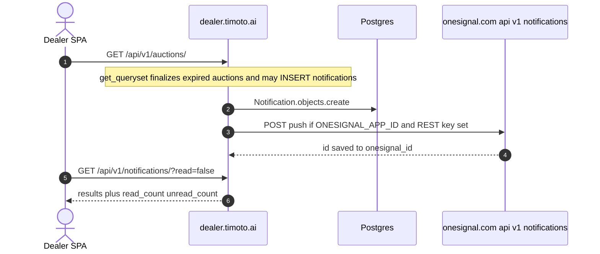
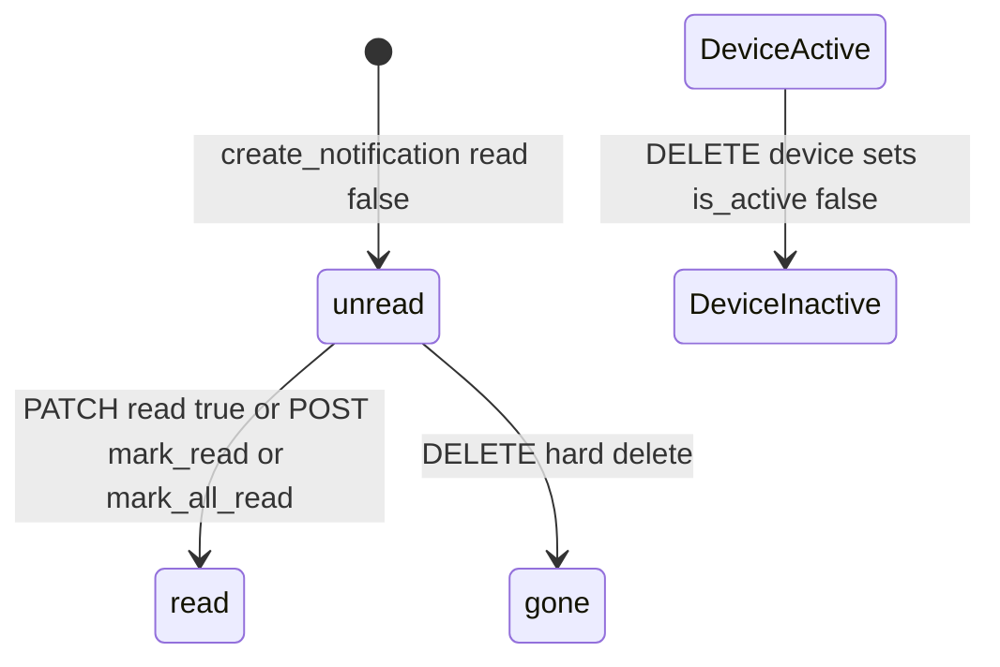

# 1. Overview and Business Intent

Auction and payment events insert `notifications_notification` rows and optionally POST to OneSignal. CONTRACT says poll `GET /notifications/unread_count/` every 30 seconds. In `timoto_dealer_portal_v2/frontend/src` the only notification-related file is `utils/oneSignal.ts`. There is **no** axios call to `/notifications/` or `/notification-devices/` in that src tree.

**Actors:** Cognito JWT dealer; OneSignal REST; writers in auctions/views.py GET list, auctions/models.py finalize\_auction, payments/views.py, auctions/serializers.py outbid.

**Target files:** backend/notifications/models.py, views.py, serializers.py, services.py, urls.py. Dual mount `/api/v1/` and `/api/`.

Auth: IsAuthenticated plus Cognito JWT. Lookup notification\_id / device\_id. Pagination page\_size=20, max 100.

---

# 2. End-to-End Flow and Sequence Diagram





create\_notification always INSERTs. Push failure is logged; the row stays. Missing OneSignal credentials skip HTTP and still return the row.

---

# 3. Detailed API Contracts

Router: notifications and notification-devices. CONTRACT documents `/api/notifications/` legacy. Production SPA base is `/api/v1`.

Query read=true or read=false. Query category comma-separated. Serializer aliases: id from notification\_id, message from body, type from category with legacy maps auction\_ending to auction\_ending\_soon, winner to auction\_won, deposit\_missed to no\_deposit, delivery to delivery\_info. timestamp from sent\_at. is\_read from read. plus auction\_status.

List response also has read\_count and unread\_count from ALL of the user notifications, not the filtered queryset.

auction\_status from metadata auction\_id. List prefetches UUIDs into auction\_cache. Missing auction: status not\_found, is\_valid false. Cancelled never valid. Active always valid. Ended: deposit\_due valid if deposit pending or deposited; payment\_due needs payment pending and deposit deposited; auction\_won/next\_win valid only while deposit pending.

ViewSet mixins List Update Destroy. No Retrieve. PATCH/PUT field read only. POST mark\_all\_read/ returns marked count. POST mark\_read/ ids must be a list else 400. GET unread\_count/ returns integer.

POST notification-devices/ update\_or\_create on global unique player\_id. Same player on a second account steals the row. DELETE sets is\_active false. List does not filter is\_active.

| HTTP Code | Error | Trigger |
| --- | --- | --- |
| 400 | ids phai la mot danh sach | mark\_read ids not a list |
| 201 | device serializer | create or steal player\_id |
| 200 | marked count | mark\_all\_read / mark\_read |

Push headings/contents language key en. If no active devices: include\_external\_user\_ids equals user.user\_id. Timeout 10s. Endpoint [https://onesignal.com/api/v1/notifications](https://onesignal.com/api/v1/notifications).

action\_url uses /home/auction/ plus UUID. SPA routes are /homepage/. Deep links can 404.

---

# 4. Database Schema and Locks

No select\_for\_update in notifications views or create\_notification.

```sql
CREATE TABLE notifications_notification (
    notification_id UUID PRIMARY KEY,
    user_id UUID NOT NULL REFERENCES users_customuser(user_id) ON DELETE CASCADE,
    title VARCHAR(200) NOT NULL,
    body TEXT NOT NULL,
    category VARCHAR(32) NOT NULL DEFAULT 'general',
    action_label VARCHAR(50) NOT NULL DEFAULT '',
    action_url VARCHAR(500) NOT NULL DEFAULT '',
    metadata JSONB NOT NULL DEFAULT '{}',
    read BOOLEAN NOT NULL DEFAULT FALSE,
    sent_at TIMESTAMPTZ NOT NULL,
    updated_at TIMESTAMPTZ NOT NULL,
    onesignal_id VARCHAR(64)
);
CREATE TABLE notifications_notificationdevice (
    device_id UUID PRIMARY KEY,
    user_id UUID NOT NULL REFERENCES users_customuser(user_id) ON DELETE CASCADE,
    player_id VARCHAR(200) NOT NULL UNIQUE,
    platform VARCHAR(20) NOT NULL DEFAULT 'web',
    is_active BOOLEAN NOT NULL DEFAULT TRUE,
    created_at TIMESTAMPTZ NOT NULL,
    updated_at TIMESTAMPTZ NOT NULL,
    UNIQUE (user_id, player_id)
);
```

Categories: outbid, leading, auction\_ending\_soon, auction\_won, next\_win, auction\_ended, deposit\_due, deposit\_success, no\_deposit, delivery\_info, payment\_due, no\_payment, plus deposit\_missed, payment\_success, general.

---

# 5. Frontend and UI Logic

CONTRACT: PATCH to mark read. Poll unread\_count every 30s. Register device POST /api/notification-devices/.

Live SPA: oneSignal.ts waits up to 5s for window.OneSignal. It does not POST player\_id to Django. Inbox REST is unimplemented in frontend/src. Backend still writes rows on auction GET.

---

# 6. Edge Cases and Resilience

1. GET /auctions/ is a notification producer.
2. OneSignal skip is silent.
3. Device steal by shared player\_id.
4. leading create\_notification in PlaceBidSerializer is commented out.
5. List read\_count ignores filters.
6. Hard DELETE does not cancel the OneSignal message.
7. Dual prefix /api/ and /api/v1/.