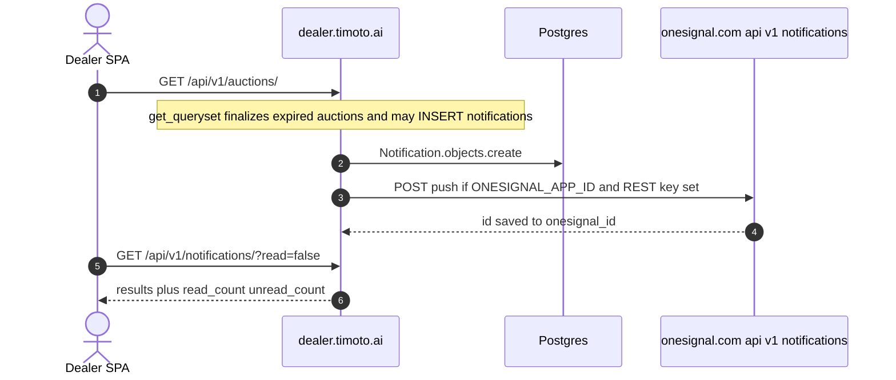
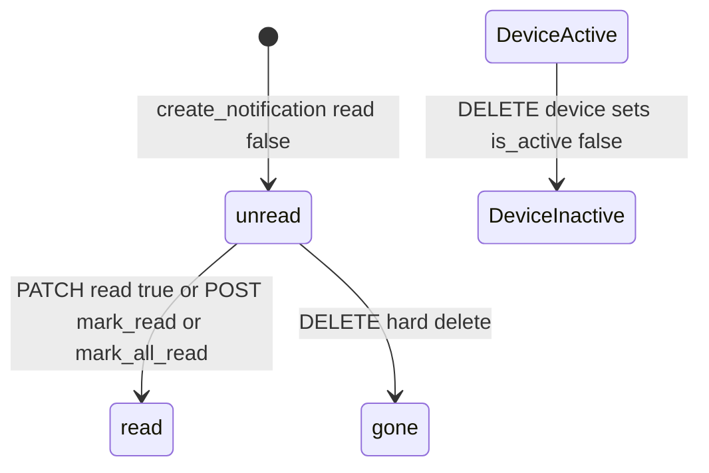

# 1. Overview and Business Intent

Auction and payment events insert `notifications_notification` rows and optionally POST to OneSignal. The dealer SPA CONTRACT says poll `GET /notifications/unread_count/` every 30 seconds. In `timoto_dealer_portal_v2/frontend/src` the only notification-related file is `utils/oneSignal.ts`. There is **no** axios call to `/notifications/` or `/notification-devices/` in that `src` tree.

**Actors:** Cognito JWT dealer; OneSignal REST; writers in `auctions/views.py` (GET list), `auctions/models.py` (`finalize_auction`), `payments/views.py`, `auctions/serializers.py` (outbid).

**Target files:** `backend/notifications/models.py`, `views.py`, `serializers.py`, `services.py`, `urls.py`. Dual mount `/api/v1/` and `/api/` via `timoto/urls.py`.

Auth: `IsAuthenticated` plus Cognito JWT. Lookup field `notification_id` / `device_id`. Pagination `page_size=20`, max 100.

---

# 2. End-to-End Flow and Sequence Diagram





`create_notification` always INSERTs. Push failure is logged; the row stays. Missing OneSignal credentials skip HTTP and still return the row.

---

# 3. Detailed API Contracts

Router: `notifications` and `notification-devices`. CONTRACT documents `/api/notifications/` (legacy). Production SPA base is `/api/v1`.

### List GET `/api/v1/notifications/`

Query `read=true` or `read=false`. Query `category` comma-separated. Serializer aliases: `id` from `notification_id`, `message` from `body`, `type` from `category` (legacy maps `auction_ending` to `auction_ending_soon`, `winner` to `auction_won`, `deposit_missed` to `no_deposit`, `delivery` to `delivery_info`), `timestamp` from `sent_at`, `is_read` from `read`, plus `auction_status`.

List response also has `read_count` and `unread_count` computed from **all** of the user's notifications, not the filtered queryset.

`auction_status` is loaded from `metadata.auction_id`. List prefetches those UUIDs into `auction_cache`. If the auction is missing: `status=not_found`, `is_valid=false`. `_is_auction_valid`: cancelled is never valid; active is always valid; ended depends on category (deposit\_due valid if deposit\_status pending or deposited; payment\_due needs payment pending and deposit deposited; auction\_won/next\_win valid only while deposit pending).

ViewSet mixins: List, Update, Destroy. **No Retrieve.** GET by id is not registered.

PATCH/PUT body field `read` only (`NotificationUpdateSerializer`). POST `mark_all_read/` returns `marked` count. POST `mark_read/` body `ids` must be a list else 400 `ids phải là một danh sách`. GET `unread_count/` returns `unread_count` integer.

### Devices

POST `/api/v1/notification-devices/` `update_or_create` on **global unique** `player_id`. Same OneSignal player on a second account **steals** the row (`defaults.user = request.user`, `is_active=True`). Unique together is `(user, player_id)` plus `player_id` unique, so steal is by overwriting user\_id.

DELETE does **not** delete: `is_active=False`. List queryset does **not** filter `is_active`, so inactive devices still appear.

| HTTP Code | Error | Trigger |
| --- | --- | --- |
| 400 | ids phải là một danh sách | mark\_read ids not a list |
| 201 | device serializer | create or steal existing player\_id |
| 200 | marked count | mark\_all\_read / mark\_read |
| 204 or 200 | destroy notification | hard delete row |

Push payload: headings/contents language key `en` (Vietnamese title/body still go in that slot). `data` is `metadata`. `url` is `action_url` when set. If no active devices: `include_external_user_ids` equals `str(user.user_id)`. Timeout 10s. Endpoint `https://onesignal.com/api/v1/notifications`.

Writers pass `action_url` like FRONTEND\_BASE\_URL plus `/home/auction/` plus auction UUID. SPA routes are `/homepage/...` per backend CLAUDE.md. Deep links from push can 404 on the SPA.

---

# 4. Database Schema and Locks

No `select_for_update` in notifications views or `create_notification`.

```sql
CREATE TABLE notifications_notification (
    notification_id UUID PRIMARY KEY,
    user_id UUID NOT NULL REFERENCES users_customuser(user_id) ON DELETE CASCADE,
    title VARCHAR(200) NOT NULL,
    body TEXT NOT NULL,
    category VARCHAR(32) NOT NULL DEFAULT 'general',
    action_label VARCHAR(50) NOT NULL DEFAULT '',
    action_url VARCHAR(500) NOT NULL DEFAULT '',
    metadata JSONB NOT NULL DEFAULT '{}',
    read BOOLEAN NOT NULL DEFAULT FALSE,
    sent_at TIMESTAMPTZ NOT NULL,
    updated_at TIMESTAMPTZ NOT NULL,
    onesignal_id VARCHAR(64)
);

CREATE TABLE notifications_notificationdevice (
    device_id UUID PRIMARY KEY,
    user_id UUID NOT NULL REFERENCES users_customuser(user_id) ON DELETE CASCADE,
    player_id VARCHAR(200) NOT NULL UNIQUE,
    platform VARCHAR(20) NOT NULL DEFAULT 'web',
    is_active BOOLEAN NOT NULL DEFAULT TRUE,
    created_at TIMESTAMPTZ NOT NULL,
    updated_at TIMESTAMPTZ NOT NULL,
    UNIQUE (user_id, player_id)
);
```

Category TextChoices (12 FE types plus legacy): `outbid`, `leading`, `auction_ending_soon`, `auction_won`, `next_win`, `auction_ended`, `deposit_due`, `deposit_success`, `no_deposit`, `delivery_info`, `payment_due`, `no_payment`, plus `deposit_missed`, `payment_success`, `general`. Migration 0001 used older labels (`auction_ending`, `winner`, `delivery`). Serializer still maps those old strings.

Platform: `web`, `ios`, `android`. Default web.

`format_datetime_vn` is `%H:%M %d/%m/%Y` in `Asia/Ho_Chi_Minh`. Naive datetimes are treated as UTC then converted.

---

# 5. Frontend and UI Logic

CONTRACT: PATCH to mark read (not POST). Poll unread\_count every 30s. Register device POST `/api/notification-devices/`.

Live SPA: `oneSignal.ts` waits up to 5s for `window.OneSignal` plus `__oneSignalInitialized`. It does not POST player\_id to Django. Inbox REST is unimplemented in `frontend/src`. Backend still writes rows on auction GET.

`autoReminderService.ts` is a **client timer** (localStorage), not this REST inbox. Both can fire for deposit 30 min and 10 min.

---

# 6. Edge Cases and Resilience

1. GET `/auctions/` is a notification producer. Listing auctions is not read-only.
2. OneSignal skip is silent; ops cannot tell from HTTP 201 of the auction list that push never left.
3. Device steal: shared browser OneSignal player\_id moves the row to the newly logged-in user.
4. `leading` create\_notification in PlaceBidSerializer is commented out; category still exists.
5. List `read_count` ignores `?read=` and `?category=` filters.
6. Hard DELETE of a notification does not cancel the OneSignal message.
7. Dual prefix `/api/` and `/api/v1/`.