# 1. Overview & Business Intent

Dealer Hub (`dealer.timoto.ai`) lets authenticated dealers browse combos, place orders (VietQR or COD), and bid on used-bike auctions. Money is integer VND on dealer orders and auctions. Legacy `orders.Order` and evaluation prices still use `numeric(12,2)`.

**Actors:** Dealer SPA (`timoto_dealer_portal_v2`), Cognito-backed `CustomUser`, VietQR/VNPay IPN, auction finalize job / GET-side deadline checks.

**Target files:**

- `timoto-dealer-portal/backend/users/models.py`
- `timoto-dealer-portal/backend/orders/models.py`
- `timoto-dealer-portal/backend/auctions/models.py`
- `timoto-dealer-portal/backend/evaluations/models.py`
- Inventory hold: `backend/orders/combo_inventory.py`
- Migrations through `users.0008`, `orders.0007`, `auctions.0013`, `evaluations.0005`

`AUTH_USER_MODEL = 'users.CustomUser'`. `USERNAME_FIELD = 'email'`. Production is PostgreSQL, `USE_TZ=True`, DateTime = `timestamptz`, JSON = `jsonb`. Django does **not** emit `DEFAULT gen_random_uuid()`; UUID defaults are Python `uuid.uuid4`.

**Type-2 SCD is only real on `BikeEvaluation`.** `CustomUser.user_id` is the PK so a second event row with the same id is impossible. `Order.order_id` is UNIQUE so SCD is also blocked. `Auction.auction_id` is UNIQUE. `BikeEvaluation.eval_id` is **not** unique; composite unique is `(eval_id, event_timestamp)`.

Dealer AI report `GET /api/v1/bikes/:bike_id/ai-report/` reads unmanaged `bikes_bikeevaluationresult`, **not** `evaluations_bikeevaluation`.

---

# 2. End-to-End Flow & Sequence / State

### DealerOrder: two independent status axes

Default insert from `DealerOrderViewSet.create`: `delivery_status='delivering'`, `payment_status='pending'`, `payment_method` from payload (default `vietqr`). Cancel is blocked if `payment_status == 'paid'`. VietQR receive requires paid. COD receive does **not** flip `payment_status`. Invoice requires `delivered` **and** `paid`. Reorder only from `cancelled`.

Inventory (`combo_inventory.py`): a combo is held when an item’s parent has `delivery_status IN ('delivering','delivered')` **and** `payment_status='paid'`. Cancel calls `release_combos_for_order`.

```mermaid
stateDiagram-v2
  [*] --> delivering: POST /api/v1/orders/ payment_status=pending
  delivering --> cancelled: POST cancel/ iff payment_status != paid
  delivering --> delivered: POST receive/ VietQR requires paid; COD always allowed
  cancelled --> delivering: POST reorder/ new DealerOrder row
  pending --> paid: VietQR callback POST pay/ then IPN
```

Mismatch: serializer `get_can_cancel()` is true even when paid; `cancel()` then returns 400 `"Cannot cancel an order that has already been paid."`

### Auction: random duration, 10% deposit, 7-day remainder

Live bidding duration is one of `[4.0, 3.0, 2.0, 1.0, 0.5]` hours (`get_random_auction_duration()`). Minimum increment **100000 VND**. Fast bid = `max(current_price, start_price) + 100000`. Winner: `order_by('-bid_amount', 'created_at').first()`. Deposit window **4 hours** after `end_time`. Remainder **7 days** after `deposited_at` (`int(round(winning_price * 0.1))` deposit). Missed deposit → next-highest **other** user gets a fresh 4h window; if none, `_restart_new_cycle()` **DELETE\+INSERT** (CASCADE drops bids and watches). Missed full payment → same restart. `status='cancelled'` exists in choices; no production writer in these model files sets it. `delivery_waiting` / `delivered` exist; no writer in this repo sets them except resets to `pending`.

`AuctionListSerializer` **mutates** on GET: `check_deposit_deadline()` / `check_payment_deadline()` may delete the row.

PLACEHOLDER\_FULL\_BODY\_PENDING\_WRITE\_PAGE