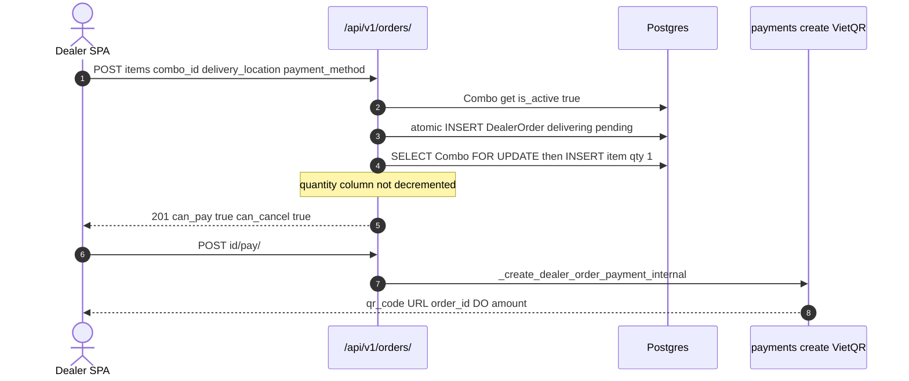
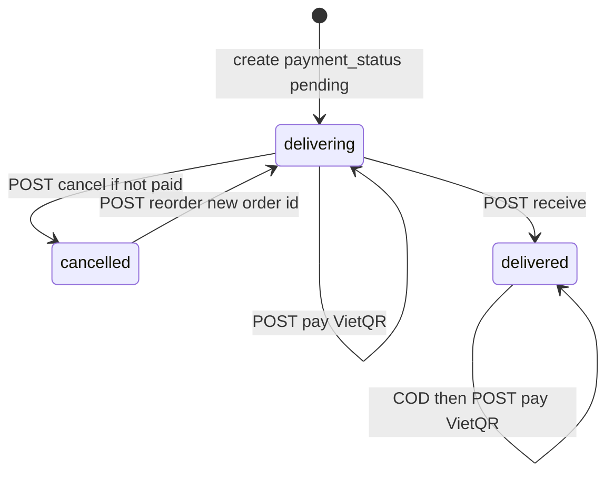

# 1. Overview and Business Intent

Dealers buy catalog combos. Quantity is always 1 per combo in create and reorder. Inventory hide happens after VietQR paid, not in this ViewSet.

**Target files:** backend/orders/views.py, serializers.py, urls.py, combo\_inventory.py. Dual /api/v1/orders/ and /api/orders/. Auth IsAuthenticated. Lookup dealer\_order\_id. List page\_size 20. Filter delivery\_status in delivering, delivered, cancelled.

CONTRACT create payload: items array of combo\_id only, delivery\_location, payment\_method vietqr or cod.

---

# 2. End-to-End Flow and Sequence Diagram





---

# 3. Detailed API Contracts

Queryset is user-scoped with prefetch items, combo, media, bikes.

Create: items min\_length 1. Missing/inactive combo ValidationError. Inside atomic: order delivering pending. Each item Combo select\_for\_update. IntegrityError becomes 400 Khong the tao don hang.

Cancel: 404 Order not found if not owner. 400 if not delivering. 400 Cannot cancel an order that has already been paid if payment\_status paid. Serializer can\_cancel is delivering without checking paid. SPA that trusts can\_cancel on a paid delivering order will POST cancel and get 400.

Receive: must be delivering. VietQR must already be paid. COD may receive unpaid. Sets delivered only.

Pay: already paid 400. VietQR must still be delivering. COD may pay while delivering or delivered. Delegates to payments helper.

Invoice: only delivered and paid. JSON message plus order serializer. No PDF.

Reorder: only cancelled. New order copies delivery\_location and payment\_method; qty 1 at current combo.price.

GET support/: SUPPORT\_PHONE default plus84935777249, SUPPORT\_ZALO\_URL default [https://zalo.me/0935777249](https://zalo.me/0935777249).

| HTTP Code | Error | Trigger |
| --- | --- | --- |
| 404 | Order not found. | not owner or bad UUID |
| 400 | Cannot cancel an order that has already been paid. | cancel after VietQR success |
| 400 | Order must be paid before marking as received. | receive too early |
| 400 | Invoice available only for delivered and paid orders. | invoice gate |
| 201 | new order | create or reorder |

---

# 4. Database Schema and Locks

Locks: Combo.select\_for\_update on create and reorder. Order row itself is not select\_for\_update on cancel/receive/pay.

```sql
CREATE TABLE orders_dealerorder (
    dealer_order_id UUID PRIMARY KEY,
    user_id UUID NOT NULL,
    total_price NUMERIC,
    delivery_location VARCHAR(255),
    delivery_status VARCHAR(32) NOT NULL,
    payment_status VARCHAR(32) NOT NULL,
    payment_method VARCHAR(16) NOT NULL,
    masked_order_code VARCHAR(32) UNIQUE,
    created_at TIMESTAMPTZ,
    updated_at TIMESTAMPTZ
);
CREATE TABLE orders_dealerorderitem (
    id BIGSERIAL PRIMARY KEY,
    dealer_order_id UUID NOT NULL,
    combo_id UUID NOT NULL,
    quantity INTEGER NOT NULL DEFAULT 1,
    unit_price NUMERIC,
    line_total NUMERIC,
    sort_order INTEGER
);
```

can\_receive: delivering and (COD or payment paid). can\_pay: pending and (vietqr plus delivering or COD plus delivering/delivered). can\_reorder: cancelled.

---

# 5. Frontend and UI Logic

CONTRACT: use server can\_\* for buttons. Mismatch: can\_cancel true while paid delivering. Pay response qr\_code is an image URL.

---

# 6. Edge Cases and Resilience

1. Create FOR UPDATE does not decrement quantity or set is\_active false.
2. Reorder uses current combo.price, not historical line unit\_price.
3. Invoice is not an accounting document.
4. Support defaults are in source if env is unset.
5. Dual /api/ and /api/v1/.
6. COD receive without pay leaves payment pending and delivery delivered, which can\_pay still allows.