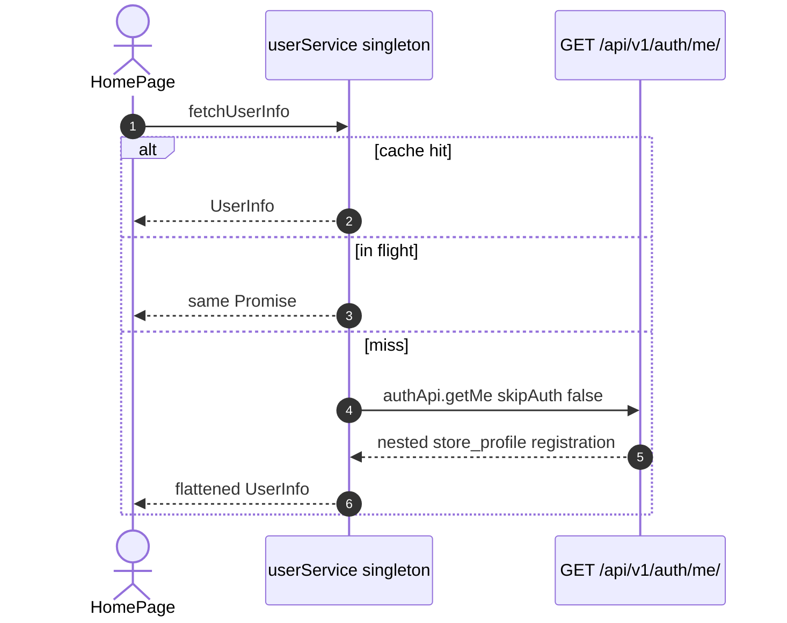
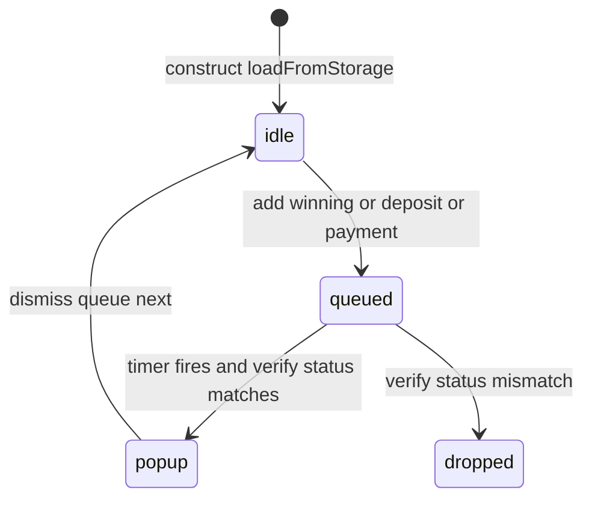

# 1. Overview and Business Intent

Two frontend singletons sit between dealer screens and Django.

userService.ts flattens GET /auth/me/ into UserInfo and keeps it in memory for the tab lifetime. HomePage.tsx and OrderNow.tsx call fetchUserInfo. Setting.tsx and logout paths call clearUserInfo.

autoReminderService.ts about 1900 lines does not call /notifications/. It stores auction ids in localStorage and starts setTimeouts. Backend GET /auctions/ also inserts deposit-due notifications. Both can fire. No tsx file in frontend/src imports autoReminderService; the export is unused by pages.

---

# 2. End-to-End Flow and Sequence Diagram





If setVerifyApi was never called, verifyAuctionStatus returns the expected status and still shows the popup.

---

# 3. Detailed API Contracts (client)

userService HTTP is only GET /auth/me/ with Bearer IdToken. Normalized fields include user\_id, phone\_number from top-level then registration.phone\_number, store fields from store\_profile. Zalo null phone becomes empty string. fetchUserInfo coalesces concurrent callers. After success, later callers skip refetch.

autoReminderService HTTP is injected via setVerifyApi. time\_left parsed as HH:MM:SS to ms. Invalid string returns 0.

Winning delay 5000 ms. Deposit first 30 minutes. Deposit second 10 minutes. Payment 24 hours.

Storage keys: autoReminder\_winningAuctions, autoReminder\_depositReminders, autoReminder\_deposit2ndReminders, autoReminder\_paymentReminders, plus four TRIGGERED sets.

| HTTP Code | Error | Trigger |
| --- | --- | --- |
| throw | User info is null | getMe empty data |
| popup skip | verify status mismatch | auction no longer winning |
| popup shown | verify API unset | warn then fake expected status |
| 0 ms | bad time\_left | parse catch |

---

# 4. Database Schema and Locks

None. Client-only.

```sql
CREATE TABLE auto_reminder_localstorage_logical (
    auction_id TEXT PRIMARY KEY,
    bike_model TEXT,
    winning_price INTEGER,
    time_left_ms INTEGER,
    saved_at BIGINT,
    reminder_time BIGINT
);
```

Visibility handler pauses timers when the tab is hidden.

---

# 5. Frontend and UI Logic

HomePage loads user on mount. Logout clears cache. Popup queue types: winning, deposit first or second, payment. Only one popup at a time. This is not OneSignal and not GET /notifications/. CONTRACT poll of unread\_count is unimplemented in frontend/src.

---

# 6. Edge Cases and Resilience

1. Stale userService cache until clearUserInfo.
2. localStorage is per browser profile, not per Cognito user.
3. Duplicate with server create\_notification on GET auctions for 30 min / 10 min deposit windows.
4. Missing verify function still shows popups.
5. parseTimeLeft does not validate NaN.
6. No tsx importer for autoReminderService in frontend/src.