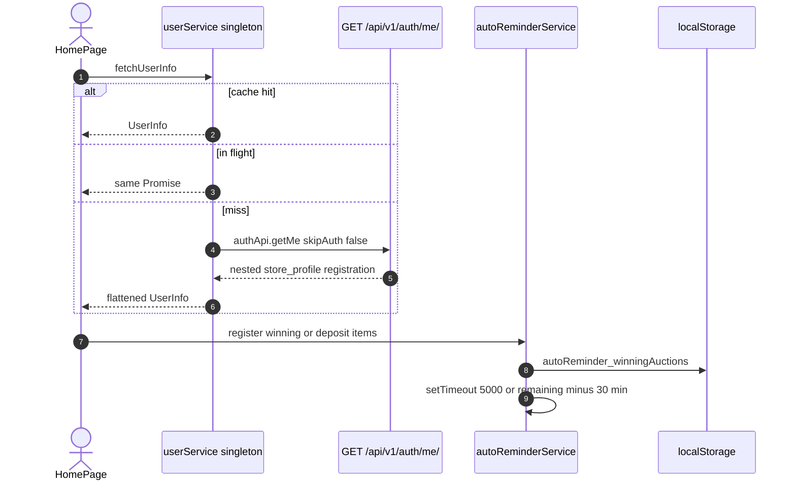
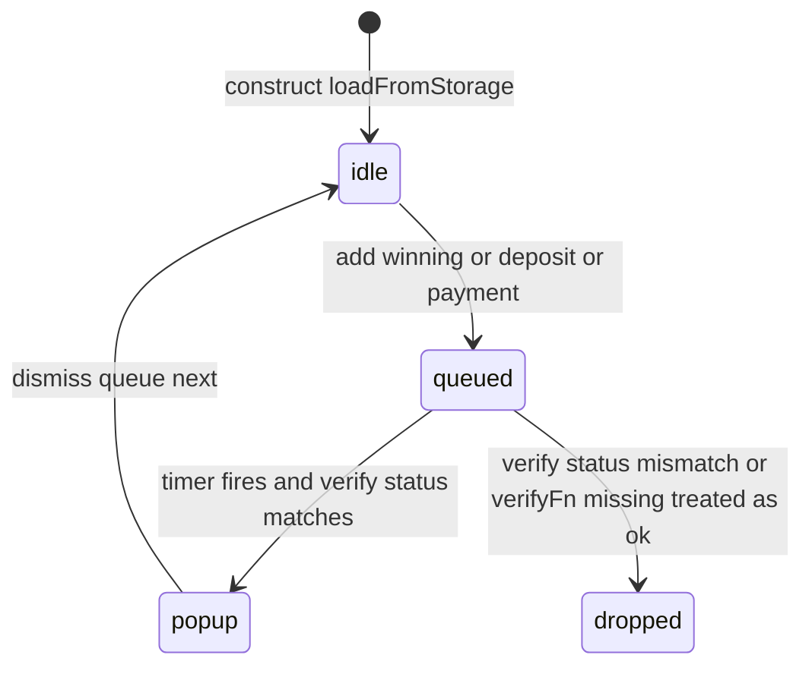

# 1. Overview and Business Intent

Two frontend singletons sit between dealer screens and Django.

`userService.ts` flattens `GET /auth/me/` into a `UserInfo` object and keeps it in memory for the tab lifetime. `HomePage.tsx` and `OrderNow.tsx` call `fetchUserInfo`. `Setting.tsx` and logout paths call `clearUserInfo`.

`autoReminderService.ts` (about 1900 lines) does **not** call `/notifications/`. It stores auction ids in `localStorage`, starts `setTimeout`s, and shows a sequential popup queue (winning, deposit first, deposit second, payment). Backend GET `/auctions/` also inserts deposit-due notifications (see the auctions page). Both can fire.

**Actors:** Cognito session; auction list/detail JSON `status` and `time_left` string `HH:MM:SS`.

**Target files:** `frontend/src/services/userService.ts`, `frontend/src/services/autoReminderService.ts`, callers `pages/v2/HomePage.tsx`, `pages/v2/OrderNow.tsx`, `pages/Setting.tsx`.

---

# 2. End-to-End Flow and Sequence Diagram





If `setVerifyApi` was never called, `verifyAuctionStatus` **returns the expected status** (treats as valid) and still shows the popup.

---

# 3. Detailed API Contracts (client)

`userService` HTTP is only `authApi.getMe()` → `GET /auth/me/` with Bearer IdToken. 401 handling is in axios interceptors, not this file. No PATCH profile here.

Normalized fields: `user_id`, `phone_number` from top-level then `registration.phone_number`, `email`, `status`, `status_label`, `registration_method` from `registration.method`, store fields from `store_profile` with delivery fallback for address, `full_name` and `avatar_url` from top-level (CONTRACT OPEN ISSUE: Zalo nulls stay null). Zalo users with backend `phone_number` null become `''` via `?? ''`.

`fetchUserInfo` coalesces concurrent callers with `fetchPromise`. After success, later callers get `this.userInfo` without refetch. Profile updates on `OrderNow` explicitly `clearUserInfo` then `fetchUserInfo`.

`autoReminderService` HTTP is injected: `setVerifyApi(fn)` should GET auction detail. Expected statuses for popups: winning family vs `deposited` for payment reminder. `time_left` parsed as hours minutes seconds to ms. Invalid string returns 0 ms.

Constants:

| Name | Value |
| --- | --- |
| WINNING\_REMINDER\_DELAY\_MS | 5000 |
| DEPOSIT\_REMINDER\_THRESHOLD\_MS | 30 times 60 times 1000 |
| DEPOSIT\_2ND\_REMINDER\_THRESHOLD\_MS | 10 times 60 times 1000 |
| PAYMENT\_REMINDER\_THRESHOLD\_MS | 24 times 60 times 60 times 1000 |

Storage keys: `autoReminder_winningAuctions`, `autoReminder_depositReminders`, `autoReminder_deposit2ndReminders`, `autoReminder_paymentReminders`, plus four `*_TRIGGERED` sets so a popup is not repeated.

| HTTP Code | Error | Trigger |
| --- | --- | --- |
| throw | User info is null | getMe empty data |
| popup skip | verify status mismatch | auction no longer winning/deposited |
| popup shown | verify API unset | warn then fake expected status |
| 0 ms | bad time\_left | parse catch |

There is no Django table for these timers. Persistence is browser localStorage JSON.

---

# 4. Database Schema and Locks

None. Client-only. Backend locks for the same auctions are `finalize_auction` FOR UPDATE and bid races without FOR UPDATE (auctions page).

```sql
-- No table. Logical localStorage document:
-- auctionId, bikeModel, winningPrice, timeLeftMs, savedAt, endTime or reminderTime
```

Visibility handler pauses/resumes timers when the tab is hidden so a 5s winning popup does not fire in a background tab then surprise on return (implementation uses `document.visibilityState`).

---

# 5. Frontend and UI Logic

HomePage loads user on mount; error falls back to `getUserInfo` cache. Logout clears cache.

Popup queue types: `winning` (isFirstWinner, bikeImageUrl), `deposit` with `reminderStage` first or second, `payment`. Only one popup at a time; `queueChangeCallback` notifies React. `dismissCurrentPopupCallback` can replace the visible popup when the same auctionId updates.

This is **not** OneSignal and **not** `GET /notifications/`. CONTRACT poll of unread\_count is unimplemented in `frontend/src`.

---

# 6. Edge Cases and Resilience

1. Stale `userService` cache: store\_name change is invisible until clear (OrderNow does clear after update; other pages may not).
2. localStorage is per browser profile, not per Cognito user. User B on the same laptop can see User A reminder keys unless logout calls the service `clear` (it removes those keys in `clearAll`).
3. Duplicate with server `create_notification` on GET auctions for the same 30 min / 10 min deposit windows.
4. Missing verify function still shows popups.
5. `parseTimeLeft` does not validate NaN; `"::"` can yield NaN ms.
6. Singleton survives SPA client-side route changes; full reload rehydrates from localStorage including triggered sets, so a popup already shown stays suppressed.
7. No `*.tsx` file in `frontend/src` imports `autoReminderService`. The singleton is exported but unused by pages unless a caller exists outside this tree.