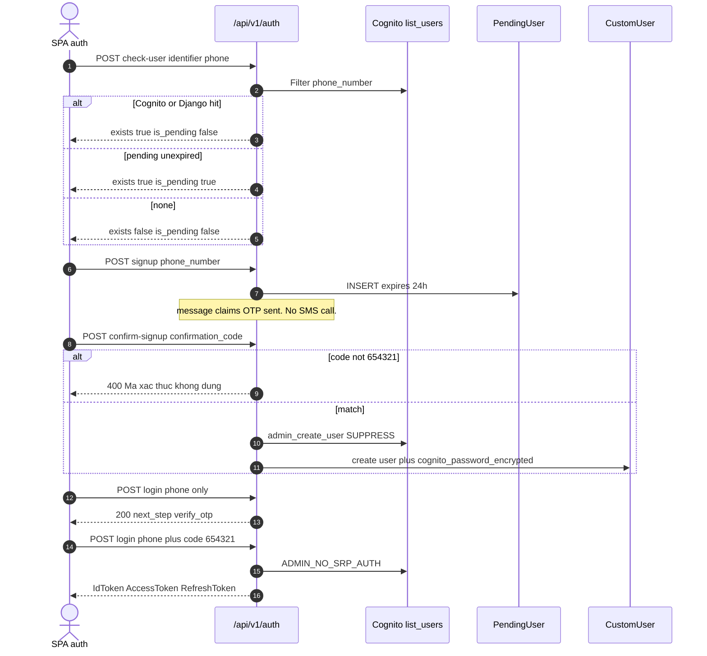
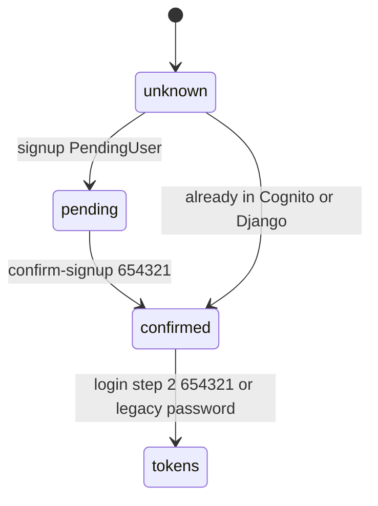

# 1. Overview and Business Intent

Dealer SPA auth is AWS Cognito plus a Django CustomUser row. The UI copy says OTP was sent to the phone. **No view in users/views.py calls Cognito SMS or SNS.** Signup confirm and login Step 2 compare the body field to DEV\_OTP\_CODE / HARDCODED\_CONFIRMATION\_CODE equal to 654321.

**Actors:** SPA SignInSignUpFigma.tsx and OtpVerifyFigma.tsx; boto3 cognito-idp; PendingUser 24h staging table.

**Target files:** backend/users/views.py, urls.py, models.py. Mount /api/v1/auth/ and /api/auth/. CONTRACT table uses /api/auth/. Staging SPA VITE\_API\_BASE\_URL=/api/v1.

Cognito client: connect timeout default 2s, read 5s, retries max\_attempts 1. SecretHash: Base64 HMAC-SHA256 of username plus APP\_CLIENT\_ID with APP\_CLIENT\_SECRET.

---

# 2. End-to-End Flow and Sequence Diagram





---

# 3. Detailed API Contracts

Phone normalize: plus 84 and 9 digits.

POST /api/v1/auth/check-user/ AllowAny. Body identifier required. Order: Cognito list\_users Limit 1, then CustomUser, then unexpired PendingUser. Cognito or Django hit deletes orphan PendingUser. 200: exists and is\_pending booleans. 500 returns error string of the exception.

POST /api/v1/auth/signup/ AllowAny creates only PendingUser. Password optional. Existing PendingUser for that phone is deleted then re-inserted. Success message claims OTP sent.

POST /api/v1/auth/confirm-signup/ code must equal 654321 before DB work. Creates Cognito UUID username, admin\_set\_user\_password Permanent, Django CustomUser, encrypts password Fernet of sha256 SECRET\_KEY.

POST /api/v1/auth/login/ also implements GET PUT PATCH DELETE HEAD. GET/HEAD read phone\_number password code from query string. Step 1 phone only: 200 next\_step verify\_otp. Does not send OTP. Step 2 code must be 654321 then ADMIN\_NO\_SRP\_AUTH. SPA must send IdToken as Bearer. Unknown phone 401.

If Cognito has no user but Django does: admin\_create\_user SUPPRESS with DEV\_OTP\_PASSWORD DevOTP654321. Demo phone plus84984550729 accepts password123.

GET PUT PATCH /api/v1/auth/me/. If zalo\_id set, phone\_number is null. delivery\_profile mirrors store address. CONTRACT OPEN ISSUE: Zalo full\_name and avatar\_url stay null if never written on link.

| HTTP Code | Error | Trigger |
| --- | --- | --- |
| 400 | Dinh danh la bat buoc. | check-user missing identifier |
| 400 | Ma OTP khong dung. | login step 2 not 654321 |
| 400 | Ma xac thuc khong dung. | confirm-signup not 654321 |
| 401 | So dien thoai chua dang ky. | login unknown phone |
| 404 | Khong tim thay nguoi dung. | confirm without PendingUser |
| 500 | Cognito exception string | check-user / login list\_users |

---

# 4. Database Schema and Locks

No row locks in auth views. CustomUser.user\_id is PK. Manager get on non-pk fields returns latest event\_timestamp.

```sql
CREATE TABLE users_pendinguser (
    pending_id UUID PRIMARY KEY,
    phone_number VARCHAR(20) NOT NULL UNIQUE,
    email VARCHAR(254),
    name VARCHAR(200),
    password VARCHAR(255),
    created_at TIMESTAMPTZ NOT NULL,
    expires_at TIMESTAMPTZ NOT NULL,
    otp_session VARCHAR(500),
    otp_sent_at TIMESTAMPTZ,
    otp_attempts INTEGER NOT NULL DEFAULT 0
);
```

otp\_session on PendingUser is unused by LoginView. cognito\_password\_encrypted is Fernet of SECRET\_KEY.

---

# 5. Frontend and UI Logic

authApi.checkUser, signup without client password, confirm-signup, login step 1 then step 2. userService.ts caches GET /auth/me/ until clearUserInfo.

---

# 6. Edge Cases and Resilience

1. Universal OTP 654321 is compiled into the image. Not DEBUG-gated.
2. Login GET/DELETE with password in the query string leaks secrets into access logs.
3. Recreating Cognito user with known DEV\_OTP\_PASSWORD is a shared fallback password.
4. check-user 500 returns raw exception text.
5. Signup success copy is false: no SMS is sent.
6. otp\_attempts / otp\_session unused by LoginView.
7. Type-2 SCD on CustomUser is incomplete: PK is user\_id.