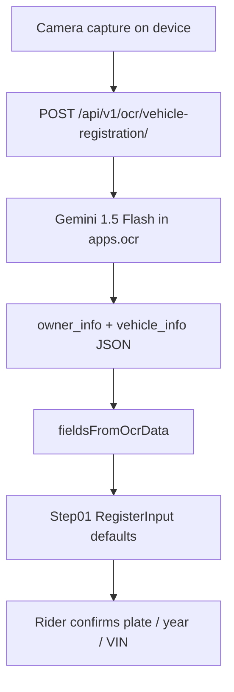

## Summary

Rider photographs the cavet (Giấy chứng nhận đăng ký xe). Backend Gemini extracts owner \+ vehicle fields. `Apps` maps them into Sell Step01 (`RegisterInput`). iOS Simulator has **no camera** — Autonoma A3 / Maestro M2 must run on a physical device or skip. Never fake-pass OCR in CI.



## Repos

- `timoto-mobile` (`Apps/` \+ `backend/apps/ocr/`)

## Files

- `backend/apps/ocr/views.py` — `recognize_vehicle_registration`
- `backend/apps/ocr/services.py` — Gemini call
- `Apps/src/pages/Step01/RegisterInput.tsx` — seeds brand/model/year/plate/engine/chassis/color from `ocrData`
- `Apps/src/utils/ocrCatalogMatch.ts` — `fieldsFromOcrData`

## HTTP

`POST /api/v1/ocr/vehicle-registration/`

Accepts multipart `image` **or** JSON `image_url` / `image_base64`.

## Contract

Success envelope:

```json
{
  "success": true,
  "error_code": 0,
  "error_message": "",
  "data": {
    "owner_info": { "full_name": "...", "birth_year": "...", "address": "..." },
    "vehicle_info": {
      "license_plate": "43C2-085.15",
      "brand": "VINFAST",
      "model_code": "FELIZ S",
      "engine_number": "...",
      "chassis_number": "...",
      "color": "Xanh"
    }
  }
}
```

Step01 must prefer rider-confirmed fields over OCR when both exist.

## Invariants

- E2E OCR = real camera. Simulator skip is explicit, not green.
- PR CI: fixture bytes \+ mocked Gemini. No live Vision/Gemini on every PR.
- Staging OCR smoke: at most one live call when explicitly requested.

## Tests

- Jest helpers exist around OCR mapping — expand `cavetFormMapping` rather than whole-screen snapshots.
- Backend OCR unit tests: **none today** (P1). Add parse fixtures from known JSON dumps.
- Autonoma **A3** cites this slug. Blocker if Free cloud is sim-only — write Option A (device cloud) vs Option B (Johnathan iPhone) on this page when the spike lands.

## Do not

- Do not copy `AllowAny` from `views.py` onto new money endpoints. Treat current OCR auth as a known smell, not a pattern.
- Do not send cavet images of real customers to public LLM logs in tests.