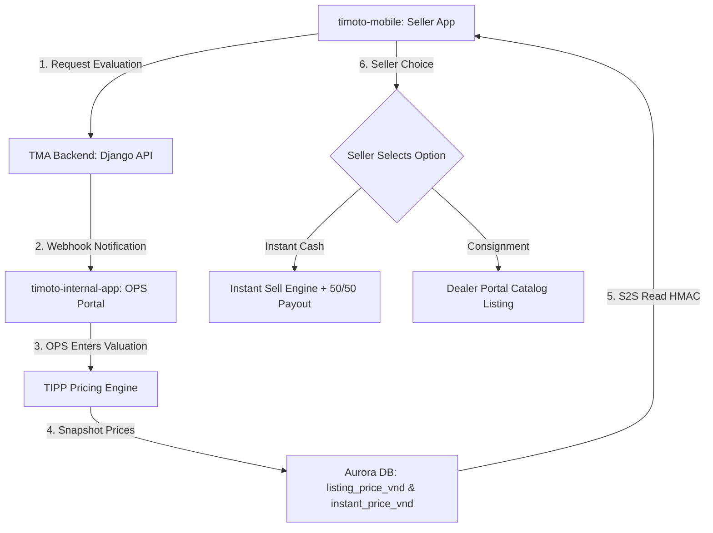

# 1. Feature Architecture & Business Intent

Dual-Price (TMA-79) allows motorcycle sellers to choose between two distinct monetization paths:

1. **Instant Cash (Thu mua ngay)**: Fast liquidity, 50/50 split payout, handled by internal OPS.
2. **Consignment Listing (Đăng bán sàn)**: Higher expected payout, listed on the marketplace for dealers/riders to buy.

# 2. End-to-End Hop Diagram



# 3. Code Implementation Details

### 1. FMP & TIPP Pricing Calculation (`timoto-internal-app`)

- **File**: `backend/bikes/tipp_pricing.py`
- **Formula**:
  - `instant_price_vnd` = `fmp_price` \* `0.85` (15% margin for instant risk & speed)
  - `listing_price_vnd` = `fmp_price` \* `1.02` (Suggested marketplace listing price)

### 2. Snapshotting at Submission (`timoto-internal-app`)

- **File**: `backend/bikes/submissions_api.py`
- **View**: `SubmissionDetail.submit`
- **Code**:

```python
bike.instant_price_vnd = computed_instant_price
bike.listing_price_vnd = computed_listing_price
bike.pricing_submitted_at = timezone.now()
bike.save(update_fields=['instant_price_vnd', 'listing_price_vnd', 'pricing_submitted_at'])
```

### 3. Secure HMAC Read (`timoto-mobile`)

- **File**: `mobile/internal_operator_offer.py`
- **Security**: Verifies SHA-256 HMAC signature using `S2S_HMAC_KEY`.
- **Response**:

```json
{
  "bike_id": 1042,
  "instant_price_vnd": 28500000,
  "listing_price_vnd": 32000000,
  "expires_at": "2026-08-25T12:00:00Z"
}
```

### 4. UI Choice Binding (`timoto-mobile`)

- **Screen**: `apps/mobile/src/screens/ChoosePriceScreen.tsx`
- **Behavior**: Renders two distinct cards (Instant vs Listing). Selecting Instant triggers Pickup schedule; selecting Listing publishes bike to Marketplace.