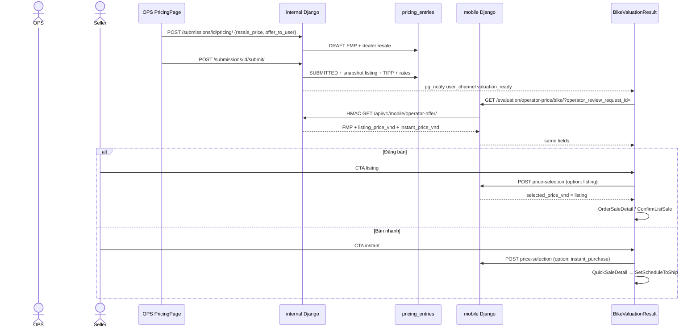

## Summary

TMA-79 is **not** two prices OPS types. OPS types **one** number: FMP (`offer_to_user`). Internal Django snapshots listing and TIPP **on submit**. The seller app then shows two CTAs. Spec: `timoto-internal-app/docs/API_LISTING_FLOW.md` \+ `FE_FMP_TIPP_DUAL_PRICE.md`. Live seller UI is `BikeValuationResult.tsx`, not the dead `ChoosePrice/ValuationComplete.tsx`.

## Formulas (locked, server-side)

```text
listing_price_vnd  = FMP × 0.95 × 0.90   // Đăng bán / higher price — TiMoto does not own the bike
instant_price_vnd  = FMP × 0.75           // Bán nhanh / TIPP — TiMoto buys, takes inventory
```

Example FMP = 25,000,000 → listing 21,375,000 → TIPP 18,750,000. Rounding: half-up whole VND. Old 0.80 TIPP rate is dead.

## Repos / files

| Layer | File |
| --- | --- |
| Spec | `docs/API_LISTING_FLOW.md`, `docs/FE_FMP_TIPP_DUAL_PRICE.md`, `docs/API_OPERATOR_OFFER_DUAL_PRICE.md` |
| OPS DB | `ops_auth.PricingEntry` → table `pricing_entries` |
| OPS write | `POST /api/submissions/:id/pricing/` then `POST .../submit/` |
| S2S read | `GET /api/v1/mobile/operator-offer/` HMAC |
| Rider read | `GET /api/v1/evaluation/operator-price/{bike}/` |
| Rider write | `POST /api/v1/evaluation/price-selection/{bike}/` `{option}` |
| Listing FSM | `POST .../listing/{bike}/confirm/` sets `SellerListing` \+ `Bike.marketplace_status='listed'` |
| FE parse | `apps/src/api/sellerDualPrice.ts` `parseSellerDualPrice` |
| FE screen | `apps/src/pages/BikeValuationResult.tsx` |

## Sequence (spec \+ live code)



## Hop: OPS types FMP

**Why:** Product rule — OPS never invents listing/TIPP. Those are policy rates.

**Caller:** OPS web `PricingPage` / RN `PricingInput`.

**Request** `POST /api/submissions/{bike_id}/pricing/` (JWT OPS):

```json
{
  "resale_price": "30000000",
  "offer_to_user": "25000000"
}
```

**200 (Postman):** `pricing.status=DRAFT`, `offer_to_user` = FMP, `margin` = resale − FMP. **No** listing/TIPP yet.

**422:** FMP empty/0/negative/non-integer, or FMP \> resale.

**DB write:** `pricing_entries.offer_to_user`, `resale_price`, `margin`, `status=DRAFT`.

**FE:** two inputs. Spec wants two **read-only** rows (Listing, TIPP) using GET `rates`. **SPEC GAP:** neither OPS web nor RN renders those rows today.

## Hop: OPS submit snapshots

**Why:** Freeze rates so later env changes do not rewrite old offers.

**Request** `POST /api/submissions/{bike_id}/submit/` body `{}` (or `{feedback_text}` on some clients).

**Preconditions:** DRAFT \+ (`ai_viewed_at` OR `ai_review_waived`).

**200 (Postman):**

```json
{
  "bike_id": "…",
  "masked_bike_id": "AB1234",
  "offer_price": 25000000,
  "sla_elapsed_seconds": 187,
  "sla_met": true,
  "tma_offer_push_ok": true
}
```

`offer_price` **is FMP**, not TIPP. Do not display it as “TiMoto buys now”.

**DB write:** `listing_price_vnd`, `instant_price_vnd`, `market_multiplier_rate`, `timoto_fee_rate`, `instant_purchase_discount_rate`, `submitted_at`, `status=SUBMITTED`. Then `pg_notify` so rider WS/FCM fires `valuation_ready`.

**GET success 200** (Postman) includes the snapshot fields the OPS success screen _could_ show.

## Hop: rider reads dual price (S2S then FE)

App **does not** call internal. App calls mobile:

`GET /api/v1/evaluation/operator-price/{bike_id}/?operator_review_request_id=`

Mobile HMAC-calls internal:

```http
GET /api/v1/mobile/operator-offer/?bike_id=&operator_review_request_id=
X-Timoto-Signature: sha256=<hex>
```

HMAC message UTF-8 `{bike_id}\n{operator_review_request_id}` lowercase UUIDs.

**200 (Postman \+ spec):**

```json
{
  "ok": true,
  "success": true,
  "offer_to_user": 25000000,
  "fair_market_price_vnd": 25000000,
  "listing_price_vnd": 21375000,
  "market_multiplier_rate": "0.95",
  "timoto_fee_rate": "0.90",
  "instant_price_vnd": 18750000,
  "instant_purchase_discount_rate": "0.75",
  "resale_price": 30000000,
  "margin": 5000000,
  "submitted_at": "2026-07-20T10:00:00+00:00"
}
```

**401** invalid signature. **404** no SUBMITTED row yet. **503** secret missing (and a misconfigured verifier may return True if secret empty — sev-1).

**FE bind** (`parseSellerDualPrice`):

| Seller copy | JSON key |
| --- | --- |
| (hidden / reference) FMP | `fair_market_price_vnd` / `offer_to_user` / legacy `valuation_price` |
| Đăng bán | `listing_price_vnd` |
| Bán nhanh | `instant_price_vnd` |

If API keys missing, `priceCalculations.ts` **fallback** FMP×0.95×0.9 — marked `@deprecated`. Prefer snapshot.

`BikeValuationResult` blocks listing CTA if `listingPrice == null` (“Chưa có giá đăng bán”).

## Hop: persist seller choice

**Request** `POST /api/v1/evaluation/price-selection/{bike_id}/?operator_review_request_id=`

```json
{ "option": "listing" }
```

`option` ∈ `listing` | `instant_purchase` only.

**200/201 (spec):**

```json
{
  "success": true,
  "selection_id": "770e8400-e29b-41d4-a716-446655440000",
  "bike_id": "550e8400-e29b-41d4-a716-446655440000",
  "operator_review_request_id": "880e8400-e29b-41d4-a716-446655440000",
  "option": "listing",
  "selected_price_vnd": 21375000,
  "listing_price_vnd": 21375000,
  "instant_price_vnd": 18750000
}
```

**DB:** `SellerPriceSelection`. Listing confirm (separate hop) creates `SellerListing` and sets `Bike.marketplace_status='listed'`.

**Next screen:** listing → `OrderSaleDetail` / `ConfirmListSale` → `WaitingForBuyer` (poll listing status). Instant → `QuickSaleDetail` → `SetScheduleToShip`.

## Invariants

- `offer_to_user` is never TIPP.
- Client-sent listing/TIPP on OPS pricing POST are ignored.
- Snapshots do not change when env rates change.
- HMAC secret must not ship in the RN binary.

## Tests

Postman folder **Mobile — Operator offer**. Django `test_seller_listing_api.py`. Autonoma: cite `mintlify:/features/dual-price-listing`.

## Do not

- Do not wire `ChoosePriceValuationComplete` as the live dual-price screen.
- Do not poll `GET /evaluation/full/` for this flow.