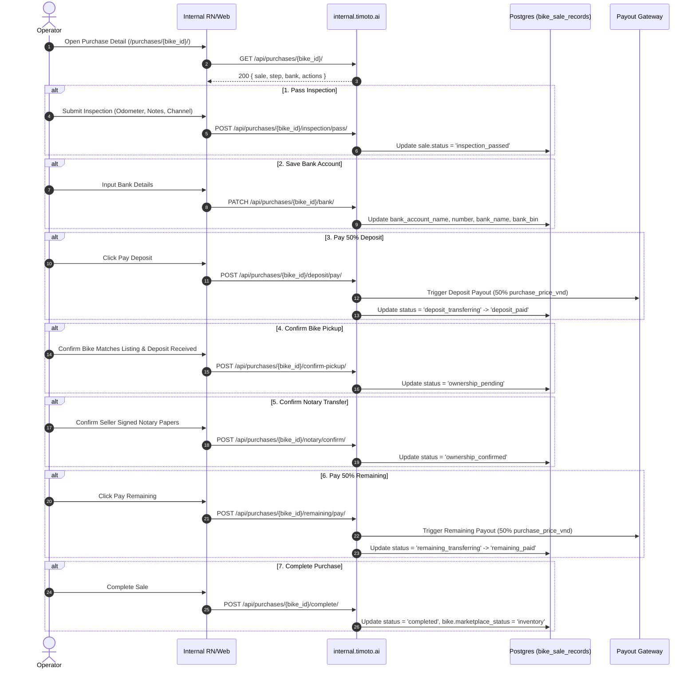

## Overview

The **Instant Sell Purchase Lifecycle** (`backend/bikes/instant_sell.py`, `purchases_api.py`, `payouts.py` in `timoto-internal-app`) manages the end-to-end acquisition of bikes directly from sellers who selected the Instant Purchase option (or switched from listing).

## Sequence Diagram



## Step-by-Step API Contracts

### 1. View Detail & Action Flags

`GET /api/purchases/{bike_id}/`

- **Auth**: OPS JWT Bearer
- **Response 200**:
  ```json
  {
    "bike_id": "8f8832a8-084d-4c7b-b384-5f50fa5f9104",
    "sale": {
      "id": "e4a29a01-9012-4c22-a890-123456789abc",
      "status": "inspection_passed",
      "sale_channel": "instant_sell",
      "purchase_price_vnd": 30000000,
      "deposit_amount_vnd": 15000000,
      "remaining_amount_vnd": 15000000,
      "bank_account_name": "NGUYEN VAN A",
      "bank_account_number": "19031234567890",
      "bank_name": "Techcombank",
      "bank_bin": "970407"
    },
    "step": {
      "current_step": 3,
      "total_steps": 7,
      "name": "Bơm cọc 50%"
    },
    "actions": {
      "can_pay_deposit": true,
      "can_confirm_pickup": false,
      "can_confirm_notary": false,
      "can_pay_remaining": false,
      "can_complete_sale": false,
      "can_reject": true
    }
  }
  ```

### 2. Pass Inspection

`POST /api/purchases/{bike_id}/inspection/pass/`

- **Request Body**:
  ```json
  {
    "actual_odometer": 18500,
    "inspection_notes": "Xe đẹp, máy êm, trầy nhẹ yếm phải",
    "sale_channel": "instant_sell"
  }
  ```
- **DB Mutation**: Sets `bike_sale_records.status = 'inspection_passed'`, updates odometer & inspection notes.

### 3. Update Seller Bank Account

`PATCH /api/purchases/{bike_id}/bank/`

- **Request Body**:
  ```json
  {
    "account_name": "NGUYEN VAN A",
    "account_number": "19031234567890",
    "bank_name": "Techcombank",
    "bank_bin": "970407"
  }
  ```

### 4. Pay Deposit (50%)

`POST /api/purchases/{bike_id}/deposit/pay/`

- **Pre-condition**: `actions.can_pay_deposit == true` AND `bank_account_number` is populated.
- **Payout Mutation**: Creates entry in `bike_sale_payouts` (`kind: 'deposit'`, `amount_vnd: purchase_price_vnd * 0.5`).
- **Status Flow**: `inspection_passed` $$\to$$ `deposit_transferring` $$\to$$ `deposit_paid`.

### 5. Confirm Pickup

`POST /api/purchases/{bike_id}/confirm-pickup/`

- **Request Body**:
  ```json
  {
    "bike_matches_listing": true,
    "deposit_paid_confirmed": true
  }
  ```
- **Status Flow**: `deposit_paid` $$\to$$ `ownership_pending`.

### 6. Confirm Notary / Ownership Transfer

`POST /api/purchases/{bike_id}/notary/confirm/`

- **Request Body**:
  ```json
  {
    "seller_signed": true,
    "notary_confirmed_transfer": true
  }
  ```

### 7. Pay Remaining (50%)

`POST /api/purchases/{bike_id}/remaining/pay/`

- **Payout Mutation**: Creates entry in `bike_sale_payouts` (`kind: 'remaining'`, `amount_vnd: purchase_price_vnd * 0.5`).
- **Status Flow**: `ownership_confirmed` $$\to$$ `remaining_transferring` $$\to$$ `remaining_paid`.

### 8. Complete Sale

`POST /api/purchases/{bike_id}/complete/`

- **Request Body**:
  ```json
  {
    "documents_received": true,
    "remaining_paid_confirmed": true
  }
  ```
- **Status Flow**: `remaining_paid` $$\to$$ `completed`. Bike `marketplace_status` becomes `inventory` (ready for Dealer Hub catalog).

### 9. Reject Purchase

`POST /api/purchases/{bike_id}/reject/`

- **Request Body**:
  ```json
  {
    "reason": "Tình trạng động cơ không đúng mô tả, từ chối mua"
  }
  ```
- **Constraint**: Min 5 characters for reason.
- **Status Flow**: Transitions `sale.status` to `failed`.

## Database Entities

### `bike_sale_records`

- `id` (UUID PK)
- `bike_id` (UUID FK)
- `schedule_id` (UUID FK)
- `status`: `inspection_passed` | `deposit_transferring` | `deposit_paid` | `ownership_pending` | `remaining_transferring` | `remaining_paid` | `picked_up` | `completed` | `failed`
- `sale_channel`: `instant_sell` | `listing`
- `purchase_price_vnd` (BigInt)
- `deposit_amount_vnd` (BigInt)
- `remaining_amount_vnd` (BigInt)
- `bank_account_name`, `bank_account_number`, `bank_name`, `bank_bin`

### `bike_sale_payouts`

- `id` (UUID PK)
- `sale_id` (FK `bike_sale_records`)
- `kind`: `deposit` | `remaining`
- `amount_vnd` (BigInt)
- `status`: `pending` | `succeeded` | `failed`
- `provider`: `stub` | `bank`