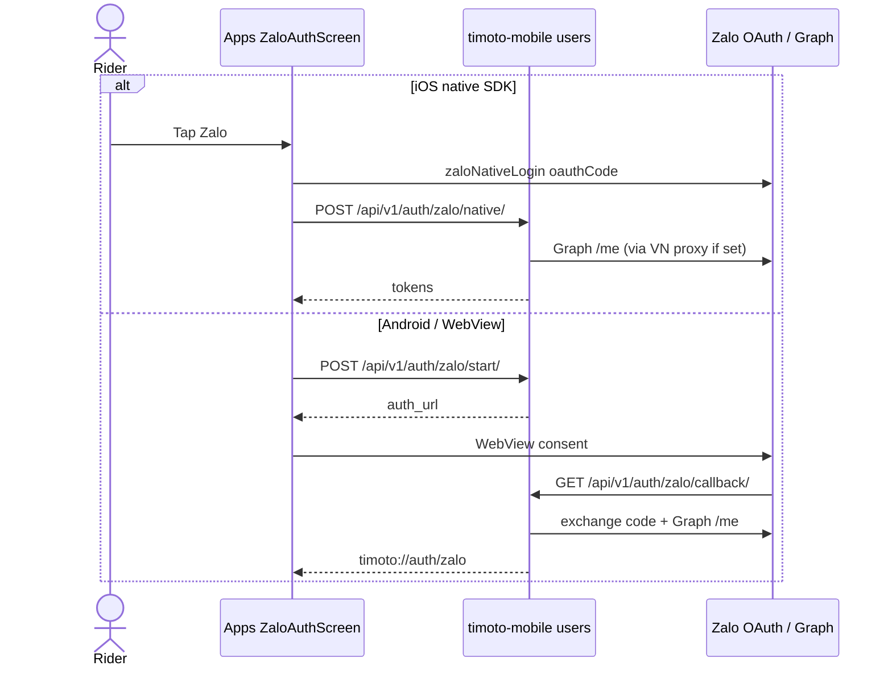

## Summary

Rider logs in with Zalo. **iOS** uses ZaloSDK native (`POST /api/v1/auth/zalo/native/`). **Android / fallback** uses PKCE WebView: app POSTs `start/`, Zalo redirects to backend `callback/`, backend redirects `timoto://auth/zalo#...`. Graph `/me` often omits `id` unless the request egresses a **Vietnam IP** — that is the `cannot_get_zalo_id` path Autonoma must cover (VN vs VNG relay).

## Repos

- `timoto-mobile` only (app \+ Django)

## Files

- `Apps/src/pages/ZaloAuthScreen.tsx` — native vs WebView branch
- `Apps/src/utils/zaloPkce.ts` — PKCE
- `Apps/src/utils/zaloAuth.ts` — native SDK wrapper
- `Apps/src/api/zaloNativeService.ts` — native exchange client
- `Apps/src/utils/zaloAuthLink.ts` — parse `timoto://auth/zalo`
- `backend/apps/users/zalo_views.py` — `zalo_start`, `zalo_callback`, `zalo_native`
- `backend/apps/users/urls.py` — routes under `/api/v1/auth/`
- `backend/config/settings.py` — `ZALO_APP_ID`, `ZALO_GRAPH_PROXY`, `ZALO_GRAPH_PROXY_URL`
- Human doc: `docs/ZALO_AUTH_MOBILE.md`

## HTTP

| Method | Path | Auth |
| --- | --- | --- |
| POST | `/api/v1/auth/zalo/start/` | none (PKCE body) |
| GET | `/api/v1/auth/zalo/callback/?code=&state=` | Zalo redirect |
| POST | `/api/v1/auth/zalo/native/` | oauthCode \+ code\_verifier |

Callback registered at Zalo Developers must be the **backend** URL, e.g. `https://api-staging.timoto.ai/api/v1/auth/zalo/callback/` — not the app deep link.

## Contract

WebView success hash includes `access_token`, `refresh_token`, `id_token`. Errors use `#error=`:

- `cannot_get_zalo_id` — Graph missing `id` (almost always non-VN egress)
- `cannot_get_phone_number_for_cognito`
- `no_access_token`

oauthCode TTL ~10 minutes. AccessToken ~1h. RefreshToken ~3 months (single use; store the new one).

## Invariants

- `ZALO_APP_SECRET` stays on the backend. Never in the app binary.
- Each login generates a new PKCE verifier.
- If Graph runs on Fargate `ap-southeast-7` without `ZALO_GRAPH_PROXY` / `ZALO_GRAPH_PROXY_URL`, expect `cannot_get_zalo_id`.

## Tests

- Jest: auth client / token storage in `Apps/__tests__/` (expand). Autonoma **A1** must export to `Apps/e2e/autonoma/` and cite this slug.
- Django: OTP/Zalo unit tests are a P0 hole — mock Cognito/Zalo HTTP; do not hit live Zalo in PR CI.

## Do not

- Do not register the app deep link as the Zalo callback URL.
- Do not call Graph from the phone and assume `id` is always present.
- Do not fake Autonoma A1 as passed if only the WebView branch was tapped.