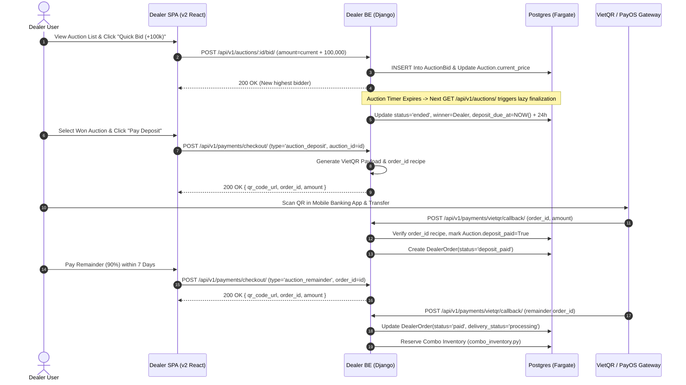

# 1. Overview

This document traces the complete lifecycle of a **Dealer Auction Purchase** across the Dealer Portal ecosystem. It connects the React SPA (`timoto_dealer_portal_v2`), the Django backend (`timoto-dealer-portal`), NLB/Nginx load balancing, and VietQR payment gateway webhooks.

# 2. Sequence Diagram

# 3. Step-by-Step Code Tracing

### Step 1: Bidding (timoto-dealer-portal)

- **SPA Component**: `src/pages/AuctionsPage.tsx`
- **BE View**: `AuctionsViewSet.place_bid` (`backend/catalog/views.py`)
- **Rules**: Bid increment must be \>= 100,000 VND. No `select_for_update` on bid insert (optimistic update).

### Step 2: Auction Finalization (Lazy Execution)

- **BE Hook**: `AuctionsViewSet.list` (`backend/catalog/views.py`)
- **Logic**: When any dealer fetches the auctions list, the backend checks for `end_time <= NOW()` and `status == 'active'`. It updates `status = 'ended'` and calculates winner as highest bidder.

### Step 3: 10% Deposit VietQR Checkout

- **BE View**: `CheckoutViewSet.create` (`backend/payments/checkout_views.py`)
- **Shared Contract**: Generates `order_id` string formatted as `AUC-DEP-{auction_id}-{timestamp_hash}`.
- **Callback Handling**: `VietQRCallbackView` (`backend/payments/views.py`) parses `order_id`, verifies exact transfer amount, and updates `deposit_paid = True`.

### Step 4: 90% Remainder & Inventory Sync

- **BE Service**: `backend/orders/combo_inventory.py`
- **Sync Logic**: Upon full payment callback confirmation, reserves the associated bike combo and triggers cross-channel unavailable notification to `timoto-mobile`.

# 4. Critical Edge Cases & Contracts

- **No Escrow Model**: The system does NOT hold funds in a third-party escrow account. Payments go directly to VietQR target accounts.
- **Deposit Expiry**: If 10% deposit is not paid within 24 hours of auction end, winner status fails over to second-highest bidder.