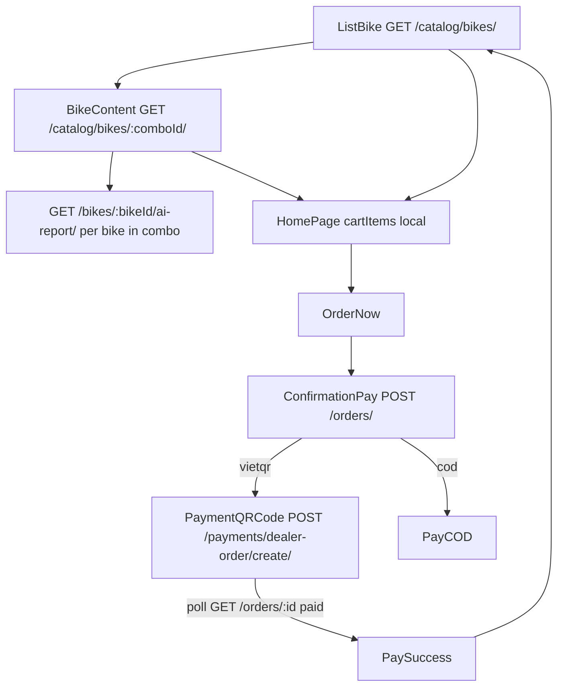

## Summary

Dealer Hub SPA is **one shell** `HomePage.tsx` that switches sub-views by pathname. Production API: `https://dealer.timoto.ai/api/v1` with `Authorization: Bearer {idToken}`. Staging uses relative `/api/v1` through nginx.

Landing `TiMoto-AI-Web` is a different repo (marketing). Dealer has its own `/landingpage` route plus `/auth`.

## Auth

1. `POST /auth/check-user/` `{identifier}`
2. New → signup → `/auth/otp` `confirm-signup`
3. Existing → `POST /auth/login/` `{phone_number}` → OTP `{phone_number, code}`
4. Zalo: browser `{apiBaseUrl}/auth/zalo/login/` → `/auth/zalo/callback` hash tokens → `GET /auth/me/`

## Catalog → pay

Orders hub `/homepage/orders`: cancel, receive, reorder, pay-again.

Images: catalog `images[]` URLs from API, no FE rewrite. AI report is **read-only** `BikeEvaluationResult` from the mobile AI pipeline — dealer does not call gRPC.

## Cross-system money (rider buy vs dealer Hub)

Dealer Hub checkout is **dealer buying combos**. Rider marketplace deposit is a **separate** client (`marketplaceBuyService`) aimed at shared checkout \+ VietQR \+ HMAC paid-hook into mobile. Do not collapse them into one screen.

## Do not

- Do not use CONTRACT `POST /orders/{id}/pay/` as the live FE path — FE uses `/payments/dealer-order/create/`.
- Do not deploy dealer with ad-hoc AWS; use the Fargate script.