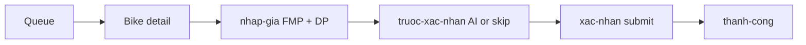

## Summary

OPS has **two UIs** on the same Django `/api`.

Web (`frontend_web_version`): React Router. No pickup list, no notification inbox, no reject-buy modal. Pricing is two fields (FMP \+ dealer resale). Listing/TIPP **not shown**.

RN (`apps/`): four tabs (Home, Định giá, Purchase, Dealer placeholder) \+ pickup \+ FCM tap routing. Same two price fields. Listing/TIPP still **not in UI** — server snapshots on submit.

## Web routes (`App.tsx`)

| Path | Page | API |
| --- | --- | --- |
| `/login` | LoginPage | `POST /api/auth/login/` `{phone,password}` |
| `/` | DashboardPage | `GET /api/dashboard/` |
| `/dinh-gia` | QueuePage | `GET /api/submissions/?tab&q&page` |
| `/dinh-gia/:bikeId` | BikeDetailPage `?tab=overview\|media\|ai` | `GET /api/submissions/:id/?tab=` |
| `/dinh-gia/:bikeId/nhap-gia` | PricingPage | GET/POST `.../pricing/` `{resale_price, offer_to_user}` |
| `/.../truoc-xac-nhan` | AiReviewChoicePage | skip AI `POST .../ai-review-choice/` |
| `/.../xac-nhan` | ConfirmPage | `POST .../submit/` `{feedback_text}` |
| `/.../thanh-cong` | SuccessPage | `GET .../success/` |
| `/xe` | VehiclesPage | `GET /api/vehicles/` |
| `/nhan-vien` | StaffPage ADMIN | `/api/admin/staff/` |

Media: `s3_url || media_url` as `` / `<video>` / `<audio>`. **No FE CDN rewrite.**

## Web pricing sequence

Submit is when `tipp_pricing.py` snapshots listing = FMP×0.95×0.90 and TIPP = FMP×0.75 and `pg_notify user_channel valuation_ready`.

## OPS RN navigator

Root: Onboarding → MainTabs (Home, Pricing stack, Purchase, Dealer) \+ root BikeDetail, pickups, rejects, notifications.

Pricing stack: PricingList → PricingInput → PricingConfirm (modal) → OfferPricingSent. PhotoDetail / VideoDetail modals.

Purchase: `getPickups` → WaitingPickupDetail → PickupSend (inspection \+ complete) or RejectPickupBike.

## FCM tap (`notificationTapRouting.ts`)

| data.type | Target |
| --- | --- |
| sale cancelled | SaleCancelledPopup |
| OFFER\_ACCEPTED / PICKUP\_SCHEDULED | PendingPickupPopup |
| PICKUP\_RESCHEDULED | WaitingPickupDetail |
| else \+ bike\_id | BikeDetail |

## Dual-price gap (both UIs)

Spec `FE_FMP_TIPP_DUAL_PRICE.md` wants read-only Listing \+ TIPP. **Neither web nor RN renders those fields.** OPS types FMP \+ DP only. Seller mobile is where dual prices appear (`BikeValuationResult`).

## Do not

- Do not POST listing\_price / instant\_price from OPS clients.
- Do not assume web has pickup screens — use the RN app or `/api/pickups/`.