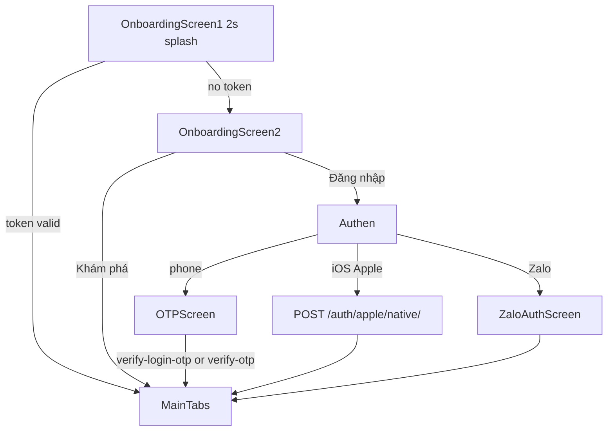

## Summary

Rider product is React Native **`timoto-mobile/apps/`** (not legacy `TiMotoAI/`). One root native stack (`AppNavigator.tsx`) plus four tabs (`MainTabNavigator.tsx`): Khám phá, Bán xe, Mua xe, Cá nhân. Gestures disabled (`gestureEnabled: false`). Logout resets to `OnboardingScreen1`.

This page is the **complete sell \+ image \+ evaluate \+ dual-price \+ pickup** map from code. Buy tab: [Rider buy](/flows/rider-buy). Cross-system sequence: [Sell → pickup](/flows/sell-to-pickup). What to ship: [What to build](/architecture/what-to-build).

## Repos

- `timoto-mobile/apps/src/navigation/AppNavigator.tsx`
- `timoto-mobile/apps/src/navigation/MainTabNavigator.tsx`
- `timoto-mobile/apps/src/navigation/types.ts` (`RootStackParamList`)
- `timoto-mobile/apps/src/constants/routes.ts`

## Files (sell \+ media)

| Path | Why it matters |
| --- | --- |
| `pages/ScanBikeCer.tsx` | Cavet camera 1280×960 |
| `pages/Step02/TakePhotosStep2.tsx` | 8 angles 1600×1200 \+ quality gate |
| `pages/Step02/Register2ndStep.tsx` | Presign PUT \+ `media/batch` images |
| `pages/Step03/TakeAudioBike.tsx` | Engine audio |
| `pages/Step03/TakeVideoBike.tsx` | Engine video |
| `pages/BikeDataAnalysis.tsx` | `evaluate/async` \+ poll \+ wait OPS WS |
| `pages/BikeValuationResult.tsx` | Dual price UI (live) |
| `pages/ChoosePrice/ValuationComplete.tsx` | Dual price UI (**dead — unused**) |
| `navigation/syncValuationResumeFromNavState.ts` | Kill-app resume |

## Full screen registry (`AppNavigator`)

Every `Stack.Screen` in `AppNavigator.tsx`. If a row is **dead**, do not build Autonoma on it.

| Route name | Component file | Presentation | Status |
| --- | --- | --- | --- |
| OnboardingScreen1 | `pages/OnboardingScreen1.tsx` | stack | live |
| OnboardingScreen2 | `pages/OnboardingScreen2.tsx` | stack | live |
| OTPScreen | `pages/OTPScreen.tsx` | stack | live |
| SuccessScreen | `pages/SuccessScreen.tsx` | stack | **dead** (OTP goes to MainTabs) |
| ZaloAuthScreen | `pages/ZaloAuthScreen.tsx` | stack | live |
| MainTabs | `MainTabNavigator.tsx` | none | live |
| RegisterSellBike | `pages/RegisterSellBike.tsx` | stack | live |
| RegisterPolicy | `pages/RegisterPolicy.tsx` | stack | live (policy copy; consent is PolicyDataConsent) |
| DYNDetail | `pages/DYNDetail.tsx` | stack | live (Home news) |
| GasBikeDetail | `pages/BuyTab/GasBikeDetail.tsx` | stack | live — [buy](/flows/rider-buy) |
| EVBikeDetail | `pages/BuyTab/EVBikeDetail.tsx` | stack | live, Buy CTA empty |
| BuyOrderList | `pages/BuyTab/BuyOrderList.tsx` | stack | live |
| BuyOrderDetail | `pages/BuyTab/BuyOrderDetail.tsx` | stack | live |
| BuyGasBikeDeposit | `pages/BuyTab/BuyGasBikeDeposit.tsx` | stack | client live; Django urls may 404 |
| SlidePhotoDetail | `pages/BuyTab/SlidePhotoDetail.tsx` | transparentModal fade | live |
| ChoosePriceValuationComplete | `pages/ChoosePrice/ValuationComplete.tsx` | stack | **dead** |
| ChoosePriceConfirmList | `pages/ChoosePrice/ConfirmListSale.tsx` | stack | live from BikeValuationResult |
| ChoosePriceWaitingBuyer | `pages/ChoosePrice/WaitingForBuyer.tsx` | stack | live |
| ChoosePriceBuyerFound | `pages/ChoosePrice/BuyerFound.tsx` | stack | live |
| ChoosePriceQuickSaleDetail | `pages/ChoosePrice/QuickSaleDetail.tsx` | stack | live |
| ChoosePriceOrderSaleDetail | `pages/ChoosePrice/OrderSaleDetail.tsx` | stack | live |
| LocationSelect | `pages/Step01/LocationSelect.tsx` | stack | live |
| RegisterInput | `pages/Step01/RegisterInput.tsx` | stack | live |
| RegisterInputSecond | `pages/Step01/RegisterInputSecond.tsx` | stack | live |
| PreValuation | `pages/Step01/PreValuation.tsx` | stack | live |
| ExpectedPrice | `pages/Step01/ExpectedPrice.tsx` | stack | live (owner only) |
| TakePhotosStep2 | `pages/Step02/TakePhotosStep2.tsx` | stack | live |
| Register2ndStep | `pages/Step02/Register2ndStep.tsx` | stack | live |
| SelectRegisterOption | `pages/SelectRegisterOption.tsx` | stack | live |
| ScanBikeCer | `pages/ScanBikeCer.tsx` | stack | live |
| OcrConfirmResult | `pages/Step01/OcrConfirmResult.tsx` | stack | live |
| Register3rdStepAudio | `pages/Step03/Register3rdStepAudio.tsx` | stack | live (hub before record) |
| TakeAudioBike | `pages/Step03/TakeAudioBike.tsx` | stack | live |
| TakeVideoBike | `pages/Step03/TakeVideoBike.tsx` | stack | live |
| Register3rdStepVideo | `pages/Step03/Register3rdStepVideo.tsx` | stack | live |
| PreviewAudioDetail | `pages/Step03/PreviewAudioDetail.tsx` | stack | live |
| PreviewVideoDetail | `pages/Step03/PreviewVideoDetail.tsx` | stack | live |
| BikeDataAnalysis | `pages/BikeDataAnalysis.tsx` | stack | live |
| BikeValuationResult | `pages/BikeValuationResult.tsx` | stack | live dual-price |
| SetScheduleToShip | `pages/ChoosePrice/SetScheduleToShip.tsx` | stack | live |
| SetScheduleConfirmation | `pages/SetScheduleConfirmation.tsx` | transparentModal fade | live |
| SaleConfirmation | `pages/SaleConfirmationPopup.tsx` | stack | live |
| Authen | `pages/Authen.tsx` | stack | live |
| ChatBotAgent | `pages/ElectricBike/ChatBotAgent.tsx` | stack | legacy |
| ElectricBike | `pages/ElectricBike/ElectricBike.tsx` | stack | legacy vs Buy tab |
| ListElectricBike | `pages/ElectricBike/ListElectricBike.tsx` | stack | legacy |
| OrderElectricBike | `pages/ElectricBike/OrderElectricBike.tsx` | stack | legacy |
| ConfirmationOrderEBike | `pages/ElectricBike/ConfirmationOrderEBike.tsx` | stack | legacy |
| OrderEBikeSuccess | `pages/ElectricBike/OrderEBikeSuccess.tsx` | stack | legacy |
| EBikeComingSoon | `pages/ElectricBike/EBikeComingSoon.tsx` | stack | live placeholder |
| SuggestTimeValuation | `pages/SuggestTimeValuation.tsx` | transparentModal fade | live (06:00–23:00 gate) |
| PolicyDataConsent | `pages/PolicyDataConsent.tsx` | transparentModal fade | live |

**Tabs** (`MainTabNavigator`): `Home` (`pages/Home.tsx`), `RegisterBikeHistory` (`pages/RegisterBikeHistory.tsx` — Bán xe), `BuyBike` (`pages/BuyTab/BuyBike.tsx`), `Personal` (`pages/Personal.tsx`).

**Typed but not a Stack.Screen:** `EditRegisterStep01`, `Login`, `Register`, `Settings`. Do not navigate to them.

## Auth (splash → token)

| Screen | Params (`types.ts`) | APIs |
| --- | --- | --- |
| OnboardingScreen1 | none | `tokenStorage.isAuthenticated()`; skip if valuation push cold-open |
| OnboardingScreen2 | none | none |
| Authen | `returnToName`, `showLoginedBackModalOnReturn` | `POST /auth/mobile/login/`; unknown phone → `signup` \+ `send-otp` |
| OTPScreen | `phoneNumber`, `name?`, `isLogin?`, `pendingId?`, `session?`, `returnToName?` | `verify-login-otp` or `verify-otp`; resend 120s |
| ZaloAuthScreen | none | iOS native `zaloNativeExchange`; else PKCE WebView. See [Zalo](/features/zalo-login) |

After tokens: `registerFcmAfterLogin()` → `POST /auth/register-fcm-token/`. Tab mount: `POST /auth/mobile/refresh/`.

## Sell entry

Home / Bán xe CTA → `runValuationEntryFlow()`. If outside 06:00–23:00 → `SuggestTimeValuation` modal. Resume checkpoint via `syncValuationResumeFromNavState.ts` (survives kill-app). Payload is JSON-serializable `valuationResume` on almost every sell route.

## Sell screens (in order)

### Policy and location

| Screen | User sees | Images | API | Next | Errors |
| --- | --- | --- | --- | --- | --- |
| RegisterSellBike | Đăng ký bán xe, 3 steps, Bắt đầu định giá | none | Geolocation \+ reverse geocode | PolicyDataConsent auto | GPS fail → LocationSelect |
| PolicyDataConsent | OpenAI data consent | none | analytics only | agree → SelectRegisterOption | decline → MainTabs |
| LocationSelect | Manual province | none | options provinces | SelectRegisterOption | `locationPermissionDenied` param |

### Step 01 cavet / form

| Screen | User sees | Images | API | Next |  |  |
| --- | --- | --- | --- | --- | --- | --- |
| SelectRegisterOption | Điền thủ công / Scan giấy tờ xe | none | — | RegisterInput or ScanBikeCer |  |  |
| ScanBikeCer | Camera frame cà vẹt | **Camera** vision-camera 1280×960 | on-device `runCavetOcr` then optional `POST /ocr/vehicle-registration/` multipart `image` | OcrConfirmResult |  |  |
| OcrConfirmResult | Editable cavet \+ warranty | preview | — | replace RegisterInput |  |  |
| RegisterInput | Hãng / Dòng / Năm | OCR-seeded | \`GET /options/brands | models | years\` | RegisterInputSecond |
| RegisterInputSecond | km, condition, warranty, document type | — | local JSON document types | ExpectedPrice if owner |  |  |

**Owner:** ExpectedPrice → asked price → `POST /bikes/` → `POST /upload/recognition-paper` presigned PUT if cavet image → PreValuation.

**Non-owner:** RegisterConfirm modal → `POST /bikes/` → **MainTabs** (no evaluate).

### Step 02 photos (feeds AI exterior)

Eight angles in `TakePhotosStep2` `guideTexts`: front, front-right, right, rear-right, rear, rear-left, left, front-left.

| Screen | Capture | Processing | Upload |
| --- | --- | --- | --- |
| TakePhotosStep2 | Camera **1600×1200**, step n/8 | `runBikeQualityGate` on-device | persist `{DocumentDirectory}/valuation/{bike_id}/photos/` then pop to Register2ndStep |
| Register2ndStep | 8 thumbnails \+ progress | — | `POST /upload/images` `{bike_id,file_count}` → presigned **PUT S3** × N → `POST /bikes/{id}/media/batch/` `media_type:image` position 1–8 |

**No gallery picker** in sell. No ImageResizer — resolution from `useCameraFormat`.

### Step 03 audio \+ video (feeds AI engine)

| Screen | Capture | Upload |
| --- | --- | --- |
| Register3rdStepAudio | hub | — |
| TakeAudioBike | mic | `POST /upload/audios` PUT; batch `audio` position 1 |
| PreviewAudioDetail | replay | — |
| Register3rdStepVideo | hub | — |
| TakeVideoBike | camera video | `POST /upload/videos` PUT; batch `video` position 1 |
| PreviewVideoDetail | replay | — |

Then `BikeDataAnalysis`.

### Evaluate \+ wait OPS (not auto-advance on AI done)

`BikeDataAnalysis` copy: Phân tích lớp vỏ áo nhựa / phụ tùng / âm thanh động cơ / chi tiết máy.

1. `POST /bikes/{id}/evaluate/async/` \+ poll `GET .../evaluate/result/` (gRPC AI — 3 `output_jsons`).
2. If authed: `POST /operator-review-requests/` \+ WebSocket `?token=id_token`.
3. Guest: login modal `LoginedBackToAnalytics` → `POST /bikes/assign-owner/` \+ ORR \+ WS.
4. **Screen does not leave** when AI finishes. It waits for WS/FCM `valuation_ready` then `GET /evaluation/result/` → `BikeValuationResult`.

WS 120s timeout emits error event. Parallel path: FCM `valuation_ready` cold-start resets to `BikeValuationResult`.

### Dual price (TMA-79) — lives on BikeValuationResult

`ChoosePriceValuationComplete` is registered and **nothing navigates there**.

| Screen | API | Next |
| --- | --- | --- |
| BikeValuationResult | `GET /evaluation/operator-price/{bike}/?operator_review_request_id=` then `POST /evaluation/price-selection/` `{option: listing\|instant_purchase}` | listing → OrderSaleDetail; instant → QuickSaleDetail |
| ConfirmListSale | — | WaitingForBuyer |
| WaitingForBuyer | — | switch to quick sale or tabs |
| BuyerFound | — | SetScheduleToShip |
| QuickSaleDetail / OrderSaleDetail | may POST price-selection | SetScheduleToShip |

### Pickup (TMA-168)

`SetScheduleToShip`: prefill `GET /bikes/{id}/`; `POST /bikes/pickup-schedule/`. Reschedule from quick-sale: `PATCH .../pickup-schedule/{id}/` `{status: cancelled}` then POST new. Params include `replace_schedule_id`, `returnToQuickSaleDetail`, dual prices `instant_price_vnd` / `listing_price_vnd` / `fmp_vnd`.

Sale history: `GET /bikes/sale-history/?tab=processing\|completed`. **Hủy bán** = `POST /bikes/sale-history/{id}/cancel/` (kills sale). **Hủy lịch** is PATCH cancel schedule only.

## Push cold start

| type | Target |
| --- | --- |
| valuation\_ready | BikeValuationResult after GET evaluation/result |
| valuation\_rejected | RejectedBikeNoti overlay → fresh sell |

`navigateSellHistoryCompleted` exists with **no caller**.

## HTTP (sell path)

| When | Method \+ path | Auth |
| --- | --- | --- |
| Create bike | `POST /bikes/` | JWT (or guest then assign-owner) |
| Cavet OCR | `POST /ocr/vehicle-registration/` multipart `image` | JWT |
| Cavet file | `POST /upload/recognition-paper` then PUT S3 | JWT |
| Photos | `POST /upload/images` then PUT S3 then `POST /bikes/{id}/media/batch/` | JWT |
| Audio/video | `POST /upload/audios\|videos` then batch | JWT |
| Evaluate | `POST /bikes/{id}/evaluate/async/` \+ poll result | JWT |
| Ask OPS | `POST /operator-review-requests/` | JWT |
| Wait | WS `?token=id_token` event `valuation_ready` | id token |
| Prices | `GET /evaluation/operator-price/{bike}/` | JWT |
| Choose | `POST /evaluation/price-selection/` | JWT |
| Pickup | `POST /bikes/pickup-schedule/` | JWT |

## Contract

- Evaluate body: `data.output_jsons` length **3** (exterior → engine → pricing). `data.error_message` empty.
- Media batch: images positions 1–8, one audio pos 1, one video pos 1.
- Price selection `option` is `listing` or `instant_purchase` only.

## Invariants

- Evaluate HTTP `/evaluation/full/` is not the Apps path.
- OCR image is recognition-paper; the 8 photos \+ audio \+ video are evaluate inputs.
- HMAC operator-offer is **backend-only**.
- Kill-app resume must keep `valuationResume` JSON-serializable (no File objects).

## Tests

Autonoma A1 login, A3 OCR real camera, A2 listing. Jest: cavet field mapping. Django pickups strongest. Cite this slug in Autonoma: `mintlify:/flows/rider-sell-images`.

## Do not

- Do not fake OCR on simulator.
- Do not send guest users through evaluate without assign-owner.
- Do not treat ChoosePriceValuationComplete as live UI.
- Do not use gallery for sell photos.
- Do not write 10k–20k lines of filler — if a screen is missing from the registry table, add a row, do not pad prose.
