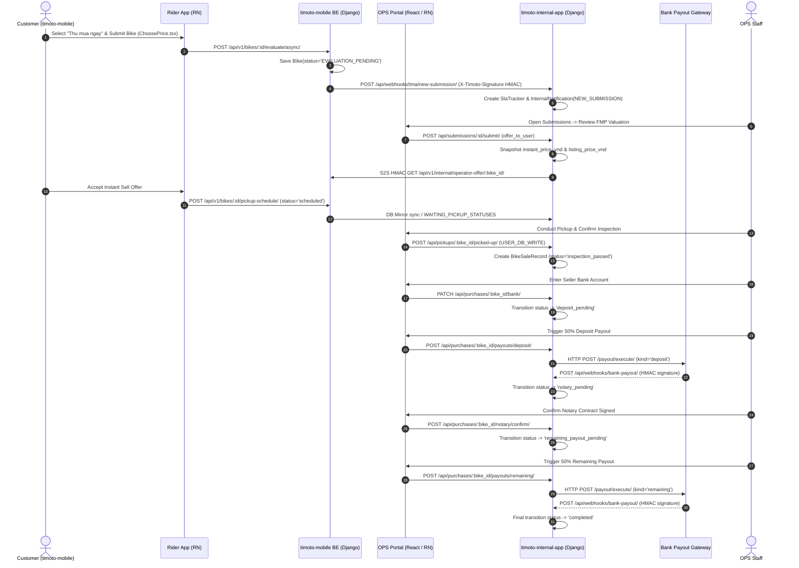

# 1. Overview & Business Intent

This document defines the complete end-to-end execution path for a Customer Selling a Motorcycle for **Instant Cash (Thu mua ngay)**. It traces every single hop: React Native frontend state -\> TMA Django backend DB records -\> Internal App OPS Web/Mobile portal -\> Payout Engine -\> Bank Webhooks.

# 2. Sequence Diagram (Cross-Repo Hop-by-Hop)

# 3. Step-by-Step Technical Execution

### Step 1: Customer Submission (timoto-mobile)

- **FE File**: `apps/mobile/src/screens/ChoosePriceScreen.tsx`
- **Action**: Calls `bikesApi.createPickupSchedule(bikeId, { price_type: 'instant' })`.
- **BE Route**: `POST /api/v1/bikes/{id}/evaluate/async/` (`bikes/views.py`).
- **Data Change**: Inserts into `bikes_bike` with `marketplace_status = 'EVALUATION_PENDING'`.

### Step 2: Webhook to OPS (timoto-internal-app)

- **BE File**: `backend/bikes/submissions_api.py`
- **Route**: `POST /api/webhooks/tma/new-submission/`
- **Security**: Verifies `X-Timoto-Signature` sha256 HMAC using `TMA_WEBHOOK_SECRET`.
- **Data Change**: `SlaTracker.objects.get_or_create(bike_id=bike_id)` and creates `InternalNotification(type='NEW_SUBMISSION')`.

### Step 3: OPS Pricing & FMP Offer

- **FE Component**: `backend/bikes/submissions_api.py` (`SubmissionDetail` view).
- **Route**: `POST /api/submissions/{bike_id}/submit/`
- **Data Change**: Calculates `listing_price_vnd` and `instant_price_vnd` from FMP formula. Updates `SlaTracker.pricing_submitted_at`.

### Step 4: Pickup & Inspection

- **Route**: `POST /api/pickups/{bike_id}/picked-up/` (`pickups_api.py`).
- **Data Change**: Transitions `BikeSaleRecord.status` from `waiting_pickup` -\> `inspection_passed`.

### Step 5: Bank Setup & 50/50 Dual Payout

- **Bank Route**: `PATCH /api/purchases/{bike_id}/bank/` -\> updates `account_number`, `bank_code`, `account_holder_name`.
- **Deposit Payout**: `POST /api/purchases/{bike_id}/payouts/deposit/` -\> creates `BikeSalePayout(kind='deposit', amount=total/2)`.
- **Notary**: `POST /api/purchases/{bike_id}/notary/confirm/` -\> sets `is_notary_signed = True`.
- **Remaining Payout**: `POST /api/purchases/{bike_id}/payouts/remaining/` -\> creates `BikeSalePayout(kind='remaining', amount=total/2)`.

# 4. Resilience & Error Handling

- **Double Payout Safeguard**: `BikeSalePayout` enforces unique payout per `(bike_id, kind)`.
- **Webhook Integrity**: Webhooks from Bank / TMA enforce HMAC sha256 request signatures.
- **Failures**: If payout HTTP rail fails, status reverts to `deposit_failed` or `remaining_payout_failed` allowing manual OPS retry.