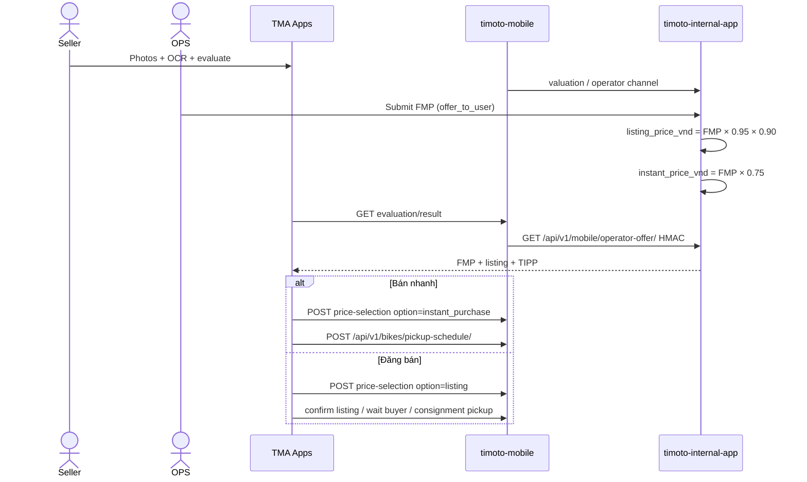

## Summary

Money path: rider lists a bike → mobile evaluate → OPS enters **FMP only** → internal snapshots listing \+ TIPP → HMAC operator-offer → seller picks listing vs instant → pickup. Full hop contracts (request JSON, 200 JSON, DB columns, FE bind) are on [Dual price](/features/dual-price-listing) and [Pickup reschedule](/features/pickup-reschedule). Postman 200 dumps: [OPS](/apis/postman-internal), [rider bikes](/apis/postman-mobile-bikes).



## Repos

- `timoto-mobile` — evaluate, price-selection, pickup-schedule, HMAC client
- `timoto-internal-app` — FMP submit, `tipp_pricing.py`, `GET /api/v1/mobile/operator-offer/`

## Files

- Internal: `backend/bikes/tipp_pricing.py`, `backend/bikes/mobile_operator_offer_views.py`, submissions pricing in `submissions_api.py`
- Internal docs: `docs/FE_FMP_TIPP_DUAL_PRICE.md`, `docs/API_OPERATOR_OFFER_DUAL_PRICE.md`, `docs/API_LISTING_FLOW.md`
- Mobile: evaluation price-selection \+ pickup-schedule views; `apps/evaluation/internal_operator_offer.py`
- Mobile docs: `docs/api/FRONTEND_DUAL_PRICE_FLOW_GUIDE.md`

## HTTP

| Step | Method | Path | Auth |
| --- | --- | --- | --- |
| OPS submit FMP | POST | `/api/submissions/:bike_id/pricing/` | OPS JWT |
| Mobile reads offer | GET | `/api/v1/mobile/operator-offer/?bike_id=&operator_review_request_id=` | HMAC (server-to-server) |
| Rider result | GET | `/api/v1/evaluation/result/{bike_id}/` | rider Bearer |
| Choose price | POST | `/api/v1/evaluation/price-selection/{bike_id}/` | rider Bearer |
| Pickup | POST/PATCH | `/api/v1/bikes/pickup-schedule/` | rider Bearer |

## Contract

Locked formulas (snapshot rates at submit; do not recompute old rows when env changes):

```text
listing_price_vnd  = FMP × 0.95 × 0.90   # FMP × 0.855
instant_price_vnd  = FMP × 0.75
```

`offer_to_user` **is** FMP. Never write TIPP into `offer_to_user` / `valuation_price`.

Operator-offer 200 example (FMP 25\_000\_000): `listing_price_vnd=21375000`, `instant_price_vnd=18750000`.

Price-selection body: `{ "option": "listing" | "instant_purchase" }`.

## Invariants

- OPS UI: only FMP editable. Listing \+ TIPP are server-computed (preview locally OK; persist only on submit).
- Tampered HMAC → 401. Stale offer rejected.
- Blind FMP: OPS must not see TIPP as an input field before submit (product rule).

## Tests

- Internal TIPP/FMP Django tests exist — keep green; add inverted-price reject if missing.
- Mobile operator-offer HMAC \+ paid-hook idempotency are P0 this sprint (one of each repo).
- Autonoma A1 this sprint; A2 listing \+ A6 OPS FMP are backlog. Playwright W3 (FMP submit) is nice-to-have.

## Do not

- Do not let the client submit `listing_price_vnd` / `instant_price_vnd` as source of truth.
- Do not use the older example rates (`market_multiplier_rate=1.04`) from stale drafts — locked rates are 0.95 / 0.90 / 0.75 unless a **snapshot** on the row says otherwise.
- Do not run live evaluate in PR CI.