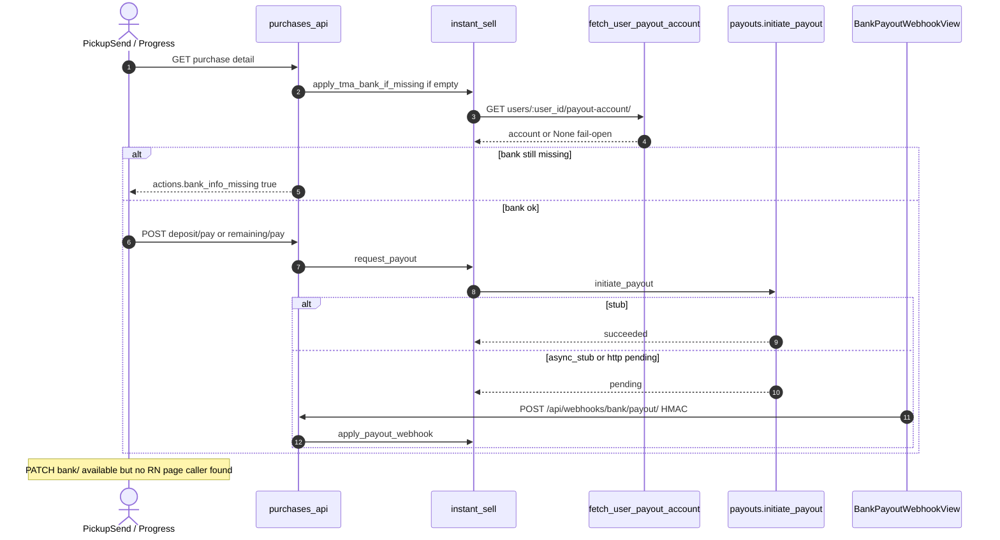
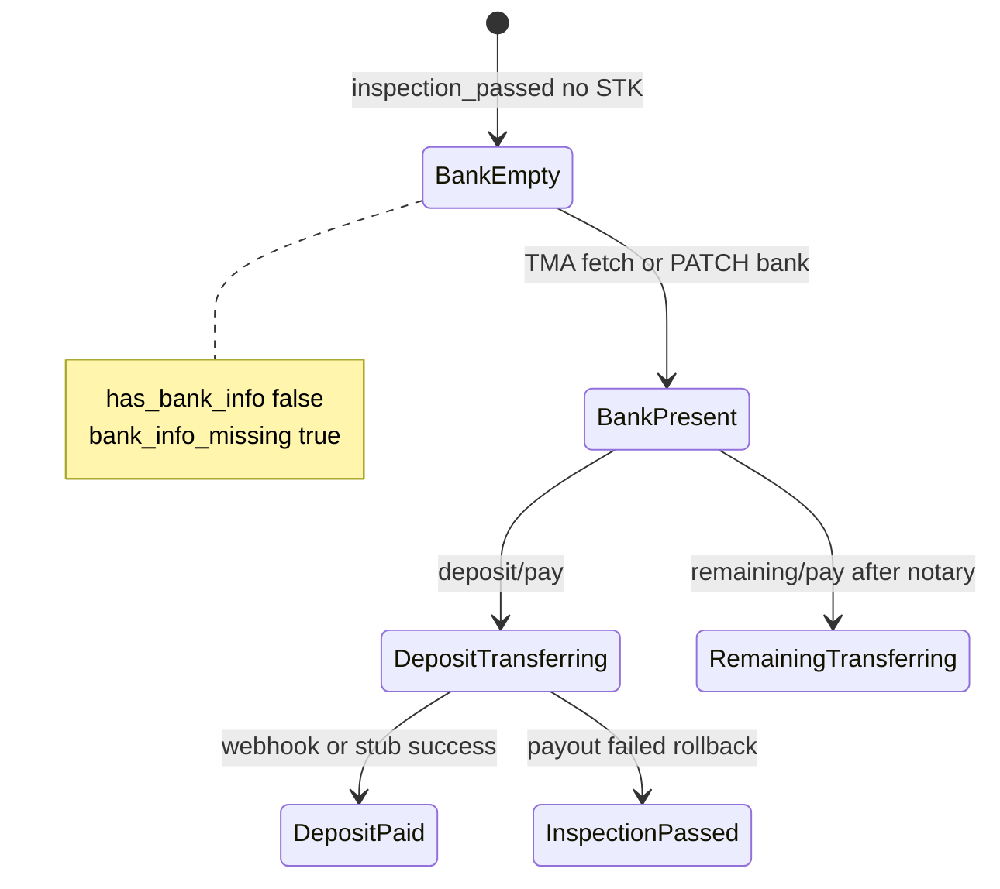

# 1. Overview and Business Intent

Instant Sell pays sellers in two legs. Before deposit or remaining transfer, the sale record must satisfy `has_bank_info`: non-empty `bank_account_number` **and** non-empty `bank_name` or `bank_bin`. Bank data arrives from (1) optional TMA user payout-account fetch on apply, (2) OPS `PATCH .../bank/`, or (3) neither — in which case FE shows bank missing and deposit CTA stays blocked via `actions.bank_info_missing`.

Outbound payout uses `payouts.initiate_payout` in modes `stub`, `async_stub`, or `http`. Async completion uses `POST /api/webhooks/bank/payout/` with HMAC-SHA256 over the raw body. That webhook authenticates the **bank provider callback**, not the seller account number.

**Actors:** OPS RN (`PickupSend.tsx` reads bank flags), Instant Sell engine, optional TMA `GET .../users/:user_id/payout-account/`, bank stub or HTTP API, webhook caller.

**Target files:**

- `backend/bikes/instant_sell.py` — `has_bank_info`, `bank_payload`, `save_bank_details`, `apply_tma_bank_if_missing`, payout gates
- `backend/bikes/payouts.py` — `initiate_payout`, modes, HTTP body with bank dict
- `backend/bikes/purchases_api.py` — `PurchaseBankView`, `BankPayoutWebhookView`
- `backend/bikes/tma_client.py` — `fetch_user_payout_account`
- `backend/ops_auth/models.py` — `BikeSaleRecord` bank columns, `BikeSalePayout`
- `apps/src/api/purchases.ts` — `patchPurchaseBank`, types
- `apps/src/pages/PickupSend.tsx` — `bank_info_missing` banner

**Not found in code:** NAPAS / Citad name-inquiry verification; OTP to confirm bank; FE screen that calls `patchPurchaseBank` (helper exported, **zero page imports**); WebSocket bank events.

---

# 2. End-to-End Flow and Sequence Diagram





---

# 3. Detailed API Contracts

### `PATCH /api/purchases/:bike_id/bank/`

- **Auth:** Ops JWT via `_require_ops`.
- **Engine:** `save_bank_details`.
- **Accepted body keys** (either naming style): `account_name` / `bank_account_name`, `account_number` / `bank_account_number`, `bank_name`, `bank_bin`.
- Sets `bank_source = 'ops'`.
- **Success 200:** JSON with `ok` true, `bike_id`, `bank` from `bank_payload`, and `actions` from `sale_actions`.

`bank_payload` includes account\_name, account\_number, bank\_name, bank\_bin, source, and `available: has_bank_info(record)`.

### `has_bank_info` rule (exact)

```text
number = strip(bank_account_number)
return bool(number) and bool(strip(bank_name) or strip(bank_bin))
```

Account name alone is **not** enough.

### TMA prefetch

`fetch_user_payout_account(user_id)` → `GET` `TMA_API_URL` \+ `/users/:user_id/payout-account/`, timeout 15s, fail-open on missing URL / 404 / transport errors. When a number is present it maps into the sale row and sets `bank_source` to `tma`.

### Payout initiation (`payouts.py`)

Env `BANK_PAYOUT_MODE`: `stub` (default immediate success), `async_stub` (pending until webhook), `http` (POST `BANK_PAYOUT_API_URL` with Idempotency-Key). HTTP payload includes bank account\_name, account\_number, bank\_name, bank\_bin. Misconfigured URL → failed result with escalate-to-Henry messaging.

### `POST /api/webhooks/bank/payout/`

- `AllowAny`, `authentication_classes = []`, `csrf_exempt`.
- Secret: `BANK_PAYOUT_WEBHOOK_SECRET` or `TMA_WEBHOOK_SECRET` or `WEBHOOK_HMAC_SECRET`.
- Header `X-Timoto-Signature: sha256=` \+ hex HMAC-SHA256 of **raw body**.
- JSON: `provider_ref` (required), `status` (required), optional `error_message`.
- Lookup payout by `provider_ref`; **no row lock**.

### HTTP error matrix

| Endpoint | HTTP | Condition |
| --- | --- | --- |
| PATCH bank | 404 | `SALE_NOT_STARTED` |
| PATCH bank | 409 | `SALE_TERMINAL` completed/failed |
| PATCH bank | 422 | `NO_BANK_FIELDS` empty update |
| deposit/remaining pay | 409/422 | missing bank via engine gate |
| webhook | 503 | secret unset |
| webhook | 401 | bad/missing `sha256=` signature |
| webhook | 400 | invalid JSON or missing provider\_ref/status |
| webhook | 200 | `ok` \+ payout \+ sale payloads |

FE types expect PATCH body:

```ts
{ account_name: string; account_number: string; bank_name: string; bank_bin?: string }
```

---

# 4. Data Model and State Machine

```sql
-- From ops_auth.models.BikeSaleRecord / BikeSalePayout
CREATE TABLE bike_sale_records (
  id UUID PRIMARY KEY,
  bike_id UUID UNIQUE NOT NULL,
  status VARCHAR(32) NOT NULL,
  bank_account_name VARCHAR(255) NULL,
  bank_account_number VARCHAR(64) NULL,
  bank_name VARCHAR(128) NULL,
  bank_bin VARCHAR(16) NULL,
  bank_source VARCHAR(16) NULL, -- 'ops' | 'tma' | null
  checklist JSONB NOT NULL DEFAULT '{}',
  purchase_price_vnd BIGINT NULL,
  deposit_amount_vnd BIGINT NULL,
  remaining_amount_vnd BIGINT NULL,
  updated_at TIMESTAMPTZ NOT NULL
);

CREATE TABLE bike_sale_payouts (
  id UUID PRIMARY KEY,
  sale_id UUID NOT NULL REFERENCES bike_sale_records(id),
  kind VARCHAR(16) NOT NULL, -- deposit | remaining
  amount_vnd BIGINT NOT NULL,
  status VARCHAR(16) NOT NULL, -- pending | succeeded | failed
  provider VARCHAR(64) NULL,
  provider_ref VARCHAR(128) NULL,
  idempotency_key VARCHAR(128) NULL,
  error_message TEXT NULL,
  raw_response JSONB NULL
);
```

`sale_actions` surfaces `bank_info_missing`, `can_pay_deposit`, `can_pay_remaining` (latter also needs notary), and `escalate_to_henry` when a payout failed.

There is **no** verified/unverified bank status column — presence of number \+ name/bin is the only gate.

---

# 5. Frontend Integration Guide

**PickupSend.tsx:** after purchase detail load, `setBankMissing(Boolean(purchase.actions?.bank_info_missing))`. Banner copy tells OPS that the seller must enter bank on TMA; deposit CTA remains gated by actions. **Does not** open a bank form or call `patchPurchaseBank`.

**purchases.ts:** exports `patchPurchaseBank` for OPS tools / future UI. Grep across `apps/src/pages` shows **no** call sites.

**Postman:** `scripts/sync_postman_internal.py` documents PATCH bank sample with Vietcombank / bin `970436` and webhook HMAC folder for S2S (not JWT).

Cross-links: [Instant Sell engine](./instant-sell-engine), [Notary](./notary-contract-signing), mobile sell flow for seller-side context.

---

# 6. Edge Cases and Known Pitfalls

- **Name not validated** against the account number — OPS or seller typo will still pass `has_bank_info` and can reach HTTP payout.
- **TMA payout-account path** is constructed in IA `tma_client.py`; a matching route was **not found** under `timoto-mobile/backend` in this documentation scan (fail-open means empty bank).
- **Webhook secret missing** returns 503, not 401 — different from bad signature.
- **Signature compare** uses `hmac.compare_digest` on hex digest after stripping `sha256=` prefix.
- **Stub mode** never hits the webhook; staging may use `async_stub` to exercise HMAC.
- **Escalation:** failed payout payloads may include `escalate_to: 'Henry'` on deposit/remaining responses.
- Do not invent OTP bank confirmation or FOR UPDATE locking — neither appears in these modules.

**Not found in code:** dedicated “bank verification” microservice; account ownership challenge; FE bank edit screen wired to PATCH.