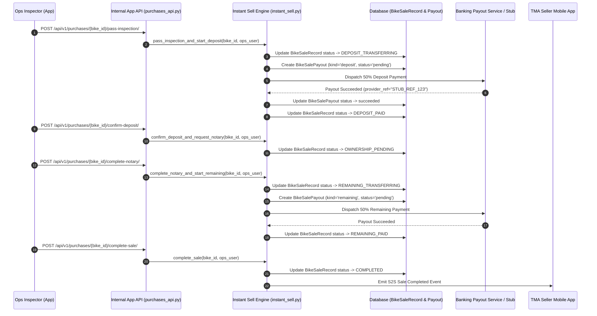
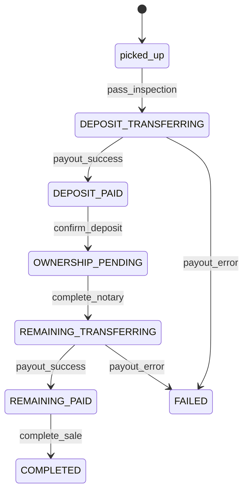

## 1. Overview & Business Intent

- **Business Role**: The **Deposit & Payout Engine** handles instant vehicle purchases by TiMoto. It manages the two-phase payment sequence: **50% Deposit** upon vehicle inspection pass and **50% Remaining Payout** upon notary contract execution and title transfer.
- **Actors**: Operations Inspectors, Ops Admins, Banking Gateway / Payout Service Stub, TMA Seller App.
- **Target Repos**: `timoto-internal-app` (`backend/ops_auth/models.py`, `backend/bikes/instant_sell.py`, `backend/bikes/payouts.py`, `backend/bikes/purchases_api.py`), `timoto-mobile` (`apps/src/pages/PurchaseProgress.tsx`).

---

## 2. End-to-End Flow & Sequence Diagram



---

## 3. Detailed API Contracts

### A. Pass Inspection & Trigger Deposit

- **HTTP Method & Route**: `POST /api/v1/purchases/{bike_id}/pass-inspection/`
- **Auth & Guards**: Django Session / Bearer JWT (`IsAuthenticated`).
- **Request Body**:
  ```json
  {
    "purchase_price_vnd": 30000000,
    "bank_account_name": "NGUYEN VAN A",
    "bank_account_number": "19038475629011",
    "bank_name": "Techcombank",
    "bank_bin": "970407"
  }
  ```
- **Success Response (200 OK)**:
  ```json
  {
    "status": "success",
    "sale": {
      "bike_id": "8f3e4a2d-1122-3344-5566-778899aabbcc",
      "status": "deposit_paid",
      "deposit_amount_vnd": 15000000,
      "remaining_amount_vnd": 15000000,
      "payouts": [
        {
          "kind": "deposit",
          "amount_vnd": 15000000,
          "status": "succeeded",
          "provider_ref": "STUB_DEP_1723996800"
        }
      ]
    }
  }
  ```

### B. Complete Notary & Trigger Remaining Payout

- **HTTP Method & Route**: `POST /api/v1/purchases/{bike_id}/complete-notary/`
- **Success Response (200 OK)**:
  ```json
  {
    "status": "success",
    "sale": {
      "bike_id": "8f3e4a2d-1122-3344-5566-778899aabbcc",
      "status": "remaining_paid",
      "remaining_amount_vnd": 15000000,
      "payouts": [
        { "kind": "deposit", "status": "succeeded" },
        { "kind": "remaining", "status": "succeeded", "provider_ref": "STUB_REM_1723997200" }
      ]
    }
  }
  ```

---

## 4. Database Schema & State Transitions

### Models (`bike_sale_records` & `bike_sale_payouts`)



- **Unique Constraint**: `uniq_bike_sale_payout_kind` on `(sale_id, kind)`. Prevents duplicate payouts of the same phase.
- **50/50 Math Formula**:
  - `deposit_amount_vnd = purchase_price_vnd // 2`
  - `remaining_amount_vnd = purchase_price_vnd - deposit_amount_vnd`

---

## 5. Resilience & Error Mitigations

1. **Race Condition Prevention**: Payout transitions wrap `BikeSaleRecord.objects.select_for_update()`.
2. **Payout Error Handling**: If banking gateway fails, payout status marks as `failed` with `error_message`, and `BikeSaleRecord` status marks as `FAILED` to block invalid status advancement.