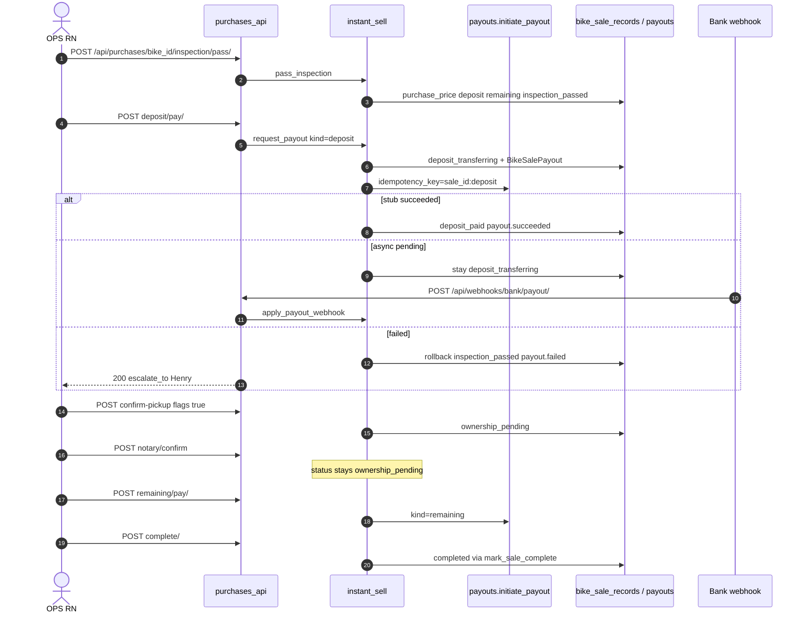
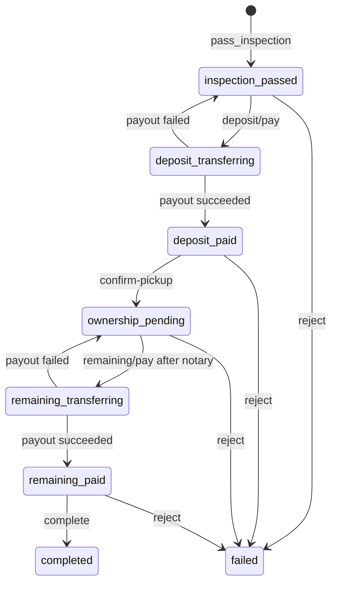

## 1. Overview & Business Intent

This document isolates the **money movement slice** of Instant Sell / listing purchase inside `timoto-internal-app`: two bank legs of 50% each after inspection, gated by bank snapshot presence and OPS checklist flags. It is not the full Instant Sell product overview (calendar → inspect → notary → marketplace). For end-to-end product context see sibling `instant-sell-engine.mdx`; for bank field presence vs NAPAS name-inquiry myths see `bank-verification.mdx` (note: do not invent a DB `idempotency_key` column — it is HTTP-only).

**Actors:** OPS RN (`PickupSend.tsx`, `PurchaseProgress.tsx`), `instant_sell.request_payout`, `payouts.initiate_payout`, optional bank HMAC webhook, TMA payout-account fetch.

**Core files**

| File | Role |
| --- | --- |
| `backend/bikes/instant_sell.py` | Amounts, bank gate, request\_payout, webhook apply, confirm pickup/notary/complete |
| `backend/bikes/purchases_api.py` | HTTP surface \+ `BankPayoutWebhookView` |
| `backend/bikes/payouts.py` | stub / async\_stub / http client |
| `backend/bikes/sale.py` | `SaleTransitionError`, `mark_sale_complete` |
| `backend/ops_auth/models.py` | `BikeSaleRecord`, `BikeSalePayout` |
| Migration | `ops_auth/migrations/0014_instant_sell_payouts.py` |

**Absences in these modules (rg evidence)**

- No OTP for bank confirm.
- No `select_for_update` / `transaction.atomic` wrapping `request_payout` (row locks elsewhere e.g. outbox are unrelated).
- No WebSocket bank events — RN polls purchase detail.
- No NAPAS/VietQR/Citad name inquiry — `has_bank_info` is string presence only.
- No DB column `idempotency_key` on `bike_sale_payouts`.

---

## 2. End-to-End Flow & Sequence Diagram

Amounts are created at **inspection pass**, not at pay time: `deposit = total // 2`, `remaining = total - deposit`. Deposit pay requires status `inspection_passed` (or already `deposit_transferring`) and bank fields. Remaining pay requires `ownership_pending` **and** `checklist.notary_confirmed` plus bank.





Per-kind payout row: `(none) → pending|succeeded|failed`; failed allows retry reusing the same row and same idempotency key string; succeeded short-circuits re-initiate.

---

## 3. Detailed API Contracts

Base `/api/` — OPS JWT except bank webhook.

| Method | Path | Engine entry |
| --- | --- | --- |
| GET | `/purchases/`, `/purchases/bike_id/` | detail includes bank, payouts, step, actions |
| PATCH | `/purchases/bike_id/bank/` | OPS bank snapshot `bank_source=ops` |
| POST | `/purchases/bike_id/inspection/pass/` | creates amounts |
| POST | `/purchases/bike_id/deposit/pay/` | `request_payout(deposit)` |
| POST | `/purchases/bike_id/confirm-pickup/` | body flags exactly `true` |
| POST | `/purchases/bike_id/notary/confirm/` | checklist only |
| POST | `/purchases/bike_id/remaining/pay/` | `request_payout(remaining)` |
| POST | `/purchases/bike_id/complete/` | terminal |
| POST | `/purchases/bike_id/reject/` | failed |
| POST | `/webhooks/bank/payout/` | HMAC `X-Timoto-Signature: sha256=` |

**Confirm bodies (JSON boolean `true` required — `is True`)**

- Pickup: `bike_matches_listing`, `deposit_paid_confirmed`
- Notary: `seller_signed`, `notary_confirmed_transfer`
- Complete: `documents_received`, `remaining_paid_confirmed`

**PATCH bank** accepts `account_name`, `account_number`, `bank_name`, `bank_bin` (or `bank_account_*` aliases). Response fields: ok, bike\_id, bank, actions — not full detail.

**Pay success** returns full detail payload plus `payout` object (`id`, `kind`, `amount_vnd`, `status`, `provider`, `provider_ref`, timestamps, `error_message`). Failed bank call still **HTTP 200** with `payout.status=failed` and `escalate_to: "Henry"`.

**Webhook body:** `provider_ref`, `status`, optional `error_message`. Lookup by `provider_ref` only.

**SaleTransitionError matrix (representative)**

| Code | HTTP | When |
| --- | --- | --- |
| `BANK_INFO_MISSING` | 422 | pay without bank |
| `SALE_WRONG_STATE` | 409 | wrong status for kind |
| `NOTARY_NOT_CONFIRMED` | 409 | remaining before notary |
| `DEPOSIT_NOT_PAID` | 409 | confirm-pickup early |
| `REMAINING_NOT_PAID` | 409 | complete early |
| `PAYOUT_AMOUNT_MISSING` | 422 | amount ≤ 0 |
| `CONFIRMATIONS_REQUIRED` | 422 | flags not true |
| `SALE_TERMINAL` | 409 | completed/failed |
| `SALE_NOT_STARTED` | 404 | no sale |
| `PAYOUT_NOT_FOUND` | 404 | webhook unknown ref |
| `INVALID_PAYOUT_STATUS` | 422 | bad webhook status |
| Webhook secret unset / bad HMAC | 503 / 401 |  |

Envelope shape: ok false plus nested error with code and message strings.

**Bank modes (`BANK_PAYOUT_MODE`)**

| Mode | Behavior |
| --- | --- |
| `stub` (default) | Immediate `succeeded`, provider\_ref like stub-kind-uuid |
| `async_stub` | `pending` until webhook |
| `http` | POST `BANK_PAYOUT_API_URL` 30s, header `Idempotency-Key` |

HTTP payload includes `amount_vnd`, `kind`, `bike_id`, `sale_id`, `idempotency_key`, `bank` object.

---

## 4. Database Schema & State Transitions

```sql
-- Logical: bike_sale_records (BikeSaleRecord)
CREATE TABLE bike_sale_records (
  id UUID PRIMARY KEY,
  bike_id UUID UNIQUE NOT NULL,
  schedule_id UUID NULL,
  status VARCHAR(32) NOT NULL,  -- see SaleStatus
  sale_channel VARCHAR(16) NOT NULL,  -- instant_sell | listing
  purchase_price_vnd BIGINT NULL,
  deposit_amount_vnd BIGINT NULL,
  remaining_amount_vnd BIGINT NULL,
  bank_account_name VARCHAR(255) NULL,
  bank_account_number VARCHAR(64) NULL,
  bank_name VARCHAR(128) NULL,
  bank_bin VARCHAR(16) NULL,
  bank_source VARCHAR(16) NULL,  -- tma | ops
  checklist JSONB NOT NULL DEFAULT '{}',
  picked_up_at TIMESTAMP NULL,
  completed_at TIMESTAMP NULL,
  completed_by_ops_user_id UUID NULL,
  failed_at TIMESTAMP NULL,
  failed_by_ops_user_id UUID NULL,
  failure_reason TEXT NULL,
  created_at TIMESTAMP NOT NULL,
  updated_at TIMESTAMP NOT NULL
);

CREATE TABLE bike_sale_payouts (
  id UUID PRIMARY KEY,
  sale_id UUID NOT NULL REFERENCES bike_sale_records(id) ON DELETE CASCADE,
  kind VARCHAR(16) NOT NULL,  -- deposit | remaining
  amount_vnd BIGINT NOT NULL,
  status VARCHAR(16) NOT NULL,  -- pending | succeeded | failed
  provider VARCHAR(32) NOT NULL DEFAULT 'stub',
  provider_ref VARCHAR(128) NULL,
  requested_by_ops_user_id UUID NULL,
  requested_at TIMESTAMP NOT NULL,
  confirmed_at TIMESTAMP NULL,
  error_message TEXT NULL,
  raw_response JSONB NOT NULL DEFAULT '{}',
  UNIQUE (sale_id, kind)
);
```

Model default status is still `'picked_up'` (legacy); Instant Sell happy path creates/updates to `inspection_passed` and **never writes `picked_up`**.

**CTA flags (`sale_actions`)** — `can_pay_deposit` when `inspection_passed` ∧ bank; `bank_info_missing` when inspection\_passed ∧ ¬bank; `can_confirm_pickup` when `deposit_paid`; `can_confirm_notary` when ownership\_pending ∧ ¬notary; `can_pay_remaining` when ownership\_pending ∧ notary ∧ bank; `can_complete_sale` when `remaining_paid`; `escalate_to_henry` when deposit or remaining payout failed.

Bank snapshot sources: TMA fail-open GET users/user\_id/payout-account/ (`bank_source=tma`), or OPS PATCH (`ops`). Account **name is never verified** against number.

---

## 5. Frontend & UI Logic (if applicable)

| Screen / module | Role |
| --- | --- |
| `apps/src/api/purchases.ts` | Typed clients for pay/confirm/complete |
| `PickupSend.tsx` | Deposit phase CTAs |
| `PurchaseProgress.tsx` | Remaining / notary / complete |
| Poll helper | `pollPurchaseDetail` (~8 × 800ms) — not WS |

`patchPurchaseBank` is exported from the API module but **no page currently calls it** (search pages for callers → unused). UI step model is three steps (`deposit` / `notary` / `complete`) with amounts on deposit and remaining steps from detail payload.

Deploy scripts may pin `BANK_PAYOUT_MODE=stub` for ECS staging — treat live mode as an ops config concern, not a code path invention.

---

## 6. Edge Cases & Resilience

1. **Odd VND** — e.g. total `1` → deposit `0`, remaining `1` → deposit pay hits `PAYOUT_AMOUNT_MISSING`.
2. **Failed payout HTTP 200** — clients must read `payout.status`, not only HTTP status.
3. **No row lock** — concurrent deposit/pay races possible; uniqueness is `(sale, kind)` only.
4. **Confirm pickup without waiting schedule** — can still set `ownership_pending` but later complete may 404 `PICKUP_NOT_COMPLETED` via `mark_sale_complete`.
5. **Second complete on completed** — gate expects `remaining_paid`; terminal completed raises wrong-state errors.
6. **Retry after fail** — same payout row \+ same idempotency key string to bank.
7. **TMA push best-effort** — exceptions logged; local DB state still advances.
8. **pass\_inspection idempotent** — if already past `inspection_passed`, returns existing amounts/status.
9. **Legacy `picked_up`** — old pickup APIs may still create that status; Instant Sell deposit machine must not be documented as using it.
10. **Customer app cannot call deposit pay** — OPS JWT purchases APIs only.

**Distinct from full Instant Sell:** notary and complete are adjacent checklist/terminal gates; marketplace listing and dealer catalog sync happen inside `mark_sale_complete`, outside the bank client. Deposit\+payout is the **two-leg bank state machine** only.