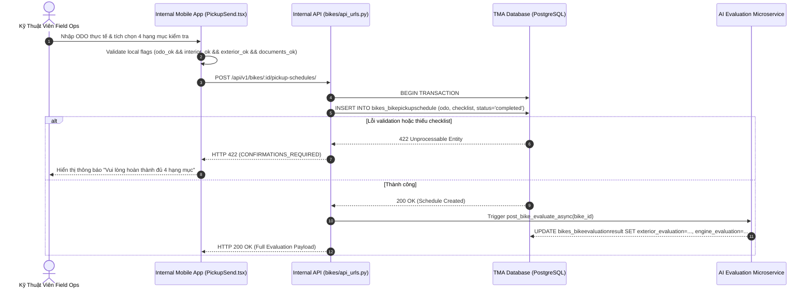

# 1. Tổng Quan Nghiệp Vụ & Phạm Vi (Context & Architecture)

Quy trình thẩm định xe máy (**Vehicle Inspection**) là bước nền tảng để xác định chất lượng thực tế của phương tiện trước khi đưa ra báo giá mua trực tiếp (TIPP) hoặc niêm yết sàn. Hệ thống kết hợp đánh giá thủ công 50 điểm của kỹ thuật viên với mô hình AI phân tích hình ảnh và âm thanh động cơ.

### Repositories Liên Quan

- **Frontend Web/Mobile**: `timoto-internal-app/apps/src/pages/PickupSend.tsx`, `BikeDetail.tsx`
- **Backend Core Service**: `timoto-internal-app/backend/bikes/api_helpers.py`, `backend/bikes/models.py`
- **AI Evaluation Mirror**: `timoto-mobile/backend/apps/bikes/views.py`, `models.py`

---

# 2. Sequence Diagram Chi Tiết (Có Validation & Failure Path)



---

# 3. Database Schema & Data Dictionary

### Table: `bikes_bikeevaluationresult`

```sql
CREATE TABLE bikes_bikeevaluationresult (
    bike_id UUID PRIMARY KEY REFERENCES bikes_bike(bike_id) ON DELETE CASCADE,
    exterior_evaluation JSONB NULL,
    engine_stage1_result JSONB NULL,
    exhaust_smoke_evaluation JSONB NULL,
    engine_evaluation JSONB NULL,
    pricing_estimation JSONB NULL,
    updated_at TIMESTAMPTZ NULL
);
```

### Thuật Toán Tính Điểm Tổng Hợp (`evaluation_dict`)

```python
def evaluation_dict(e: BikeEvaluationResult) -> dict:
    exterior = e.exterior_evaluation or {}
    engine = e.engine_evaluation or {}
    ext_parsed = _parse_exterior(exterior)
    eng_parsed = _parse_engine(engine)

    body_score = ext_parsed.get('body_condition_score')
    engine_score = eng_parsed.get('engine_condition_score')
    if body_score is not None and engine_score is not None:
        combined_score = round((body_score + engine_score) / 2, 2)
    else:
        combined_score = body_score if body_score is not None else engine_score if engine_score is not None else getattr(e, 'condition_score', None)

    return {
        'exterior_evaluation': exterior,
        'engine_evaluation': engine,
        'condition_score': combined_score,
        'exterior': ext_parsed,
        'engine': eng_parsed,
    }
```

---

# 4. Chi Tiết API Contracts

### Endpoint: Cập nhật kết quả kiểm tra & AI Report

`POST /api/v1/bikes/:bike_id/evaluate/`

#### Request Body

```json
{
  "bike_id": "8f3e4a2d-1122-3344-5566-778899aabbcc",
  "odo_km": 15000,
  "checklist": {
    "odo_ok": true,
    "interior_ok": true,
    "exterior_ok": true,
    "documents_ok": true
  }
}
```

#### Success Response (200 OK)

```json
{
  "status": "success",
  "data": {
    "bike_id": "8f3e4a2d-1122-3344-5566-778899aabbcc",
    "condition_score": 8.5,
    "exterior": {
      "body_condition_score": 8.0,
      "total_repair_cost_vnd": 500000
    },
    "engine": {
      "engine_condition_score": 9.0,
      "total_repair_cost_vnd": 0
    }
  }
}
```

---

# 5. Logic Frontend & UI Validation Matrix

Trạng thái Form kiểm tra tại `PickupSend.tsx`:

```typescript
const CHECKLIST = [
  {id: 'odo', label: 'ODO thực tế', apiKey: 'odo_ok'},
  {id: 'interior', label: 'Nội thất máy móc', apiKey: 'interior_ok'},
  {id: 'exterior', label: 'Ngoại thất (chụp ảnh)', apiKey: 'exterior_ok'},
  {id: 'documents', label: 'Giấy tờ xe', apiKey: 'documents_ok'},
];

const isFormValid = Object.values(checklist).every(Boolean) && odometerKm > 0;
```

---

# 6. Edge Cases & Resilience

1. **AI Microservice Timeout**: Nếu service AI không phản hồi trong 10s, `evaluation_dict` sẽ lấy điểm `body_condition_score` duy nhất làm điểm tổng hợp tạm thời để không block luồng thu mua.
2. **PostgreSQL Schema Isolation**: Database `tma_db` sử dụng `managed = False` trên Django ORM để bảo vệ schema sản xuất khỏi bị migrate nhầm.