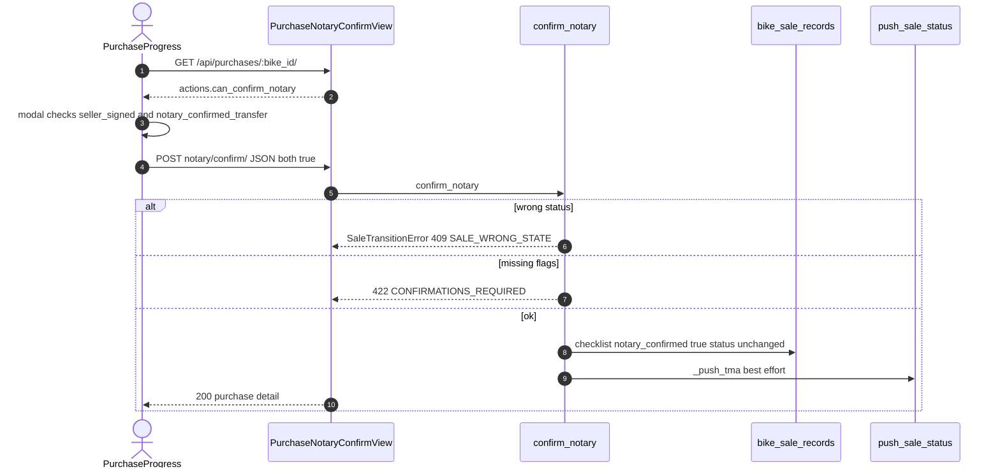
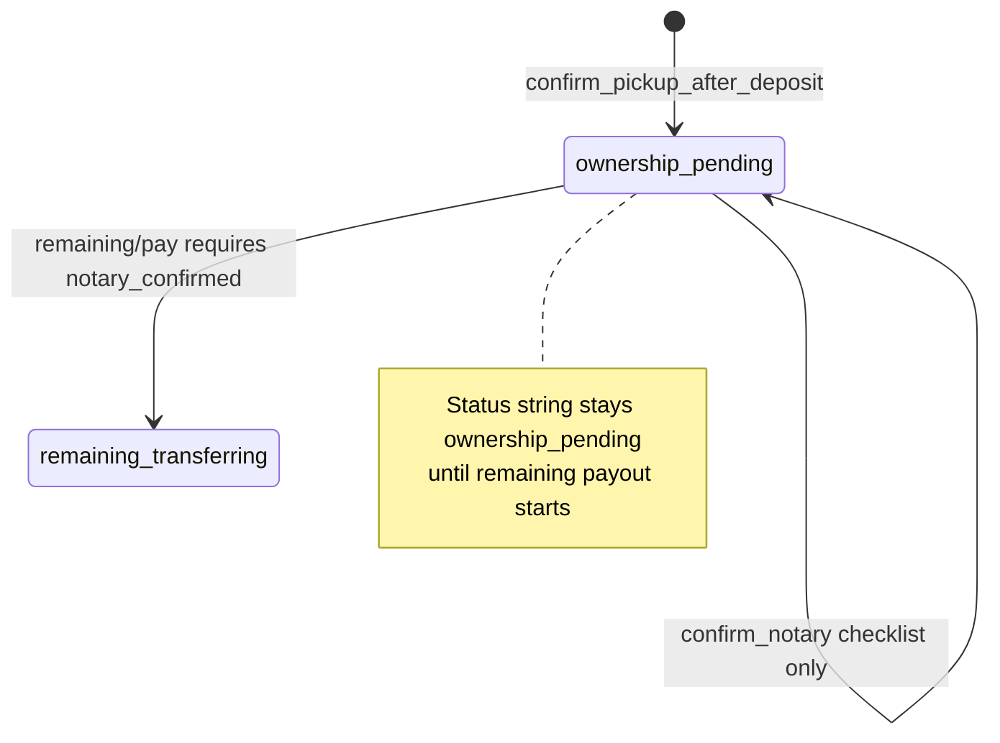

# 1. Overview and Business Intent

After deposit payout succeeds and OPS confirms pickup, Instant Sell enters `ownership_pending`. Paperwork and notary happen offline. The product records completion with a single authenticated POST that requires two boolean flags both true: `seller_signed` and `notary_confirmed_transfer`. The engine sets checklist `notary_confirmed` and timestamps; **sale status does not change**. Remaining 50% payout is blocked until that checklist flag is true.

**Actors:** OPS React Native (`PurchaseProgress.tsx`), `OpsUser` JWT, Instant Sell engine, optional TMA `push_sale_status` after checklist save.

**Target files:**

- `backend/bikes/instant_sell.py` — `NOTARY_CONFIRM_KEYS`, `confirm_notary`, `sale_actions.can_confirm_notary`
- `backend/bikes/purchases_api.py` — `PurchaseNotaryConfirmView`
- `backend/bikes/api_urls.py` — `purchases/:bike_id/notary/confirm/`
- `backend/bikes/sale.py` — checklist surface on sale payloads
- `apps/src/api/purchases.ts` — `postPurchaseNotaryConfirm`, `PostPurchaseNotaryBody`
- `apps/src/pages/PurchaseProgress.tsx` — notary modal CTA
- Tests: `backend/bikes/tests_purchases_api.py`
- Postman sync comments in `scripts/sync_postman_internal.py`

**Not found in code:** DocuSign / VNPT e-sign / PDF contract generator; WebSocket notary channel; `SELECT FOR UPDATE` on sale rows during notary; separate notary microservice.

---

# 2. End-to-End Flow and Sequence Diagram





Progress stepper in purchase detail marks step key `notary` done when checklist `notary_confirmed` is true or status is already past ownership (remaining / completed).

---

# 3. Detailed API Contracts

### `POST /api/purchases/:bike_id/notary/confirm/`

- **Auth:** `IsAuthenticated` \+ `_require_ops` (must be `OpsUser`).
- **View:** `PurchaseNotaryConfirmView.post`
- **Body (required true flags):**

```json
{
  "seller_signed": true,
  "notary_confirmed_transfer": true
}
```

Constants: `NOTARY_CONFIRM_KEYS = ('seller_signed', 'notary_confirmed_transfer')` via `parse_required_true_flags`.

**Success:** HTTP 200 full `_purchase_detail_payload` (same envelope as other purchase mutates). Checklist gains:

- `seller_signed`: true
- `notary_confirmed_transfer`: true
- `notary_confirmed`: true
- `notary_confirmed_at`: ISO timestamp
- `notary_confirmed_by_ops_user_id`: OPS user uuid string

**Status field:** remains `ownership_pending`.

### Related read-only fields

`sale_actions(record)` exposes:

- `can_confirm_notary`: status is `ownership_pending` and not yet `notary_confirmed`
- `can_pay_remaining`: `ownership_pending` and notary ok and `has_bank_info`
- `notary_confirmed`: boolean mirror

### HTTP error matrix

| HTTP | code / detail | When |
| --- | --- | --- |
| 401/403 | auth / not ops | missing JWT or not OpsUser |
| 404 | bike missing | `_get_bike` fails before engine |
| 404 | `SALE_NOT_STARTED` | no `BikeSaleRecord` |
| 409 | `SALE_WRONG_STATE` | status ≠ `ownership_pending` |
| 422 | `CONFIRMATIONS_REQUIRED` | either flag missing or not true |
| 200 | ok | checklist updated |

Envelope for `SaleTransitionError`: `ok: false` plus `error.code` and `error.message` with HTTP = `exc.status_code`.

Remaining pay without notary raises in engine: message about confirming notary before remaining funds (see Instant Sell request\_payout path).

---

# 4. Data Model and State Machine

```sql
CREATE TABLE bike_sale_records (
  id UUID PRIMARY KEY,
  bike_id UUID UNIQUE NOT NULL,
  schedule_id UUID NULL,
  status VARCHAR(32) NOT NULL,
  sale_channel VARCHAR(16) NOT NULL,
  purchase_price_vnd BIGINT NULL,
  deposit_amount_vnd BIGINT NULL,
  remaining_amount_vnd BIGINT NULL,
  bank_account_name VARCHAR(255) NULL,
  bank_account_number VARCHAR(64) NULL,
  bank_name VARCHAR(128) NULL,
  bank_bin VARCHAR(16) NULL,
  bank_source VARCHAR(16) NULL,
  checklist JSONB NOT NULL DEFAULT '{}',
  picked_up_at TIMESTAMPTZ NULL,
  completed_at TIMESTAMPTZ NULL,
  completed_by_ops_user_id UUID NULL,
  failed_at TIMESTAMPTZ NULL,
  failed_by_ops_user_id UUID NULL,
  failure_reason TEXT NULL,
  created_at TIMESTAMPTZ NOT NULL,
  updated_at TIMESTAMPTZ NOT NULL
);
```

Notary writes **only** `checklist` and `updated_at`. No dedicated notary table. No row lock in `confirm_notary`.

State relevance:

1. Enter `ownership_pending` via `confirm_pickup_after_deposit` (requires deposit paid \+ confirmation flags).
2. `confirm_notary` while still `ownership_pending`.
3. `request_payout` kind remaining requires `notary_confirmed` in checklist.
4. Reject path can still fail the sale from `ownership_pending` if OPS rejects.

---

# 5. Frontend Integration Guide

**Primary UI:** `apps/src/pages/PurchaseProgress.tsx`.

- Reads `actions.can_confirm_notary`.
- Primary CTA label when eligible: `Hoàn tất thủ tục công chứng`.
- Opens modal kind `notary` with a single check id `notary` labeled about receiving confirmation from the notary office.
- On confirm calls `postPurchaseNotaryConfirm` with both required flags set true.
- Note: path helper uses bike id (purchase id == bike uuid in this API).

**API helper:** `apps/src/api/purchases.ts` → `purchasesPath(bikeId, 'notary/confirm/')` POST JSON.

**Discovery:** `ops_api.py` documents `purchase_notary_confirm`: `POST /api/purchases/:bike_id/notary/confirm/`.

**Do not** call notary from customer TMA app — no caller under `timoto-mobile`.

Cross-links: [Instant Sell engine](./instant-sell-engine), [Bank verification / payout bank](./bank-verification), [Pickups lifecycle](./pickups-lifecycle).

---

# 6. Edge Cases and Known Pitfalls

- **Idempotent-ish UI:** if notary already confirmed, `can_confirm_notary` becomes false; repeating POST while still `ownership_pending` would set checklist again (same values) unless product adds a guard — engine does not raise “already confirmed”.
- **Status unchanged** confuses operators expecting a `notary_done` status — product uses checklist, not a new enum value.
- **Remaining pay** still needs bank info (`has_bank_info`) even after notary.
- **Complete sale** requires `remaining_paid`, not merely notary.
- **Offline paperwork:** the API only stores OPS attestation; there is no file upload field on this endpoint.
- **TMA push failure** does not roll back checklist — `_push_tma` is best-effort like other Instant Sell steps.
- Tests cover notary-then-remaining stub path in `tests_purchases_api.py`; use those as the contract for QA.

**Not found in code:** digital signature capture widget beyond boolean checks; notary office id field; multi-party countersign workflow.