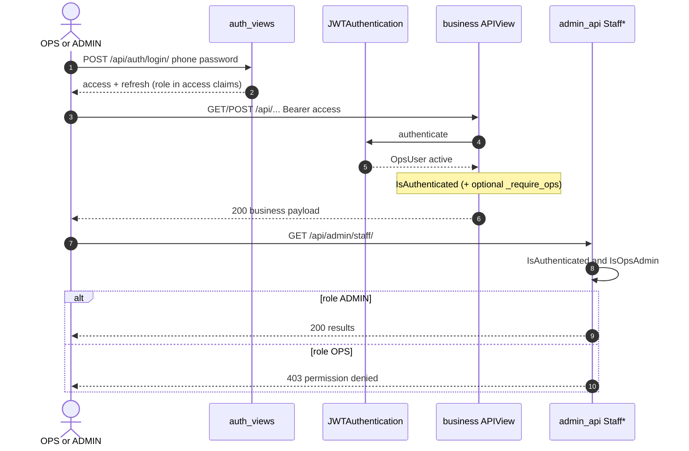
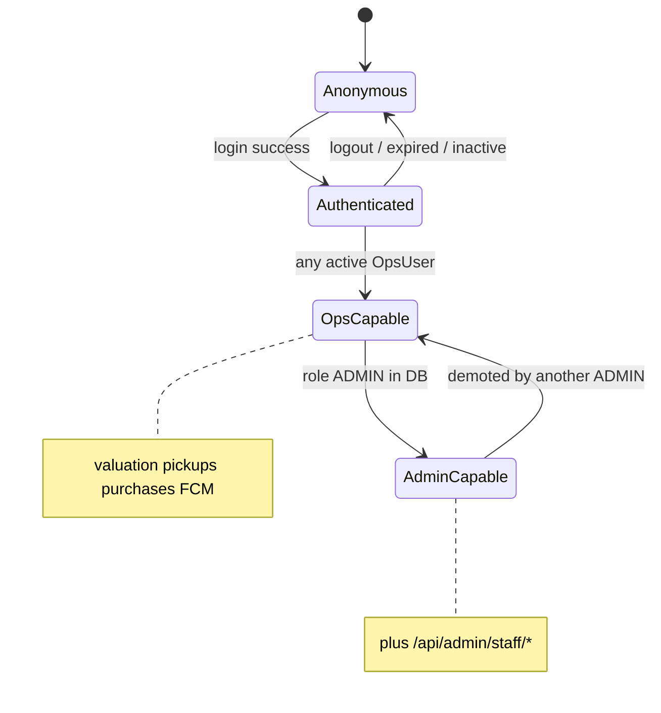

## 1. Overview & Business Intent

Internal App (IA) authenticates operations staff as `OpsUser` rows, not Django `auth_user`. There are exactly two roles stored as strings on `ops_users.role`: `OPS` (default) and `ADMIN`. Almost every business API treats both roles identically once a valid JWT proves an active `OpsUser`. The only HTTP elevation to ADMIN is staff CRUD under `/api/admin/staff/`.

**Intent**

- Let any active OPS/ADMIN phone\+password session run valuation, pickups, purchases, submissions, vehicles, notifications, FCM register.
- Restrict creating/editing other staff accounts to ADMIN.
- Avoid a fine-grained permission catalog — none exists in code.

**Source of truth**

| Concern | Path |
| --- | --- |
| Model | `backend/ops_auth/models.py` (`OpsUser`) |
| Admin permission | `backend/ops_auth/permissions.py` (`IsOpsAdmin`) |
| JWT auth | `backend/ops_auth/authentication.py`, `jwt_tokens.py` |
| Login/refresh/logout | `backend/ops_auth/auth_views.py` |
| Staff APIs | `backend/ops_auth/admin_api.py` |
| `_require_ops` valuation | `backend/bikes/ops_api.py` |
| `_require_ops` purchases | `backend/bikes/purchases_api.py` |
| Routes | `backend/bikes/api_urls.py` |
| DRF defaults | `backend/config/settings.py` |
| Web nav gate | `frontend_web_version/src/components/Layout.tsx`, `StaffPage.tsx` |
| Bootstrap CLI | `backend/ops_auth/management/commands/ops_bootstrap.py` |

**Absences (rg under backend \+ apps)**

- `HasRole`, `IsOpsUser`, `_require_admin`, `role_required`, `has_object_permission` → no matches.
- No gate that requires `role == 'OPS'` (ADMIN may use all OPS workflows).
- No OTP/SMS for OPS login — phone \+ password → JWT only.
- RN `apps/` has **no** `/admin/staff` client and no ADMIN-only nav (role may display but is not gated).

---

## 2. End-to-End Flow & Sequence Diagram

Login issues access (embeds `role`) \+ refresh tokens. Subsequent requests send `Authorization: Bearer` access token. `JWTAuthentication` loads `OpsUser` by `sub`; inactive users fail auth. View permission is usually global `IsAuthenticated`. Staff endpoints add `IsOpsAdmin`, which reads **DB** `u.role == 'ADMIN'`, not the JWT claim alone.





FCM: `POST /api/auth/register-fcm-token/` — any active OpsUser; devices capped (20) on `OpsFcmDevice`. Push fan-out is not role-filtered in notification helpers.

---

## 3. Detailed API Contracts

**Global DRF:** authentication class `ops_auth.authentication.JWTAuthentication`; default permission `IsAuthenticated`.

| Surface | Auth / permission | Who |
| --- | --- | --- |
| `POST /api/auth/login/`, `refresh/`, `logout/` | `AllowAny` | Anyone |
| `GET /api/`, health, schema | `AllowAny` | Anyone |
| `GET /api/auth/me/` | `IsAuthenticated` \+ OpsUser type check | Active OpsUser |
| `POST /api/auth/register-fcm-token/` | `IsAuthenticated` \+ OpsUser | Active OpsUser |
| `/api/admin/staff/` GET POST | `IsAuthenticated`, `IsOpsAdmin` | ADMIN |
| `/api/admin/staff/uuid/` PATCH | same | ADMIN |
| `/api/admin/staff/uuid/reset-password/` POST | same | ADMIN |
| `/api/valuation/**`, `/api/dashboard/` | `IsAuthenticated` \+ `_require_ops` | Any OpsUser |
| `/api/purchases/**` | `IsAuthenticated` \+ `_require_ops` | Any OpsUser |
| `/api/pickups/**`, `/api/vehicles/**`, submissions, notifications | `IsAuthenticated` (typically) | Any OpsUser |
| Legacy `GET /api/bikes/` | `AllowAny` | Public |
| TMA / bank / mobile S2S webhooks | `AllowAny` \+ HMAC | Shared secret, not JWT |

**Staff API bodies (admin\_api.py)**

- POST create: `phone`, `password` (min 8), `full_name` or `name`, optional `role` in `OPS`|`ADMIN` (default OPS).
- PATCH: `full_name`, `role`, `is_active`. Cannot self-deactivate; cannot self-demote ADMIN→OPS.
- Reset password: `new_password` or `password` min 8.

**`_require_ops` variants**

- `ops_api.py`: if not `isinstance(u, OpsUser)` or not `u.is_active` → 401 with detail Unauthorized.
- `purchases_api.py`: if not `isinstance(request.user, OpsUser)` → same 401 (inactive already rejected at JWT).

Neither helper checks `role == 'OPS'`.

**Error matrix**

| Case | Status | Body |
| --- | --- | --- |
| Missing/invalid Bearer | 401 | DRF `detail` (expired, invalid, not provided) |
| Inactive at authenticate | 401 | `User inactive` |
| `_require_ops` / me type fail | 401 | `Unauthorized` |
| OPS hits staff API | 403 | `You do not have permission to perform this action.` |
| Bad login | 401 | `error`: Vietnamese wrong phone/password |
| Login rate limit | 429 | `Too many login attempts` |
| Staff validation | 400 | `detail` strings (self-demote, password length, phone taken) |
| HMAC webhook bad sig | 401 | `Invalid signature` |

JWT access TTL default 8h; refresh 30d with `jti` blacklist on logout. Access claims include `role`; authorization reloads DB.

---

## 4. Database Schema & State Transitions

Logical schema for `ops_users` (`OpsUser`):

```sql
CREATE TABLE ops_users (
  id UUID PRIMARY KEY,
  phone VARCHAR(20) UNIQUE NOT NULL,
  password_hash VARCHAR(128) NOT NULL,
  full_name VARCHAR(255) NOT NULL,
  role VARCHAR(20) NOT NULL DEFAULT 'OPS',  -- OPS | ADMIN
  is_active BOOLEAN NOT NULL DEFAULT TRUE,
  created_at TIMESTAMP NOT NULL,
  updated_at TIMESTAMP NOT NULL
);
```

Related non-RBAC FKs: `pricing_entries.ops_user`, `ops_fcm_devices.ops_user`, `internal_notifications.ops_user`.

`OpsUser.is_authenticated` property returns `bool(self.is_active)`, so inactive users fail DRF `IsAuthenticated`.

**Role state**

```text
create (bootstrap or ADMIN POST) → OPS or ADMIN
ADMIN PATCH role → OPS | ADMIN (with self-demote guard)
ADMIN PATCH is_active → false (not self)
inactive → cannot authenticate
```

No Groups/Permissions tables; no M2M role assignments. Migration: `ops_auth/migrations/0001_initial.py`. DB router keeps `ops_auth` on default DB (`config/db_router.py`).

Bootstrap: `python manage.py ops_bootstrap` / env `OPS_ADMIN_PHONE`, `OPS_ADMIN_PASSWORD`, name, role — CLI only, not an HTTP public register.

---

## 5. Frontend & UI Logic (if applicable)

**Web (`frontend_web_version`)**

- Layout loads `/auth/me/`; missing token redirects login.
- Nav item “Nhân viên” rendered only when `me.user.role === 'ADMIN'`.
- Route `/nhan-vien` → `StaffPage` is not a hard client route guard: OPS can open URL; API 403 drives “Chỉ tài khoản ADMIN…” messaging.

**RN OPS app (`apps/`)**

- Stores/displays `role` from login/me.
- No staff management screens; no calls to `/api/admin/staff/`.
- Business screens assume any authenticated OpsUser.

Empty stubs not wired: `backend/ops_auth/views.py`, `backend/ops_auth/admin.py` (Django admin registration unused for this matrix).

---

## 6. Edge Cases & Resilience

1. **JWT role stale** — if an ADMIN is demoted while holding an old access token, `IsOpsAdmin` fails because it reads DB on each request; claims are informational.
2. **ADMIN is a superset** — no code path blocks ADMIN from purchases/valuation.
3. **Two `_require_ops` implementations** — purchases omits explicit `is_active` check; rely on JWTAuthentication.
4. **403 vs 401** — unauthenticated staff API calls 401; authenticated OPS gets 403 on admin routes.
5. **Login error key** — uses `error` not `detail`; clients must not assume one shape.
6. **Public legacy bikes list** — AllowAny; do not confuse with OPS RBAC.
7. **S2S webhooks** — HMAC secrets, not roles; documenting them as “ADMIN-only” would be wrong.
8. **No object-level ownership** — any OpsUser can act on any bike/purchase the API exposes; there is no per-row assignee ACL in these permission classes.
9. **FCM not role-scoped** — tokens from ADMIN and OPS both eligible for fan-out depending on notification query.
10. **Self-demote / self-deactivate** — explicit 400 guards in `StaffDetailView`.

**Bottom line:** the “matrix” is two cells — (authenticated OpsUser) vs (ADMIN for staff CRUD). Do not invent multi-role matrices, OTP gates, or FOR UPDATE locks for authorization; none appear in the OPS auth modules above.