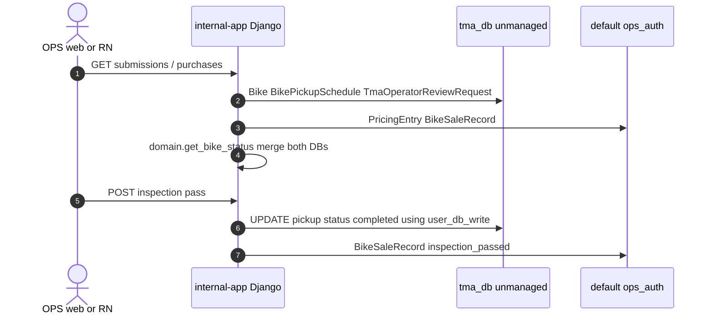
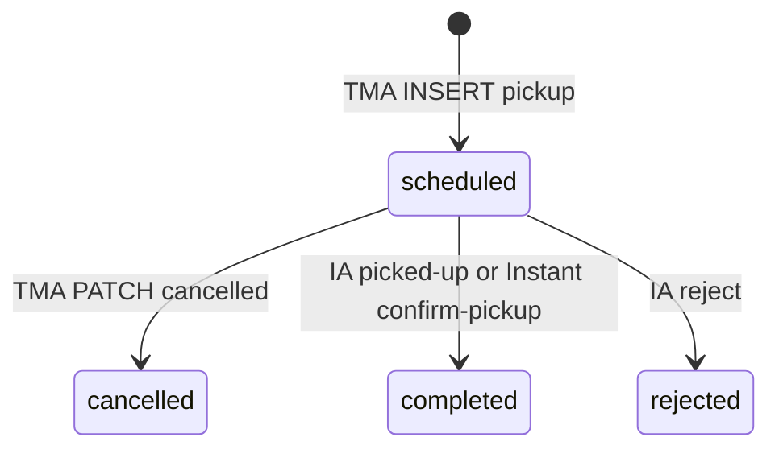

# 1. Overview & Business Intent

OPS Django reads seller bikes from TMA Postgres alias tma\_db without owning migrations. InternalAppRouter routes app bikes to tma\_db; allow\_migrate is False; MIGRATION\_MODULES bikes is None. Writes that must hit TMA use using('user\_db\_write').

There is no api\_helpers/domain.py. Reads are in backend/bikes/domain.py and backend/bikes/api\_helpers.py. Models: backend/bikes/models.py (6 unmanaged classes).

TMA tables not mirrored: bikes\_operatorreviewresult, bikes\_sellerpriceselection, bikes\_sellerlisting, bikes\_userwsconnection.

---

# 2. End-to-End Flow & Sequence Diagram





WAITING\_PICKUP\_STATUSES = scheduled, confirmed. TMA sale\_history treats rescheduled as active. Internal TERMINAL\_PICKUP\_STATUSES includes rescheduled. Production never writes that value. No writer SET confirmed.

---

# 3. Detailed API Contracts (how mirrors are consumed)

| Function | Query |
| --- | --- |
| get\_active\_waiting\_schedule | bike.schedules.filter(status in scheduled, confirmed) |
| is\_waiting\_pickup\_bike | type old\_bike AND PricingEntry SUBMITTED AND waiting schedule |
| get\_bike\_status | ORR CANCELLED/REJECTED; pickup completed/rejected; waiting Cho pickup |
| pricing\_ai\_requirement\_satisfied | BikeEvaluationResult.filter(bike\_id).exists() |
| evaluation\_dict | combined score (body\_score \+ engine\_score) / 2 |
| schedule\_dict | getattr scheduled\_at column does not exist |
| bike\_media\_item | fallback s3\_url does not exist on the model |

TmaOperatorReviewRequest has no ORM FK. Statuses PENDING\_REVIEW IN\_PROGRESS COMPLETED EXPIRED CANCELLED REJECTED. Partial unique uniq\_active\_operator\_review\_request\_per\_bike WHERE is\_active.

OPS writers: completed\_by\_ops\_user\_id points at ops\_users.id, not users\_customuser.

| HTTP / UI | Error | Trigger |
| --- | --- | --- |
| queue empty | excluded bike\_ids | ORR cancelled/rejected |
| Cho pickup | waiting statuses | scheduled or confirmed |
| Da tu choi | ORR REJECTED or pickup rejected | get\_bike\_status |
| silent None | CustomUser.DoesNotExist | safe\_user orphan user\_id |

---

# 4. Database Schema & Data Dictionary

| Django class | db\_table | PK |
| --- | --- | --- |
| CustomUser | users\_customuser | user\_id |
| Bike | bikes\_bike | bike\_id |
| BikeMedia | bikes\_bikemedia | media\_id |
| BikeEvaluationResult | bikes\_bikeevaluationresult | bike\_id OneToOne |
| TmaOperatorReviewRequest | bikes\_operatorreviewrequest | operator\_review\_request\_id |
| BikePickupSchedule | bikes\_bikepickupschedule | schedule\_id related\_name schedules |

Length mismatches: phone\_number CharField(50) vs TMA 20; masked\_bike\_id CharField(6) vs VARCHAR(120); asked\_price Decimal(15,0) vs NUMERIC(12,0). Internal BikePickupSchedule.name has no TMA column; name stuffed into notes as Contact: name.

```sql
CREATE TABLE bikes_operatorreviewrequest (
    operator_review_request_id UUID PRIMARY KEY,
    bike_id UUID NOT NULL REFERENCES bikes_bike(bike_id) ON DELETE CASCADE,
    status VARCHAR(32) NOT NULL DEFAULT 'PENDING_REVIEW',
    is_active BOOLEAN NOT NULL DEFAULT TRUE,
    CONSTRAINT chk_operatorreviewrequest_status CHECK (
        status IN ('PENDING_REVIEW','IN_PROGRESS','COMPLETED','EXPIRED','CANCELLED','REJECTED')
    )
);
CREATE UNIQUE INDEX uniq_active_operator_review_request_per_bike
    ON bikes_operatorreviewrequest (bike_id) WHERE is_active = TRUE;
```

Eval TMA columns not mapped: evaluate\_client\_payload, evaluate\_async\_status, valuation\_expires\_at. Pickup not mapped: date, schedule\_purpose. No SELECT FOR UPDATE in domain.py reads.

---

# 5. Frontend & UI Logic

OPS QueuePage / WaitingPickupList consume get\_bike\_status colors. Waiting = blue Cho pickup. Do not assume confirmed appears in production data. rescheduled in UI maps is dead. safe\_user\_dict prefers schedule phone over user phone when a waiting pickup exists.

---

# 6. Edge Cases & Resilience

1. Unmanaged ORM can INSERT if someone calls .save() on tma\_db. Router still allows writes.
2. evaluation\_dict getattr for condition\_score is absent on the model; combined score is computed from JSON.
3. Latest ORR uses -updated\_at not rejected\_at for dashboard rejected\_at fallback.
4. Bike.safe\_user swallows DoesNotExist. UI shows empty seller.
5. Schema drift is why TMA views use raw SQL while OPS uses ORM on a subset of columns.