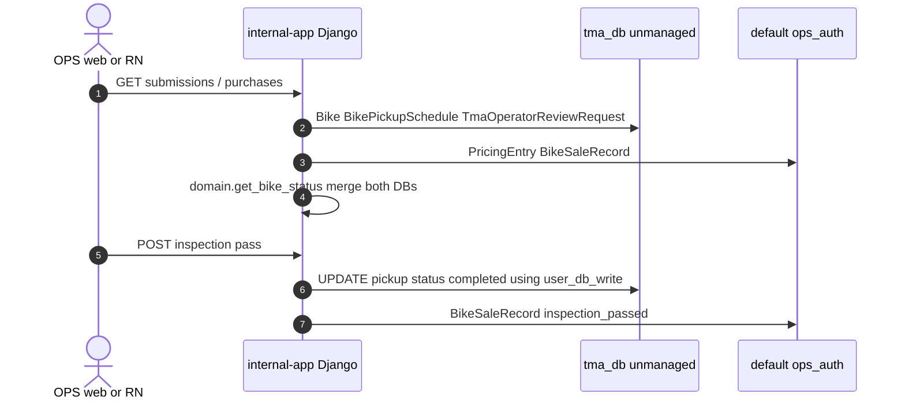
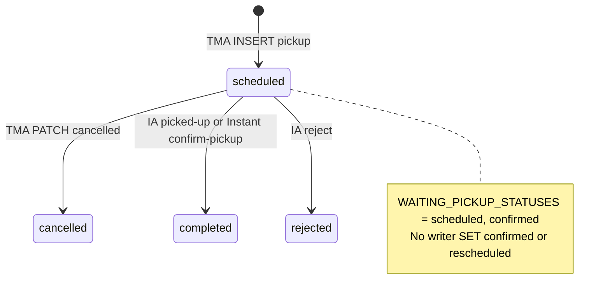

# 1. Overview & Business Intent

OPS Django reads seller bikes from TMA Postgres alias `tma_db` without owning migrations. `InternalAppRouter` routes app `bikes` to `tma_db`; `allow_migrate` is False; `MIGRATION_MODULES = ('bikes'  None)`. Writes that must hit TMA use `using('user_db_write')`.

**There is no `api_helpers/domain.py`.** Reads are in `backend/bikes/domain.py` and `backend/bikes/api_helpers.py`. Models: `backend/bikes/models.py` (6 unmanaged classes).

**Actors:** OPS queue/dashboard, Instant Sell, pickup reject/complete.

TMA tables **not mirrored**: `bikes_operatorreviewresult`, `bikes_sellerpriceselection`, `bikes_sellerlisting`, `bikes_userwsconnection`.

---

# 2. End-to-End Flow & Sequence Diagram





TMA `sale_history.py` treats `rescheduled` as **active**. Internal `TERMINAL_PICKUP_STATUSES` includes `rescheduled`. Production never writes that value.

---

# 3. Detailed API Contracts (how mirrors are consumed)

Not HTTP on these models. Callers:

| Function | Query |
| --- | --- |
| `get_active_waiting_schedule` | `bike.schedules.filter(status__in=('scheduled','confirmed')).order_by('-created_at')` |
| `is_waiting_pickup_bike` | `bike.type == 'old_bike'` AND `PricingEntry.status=='SUBMITTED'` AND waiting schedule |
| `get_bike_status` | latest ORR CANCELLED/REJECTED; pickup completed/rejected; waiting → `'Chờ pickup'` |
| `valuation_queue_excluded_bike_ids` | ORR `CANCELLED`,`REJECTED` |
| `pricing_ai_requirement_satisfied` | `BikeEvaluationResult.objects.filter(bike_id=).exists()` |
| `evaluation_dict` | JSON blobs \+ combined score `(body_score + engine_score) / 2` |
| `schedule_dict` | uses `getattr(s,'scheduled_at')` — **column does not exist** |
| `bike_media_item` | fallback attr `s3_url` **does not exist** on the model |

`TmaOperatorReviewRequest` has **no ORM FK** — cannot `select_related` Bike. Statuses CHECK: `PENDING_REVIEW`, `IN_PROGRESS`, `COMPLETED`, `EXPIRED`, `CANCELLED`, `REJECTED`. Partial unique `uniq_active_operator_review_request_per_bike` WHERE `is_active`.

OPS writers: `_mark_vehicle_picked_up` → `completed`; `PickupRejectView` → `rejected`; Instant confirm-pickup → waiting rows `completed`; Instant reject → `rejected`. `completed_by_ops_user_id` points at **ops\_users.id**, not `users_customuser`.

| HTTP / UI | Error | Trigger |
| --- | --- | --- |
| queue empty | excluded bike\_ids | ORR cancelled/rejected |
| `Chờ pickup` | waiting statuses | scheduled or confirmed |
| `Đã từ chối` | ORR REJECTED or pickup rejected | get\_bike\_status |
| silent None | CustomUser.DoesNotExist | `safe_user` orphan user\_id |

---

# 4. Database Schema & Data Dictionary

| Django class | db\_table | PK |
| --- | --- | --- |
| `CustomUser` | `users_customuser` | `user_id` |
| `Bike` | `bikes_bike` | `bike_id` |
| `BikeMedia` | `bikes_bikemedia` | `media_id` |
| `BikeEvaluationResult` | `bikes_bikeevaluationresult` | `bike_id` OneToOne |
| `TmaOperatorReviewRequest` | `bikes_operatorreviewrequest` | `operator_review_request_id` |
| `BikePickupSchedule` | `bikes_bikepickupschedule` | `schedule_id` related\_name **`schedules`** (TMA uses `pickup_schedules`) |

Length mismatches: internal `CustomUser.phone_number` CharField(50) vs TMA 20; `Bike.masked_bike_id` CharField(6) vs TMA VARCHAR(120); `asked_price` Decimal(15,0) vs TMA NUMERIC(12,0); pickup `valuation_price` Decimal(15,0) vs TMA NUMERIC(12,2). Internal `BikePickupSchedule.name` has **no TMA column** — name is stuffed into `notes` as `Contact: :name`.

Eval TMA columns **not mapped**: `evaluate_client_payload`, `evaluate_async_status`, `valuation_expires_at`. ORR not mapped: `latest_outbound_event_id`. Pickup not mapped: `date`, `schedule_purpose`.

```sql
CREATE TABLE bikes_operatorreviewrequest (
    operator_review_request_id UUID PRIMARY KEY,
    bike_id UUID NOT NULL REFERENCES bikes_bike(bike_id) ON DELETE CASCADE,
    status VARCHAR(32) NOT NULL DEFAULT 'PENDING_REVIEW',
    is_active BOOLEAN NOT NULL DEFAULT TRUE,
    CONSTRAINT chk_operatorreviewrequest_status CHECK (
        status IN ('PENDING_REVIEW','IN_PROGRESS','COMPLETED','EXPIRED','CANCELLED','REJECTED')
    )
);
CREATE UNIQUE INDEX uniq_active_operator_review_request_per_bike
    ON bikes_operatorreviewrequest (bike_id) WHERE is_active = TRUE;
```

Media CHECK `media_type IN ('image','video','audio')` after dropping `'picture'`.

No `SELECT FOR UPDATE` in domain.py / api\_helpers.py reads.

---

# 5. Frontend & UI Logic

OPS `QueuePage` / `WaitingPickupList` consume `get_bike_status` colors. Waiting = blue `Chờ pickup`. Do not assume `confirmed` appears in production data. `rescheduled` in UI maps is dead.

`safe_user_dict` prefers schedule phone over user phone when a waiting pickup exists.

---

# 6. Edge Cases & Resilience

1. Unmanaged ORM can INSERT if someone calls `.save()` on `tma_db` — router still allows writes. Discipline is process, not a DB grant documented here.
2. `evaluation_dict` `getattr` for `condition_score` is absent on the model; combined score is computed from JSON.
3. Latest ORR uses `-updated_at` not `rejected_at` for dashboard rejected\_at fallback.
4. `Bike.safe_user` swallows `DoesNotExist` — UI shows empty seller.
5. Schema drift is the reason TMA views use raw SQL while OPS uses ORM on a **subset** of columns.