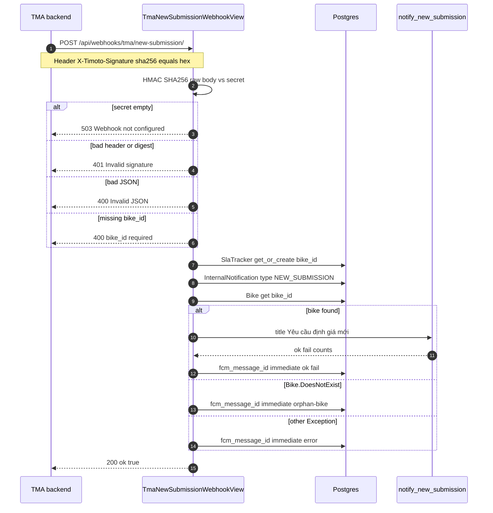
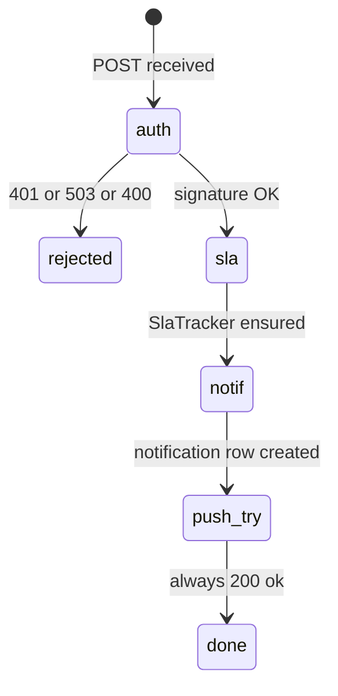

# 1. Overview and Business Intent

When the TiMoto Mobile App (TMA) backend finishes creating a bike submission that OPS must price, it notifies the Internal App with a signed HTTP webhook. The internal view does not trust body contents for identity: it verifies `X-Timoto-Signature` as `sha256=` plus hex HMAC of the raw body using `TMA_WEBHOOK_SECRET` (fallback env `WEBHOOK_HMAC_SECRET`). After verification it starts SLA tracking, records an internal notification row, and attempts an immediate FCM push to active OPS devices.

The webhook is intentionally resilient: push provider failures still return HTTP 200 with `ok` true so TMA does not retry storms. Orphan `bike_id` values (no local `Bike` row yet) still create SLA \+ notification, with `fcm_message_id` marked orphan.

**Actors:** TMA mobile backend (caller), Internal App `TmaNewSubmissionWebhookView`, Postgres `sla_trackers` / `internal_notifications` / `bikes`, FCM via `notify_new_submission`.

**Target files:** `timoto-internal-app/backend/bikes/webhooks.py`, `bikes/api_urls.py`, `bikes/notifications.py`, `ops_auth/models.py` (`SlaTracker`, `InternalNotification`).

This page documents only the new-submission webhook. It does not invent SMS, OTP, or WebSocket channels. Bank payout webhook and mobile operator-offer read APIs are separate routes.

---

# 2. End-to-End Flow and Sequence Diagram





Mount: `config/urls.py` includes `bikes.api_urls` at `api/`, and `api_urls` registers `webhooks/tma/new-submission/`. Full path: `/api/webhooks/tma/new-submission/`.

---

# 3. Detailed API Contracts

| Method | Path | Auth | Body |
| --- | --- | --- | --- |
| POST | `/api/webhooks/tma/new-submission/` | AllowAny \+ HMAC header | JSON with required `bike_id` |

View settings: `@method_decorator(csrf_exempt)`, `authentication_classes = []`, `permission_classes = [AllowAny]`. Security is entirely the shared secret HMAC.

**Required header**

| Header | Format |
| --- | --- |
| `X-Timoto-Signature` | Literal prefix `sha256=` then lowercase hex digest of HMAC-SHA256(secret, raw\_body) |

Comparison uses `hmac.compare_digest` after stripping the 7-character prefix. Header missing the prefix fails as invalid signature header.

**Success response**

HTTP 200 body is JSON with boolean field `ok` set true. No bike payload is echoed.

**Error table**

| HTTP | detail | Trigger |
| --- | --- | --- |
| 503 | Webhook not configured | both secret env vars empty |
| 401 | Invalid signature header | header missing `sha256=` prefix |
| 401 | Invalid signature | digest mismatch |
| 400 | Invalid JSON | body not JSON |
| 400 | bike\_id required | JSON missing `bike_id` |

Secret resolution order in `_tma_webhook_secret`: `TMA_WEBHOOK_SECRET` then `WEBHOOK_HMAC_SECRET`.

FCM side effect (when Bike exists): `notify_new_submission` builds title `Yêu cầu định giá mới` and body string built from bike brand, model, and year plus the suffix `— cần xử lý trong 5 phút`. Data map keys are `bike_id` and `type` with value `NEW_SUBMISSION`. Sends to all tokens from `_get_active_tokens()`.

`fcm_message_id` storage patterns written by the webhook (not FCM provider ids):

| Value pattern | Meaning |
| --- | --- |
| `immediate:ok:fail` | push attempted; integer ok/fail counts |
| `immediate:orphan-bike` | no Bike row |
| `immediate:error` | exception during notify |

---

# 4. Database Schema and Locks

No row locks or `select_for_update`. `SlaTracker.objects.get_or_create(bike_id=bike_id)` is idempotent per unique `bike_id`. Each webhook call creates a **new** `InternalNotification` row (not get\_or\_create), so duplicate deliveries create duplicate notifications unless the caller dedupes.

```sql
CREATE TABLE sla_trackers (
    id UUID PRIMARY KEY,
    bike_id UUID NOT NULL UNIQUE,
    started_at TIMESTAMPTZ NOT NULL,
    completed_at TIMESTAMPTZ,
    elapsed_seconds INTEGER,
    sla_met BOOLEAN,
    reminder_count INTEGER NOT NULL DEFAULT 0
);

CREATE TABLE internal_notifications (
    id UUID PRIMARY KEY,
    bike_id UUID NOT NULL,
    ops_user_id UUID NULL,
    type VARCHAR(32) NOT NULL,
    sent_at TIMESTAMPTZ NOT NULL,
    fcm_message_id VARCHAR(255),
    opened_at TIMESTAMPTZ,
    cancelled_at TIMESTAMPTZ
);

-- Bike lookup only; webhook does not create Bike rows
-- bikes table PK bike_id UUID; brand/model/year used in FCM body
```

`InternalNotification.Type.NEW_SUBMISSION` enum value is the string `NEW_SUBMISSION`. Separate reminder logic (`send_sla_reminder`) is not invoked inside this webhook; it only seeds the tracker with default `reminder_count` 0.

---

# 5. Frontend and OPS Client Logic

Internal OPS mobile/web clients do not call this webhook. They receive FCM data payloads with `type` `NEW_SUBMISSION` and navigate using `bike_id`. In-app notification lists read `internal_notifications` rows created here.

Caller responsibility (TMA): compute HMAC over the exact bytes POSTed; any middleware that re-serializes JSON with different spacing will break the signature. Prefer signing the raw request body string that will be transmitted.

No SPA callback URL is involved (contrast dealer Zalo OAuth). This is machine-to-machine POST only.

---

# 6. Edge Cases and Resilience

1. Empty secret disables the endpoint with 503 rather than accepting unsigned traffic.
2. Push failures are swallowed after marking `immediate:error` so TMA sees success; OPS may lack a push until another path or reminder job runs.
3. Orphan bike\_id still starts SLA clock — useful if Bike mirror lags the webhook; OPS may see notification without detail until Bike exists.
4. Duplicate webhook posts create multiple NEW\_SUBMISSION notifications and do not reset `started_at` on an existing SlaTracker (`get_or_create` returns existing).
5. CSRF exempt is required for cross-service POST without Django session cookies.
6. Related route `webhooks/bank/payout/` is a different view; do not reuse this signature contract without reading that handler.
7. Mobile HMAC read API `v1/mobile/operator-offer/` documents “same secret as TMA webhook” in url comments — keep secret rotation coordinated across those callers.
8. Reminder pushes (every 5 minutes, max 12) live in `send_sla_reminder` and are out of scope for this webhook’s request path; this view only ensures the tracker row exists so reminders have something to attach to later.