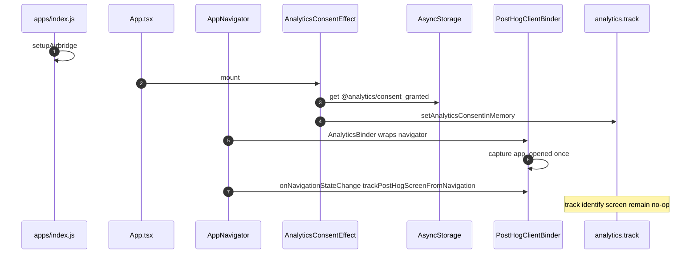
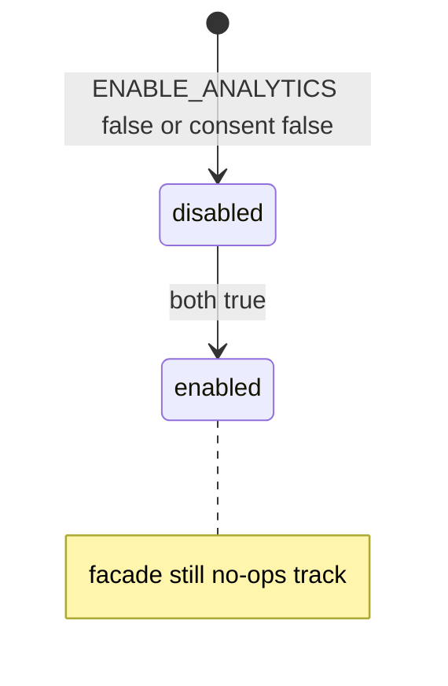

# 1. Overview and Business Intent

Product defined funnel event names in `analyticsEvents.ts` without shipping PII (no phone, email, name, plate; bike UUID allowed). Implementation split:

1. **Facade** `analytics.ts` — `track` / `identify` / `screen` are no-ops even when active (PostHog removed from this surface; API kept to avoid refactors).
2. **Binder** `AnalyticsBinder.tsx` — if `ENABLE_ANALYTICS`, mounts `PostHogProvider` and can capture `app_opened` plus screen names via `trackPostHogScreenFromNavigation`.

**Actors:** screens calling `analytics.track`, `App.tsx`, `AppNavigator.tsx`, `apps/index.js`, Airbridge SDK.

**Target files:** `apps/src/services/analytics/*`, `airbridge.ts`, `configs/app.config.ts`.

---

# 2. End-to-End Flow and Sequence Diagram





`active()` is `AppConfig.FEATURES.ENABLE_ANALYTICS && consentGranted`. Default `ENABLE_ANALYTICS` is true in app.config. `reset()` is empty; logout still calls it and does **not** clear consent storage.

---

# 3. Detailed API Contracts (client)

No Django routes.

Consent key: **`@analytics/consent_granted`** values `'1'` or `'0'`. (Docs that say `at-analytics` without the at-sign are wrong.)

| Behavior | Trigger |
| --- | --- |
| consent false | missing key or not `'1'` |
| track no-op | always discards even when active |
| screen skipped in helper | ENABLE\_ANALYTICS false OR empty trimmed API\_KEY |
| provider disabled option | raw API\_KEY falsy (no trim) — whitespace-only edge case |

`AnalyticsEvents` literals include auth\_started, otp\_requested, otp\_verified, login\_success, zalo\_auth\_started, apple\_auth\_started, auth\_onboarding\_completed, registration\_started, step1\_completed, video\_recorded, ocr\_scan\_attempted/success/failed, bike\_quality\_gate\__, evaluation\_requested, schedule\_set, home\_viewed, ebike\_section\_viewed, news\_article\_opened, bike\_exterior\_eval\__, bike\_engine\_stage1\__, bike\_full\_eval\__.

`bindPostHogClient` only stores an object with `screen()`. Facade `track` never calls it.

`ANALYTICS_PRIVACY_CHECKLIST_VERSION` is `'1.0'`. EU consent gating is documented in comments as not implemented in this spike.

Airbridge: `Airbridge.setOnDeeplinkReceived` — `__DEV__` console.log only. No navigate, no campaign parse.

---

# 4. Database Schema and Locks

```sql
CREATE TABLE analytics_consent_asyncstorage (
    key TEXT PRIMARY KEY,
    value TEXT NOT NULL
);
-- key = @analytics/consent_granted, value 1 or 0
```

Not a Postgres table.

---

# 5. Frontend and UI Logic

Mount map:

- `setupAirbridge()` — `apps/index.js`
- `AnalyticsConsentEffect` — `App.tsx`
- `AnalyticsBinder` — wraps navigator in `AppNavigator.tsx`
- `trackPostHogScreenFromNavigation` — `onNavigationStateChange` and `onNavigationReady`

If `ENABLE_ANALYTICS` is false, binder returns children with no PostHogProvider. If true, provider mounts even when API\_KEY empty (`options.disabled` true).

---

# 6. Edge Cases and Resilience

1. Funnel `analytics.track` calls never reach PostHog — dashboards stay empty for those events.
2. `app_opened` can fire before consent loads (binder does not gate on consent).
3. Logout does not clear AsyncStorage consent.
4. Production Airbridge callback ignores URL.
5. Queue files analytics.ts, AnalyticsBinder, analyticsEvents, analyticsConsent, analyticsPrivacy, index, airbridge are one surface.

---

# Appendix: PostHog provider options and privacy checklist

`AnalyticsBinder` passes `autocapture with captureScreens false` and `options.host` from `AppConfig.POSTHOG.HOST`. Screen views must go through `trackPostHogScreenFromNavigation` which dedupes `lastTrackedScreen` and requires `navigationRef.isReady()`.

Privacy checklist comments in `analyticsPrivacy.ts`: do not send phone, email, full name, license plate, or free-text PII; prefer Cognito `sub` and bike UUID; iOS `NSPrivacyTracking` false in PrivacyInfo.xcprivacy; enabling IDFA later needs ATT plus Info.plist usage string; Android Play Data safety must disclose analytics.

`index.ts` re-exports analytics, setAnalyticsConsentInMemory, AnalyticsEvents, AnalyticsBinder, AnalyticsConsentEffect, trackPostHogScreenFromNavigation, consent getters/setters, privacy version. It does **not** re-export `setupAirbridge`.

`authService.logout` calls `analytics.reset()` which is intentionally empty and does not clear AsyncStorage consent.

Airbridge deferred deeplink handling is intentionally incomplete: production builds register the callback but discard the URL. Attribution campaigns that expect in-app routing must be implemented separately. Until then, treat Airbridge as a native SDK handshake plus DEV logging only.