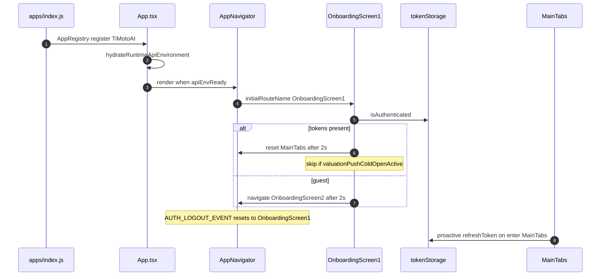
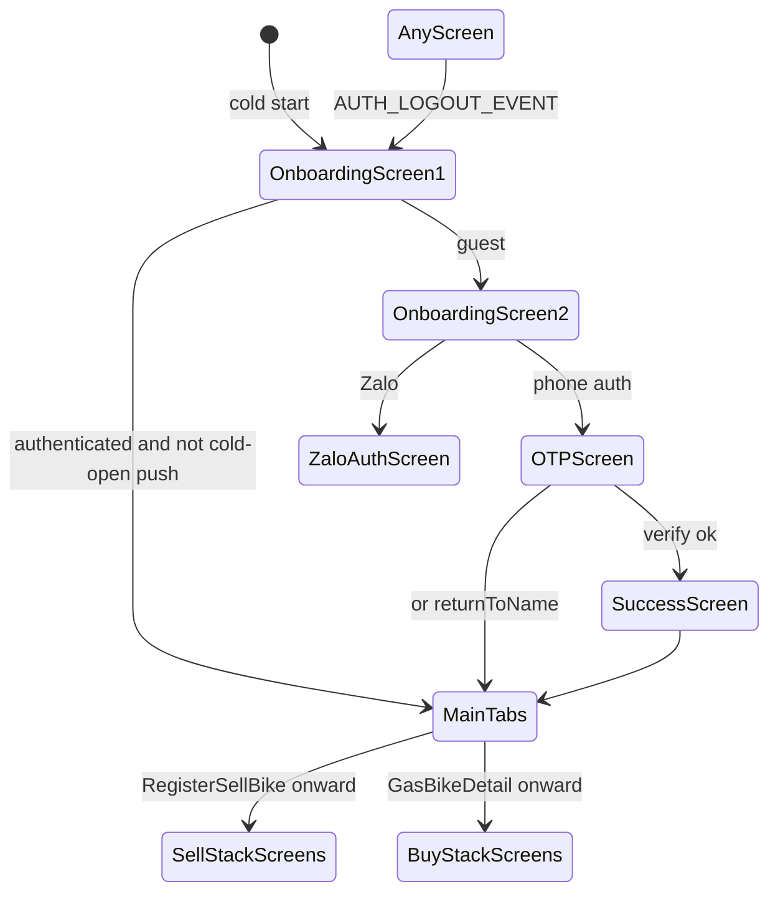

# 1. Overview and Business Intent

The customer React Native app (`timoto-mobile/apps`) is a single root native stack plus one bottom-tab navigator. There is no React Navigation auth stack switcher that unmounts the main app: cold start always lands on `OnboardingScreen1`, which checks `tokenStorage.isAuthenticated()` and either resets to `MainTabs` or navigates to `OnboardingScreen2`. Logout emits `AUTH_LOGOUT_EVENT` and resets the root stack to `OnboardingScreen1`.

**Actors:** Rider (iOS/Android binary), Cognito tokens in `tokenStorage`, FCM messaging registered in `apps/index.js` and `App.tsx`, PostHog via `AnalyticsBinder`.

**Target files:**

- `apps/index.js` — `AppRegistry.registerComponent`, Airbridge setup, FCM background handler
- `apps/App.tsx` — hydrate API env, wrap `AppNavigator`, `RejectedBikeNotiHost`
- `apps/src/navigation/AppNavigator.tsx` — root `createNativeStackNavigator`
- `apps/src/navigation/MainTabNavigator.tsx` — four tabs
- `apps/src/navigation/types.ts` — `RootStackParamList` / `MainTabParamList`
- `apps/src/constants/routes.ts` — `ROUTES.MAIN.*` string constants
- `apps/src/pages/OnboardingScreen1.tsx` — splash auth gate
- Helpers: `navigationRootRef.ts`, `runValuationEntryFlow.ts`, `valuationResumeStack.ts`, `valuationPushColdOpenGate.ts`

**Not found in code:** separate `AuthNavigator` / `SellNavigator` modules; WebSocket toast at root (comment in `AppNavigator.tsx`: realtime WS bottom toast removed). Operator-review WebSocket lives inside sell screens, not the navigator shell.

---

# 2. End-to-End Flow and Sequence Diagram





Root stack `screenOptions`: `headerShown: false`, `animation: 'slide_from_right'`, `gestureEnabled: false`, `fullScreenGestureEnabled: false`. Modal-style screens use `presentation: 'transparentModal'` with fade: `SetScheduleConfirmation`, `SuggestTimeValuation`, `PolicyDataConsent`, `SlidePhotoDetail`.

---

# 3. Detailed API Contracts

Navigation itself does not call HTTP. Related side effects:

| Trigger | Behavior |
| --- | --- |
| Enter `MainTabs` | If refresh token \+ username exist, `authService.refreshToken()` then `tokenStorage.storeTokens` |
| `AUTH_LOGOUT_EVENT` | `navigationRef.reset` to `OnboardingScreen1` |
| FCM foreground | Banner for `valuation_ready` / `valuation_rejected`; may GET evaluation and navigate |
| Cold valuation push | `setValuationPushColdOpenActive` blocks splash auto-reset to tabs |

### Main tabs (`MainTabParamList`)

| Screen name | Params |
| --- | --- |
| `Home` | none |
| `RegisterBikeHistory` | optional `initialTab`: `processing` or `completed` |
| `BuyBike` | optional `initialSegment`: `gas` or `electric` |
| `Personal` | none |

Tab labels in UI: Khám phá / Bán xe / Mua xe / Cá nhân. Initial tab: `ROUTES.MAIN.HOME` (`Home`).

### Auth and onboarding (`RootStackParamList`)

| Screen | Params |
| --- | --- |
| `OnboardingScreen1` | none |
| `OnboardingScreen2` | none |
| `OTPScreen` | `phoneNumber`; optional `name`, `isLogin`, `pendingId`, `session`, `returnToName`, `showLoginedBackModalOnReturn` |
| `SuccessScreen` | optional `message` |
| `ZaloAuthScreen` | none |
| `Authen` | optional `returnToName`, `showLoginedBackModalOnReturn` |

### Sell / valuation screens (selected)

| Screen | Required / notable params |
| --- | --- |
| `RegisterSellBike`, `RegisterPolicy` | none |
| `LocationSelect` | optional `valuationResume`, `locationPermissionDenied` |
| `RegisterInput` | optional OCR fields, `brand`/`model`/`year`, `valuationResume` |
| `RegisterInputSecond` | `RegisterInputData` plus mileage/condition/warranty/documentType/note |
| `OcrConfirmResult` | `ocrData` required; optional `location`, `valuationResume` |
| `ExpectedPrice` | `bikeData: CreateBikeRequest` |
| `TakePhotosStep2`, `Register2ndStep`, audio/video steps | optional `bike_id`, `valuationResume` |
| `BikeDataAnalysis` | optional `bike_id`, `operator_review_request_id`, `showLoginedBackModal` |
| `BikeValuationResult` | `bike_id` required; optional evaluation / ORR / `valuation_price` |
| `SetScheduleToShip` | rich optional pickup \+ dual-price fields; `returnToQuickSaleDetail`, `replace_schedule_id` |
| `SetScheduleConfirmation` | bike display strings \+ schedule \+ seller contact texts |
| ChoosePrice family | `ChoosePriceRouteParams` / `QuickSaleDetailParams` / `OrderSaleDetailParams` |

### Buy / e-bike / misc

`GasBikeDetail` / `EVBikeDetail`: optional `bikeId`. `BuyOrderDetail`: optional `orderId`, `scheduleLocked`. `BuyGasBikeDeposit`: `mode` `deposit` or `reschedule` plus schedule fields. `ConfirmationOrderEBike`: buyer \+ showroom \+ price strings. `DYNDetail`: `newsId: number`. `PolicyDataConsent`: optional `agreeNavigateTo`, `agreeNavigateParams`. `SlidePhotoDetail`: `photoUrls`, optional `initialIndex`.

### HTTP error matrix (auth gate related)

| Situation | HTTP | Navigator effect |
| --- | --- | --- |
| Refresh on MainTabs fails | client catch | log only; tabs still shown |
| Token refresh fails elsewhere | emits logout event | reset to OnboardingScreen1 |
| Guest splash | n/a | OnboardingScreen2 |
| Authenticated splash | n/a | MainTabs unless cold-open gate |

---

# 4. Data Model and State Machine

No server table owns navigation. Local persistence that gates routes:

```sql
-- Logical local keys (AsyncStorage / secure storage), not Postgres
-- tokenStorage: IdToken, AccessToken, RefreshToken, username
-- valuationResumeStorage: checkpoint JSON for kill-app resume
-- activeSellBikeStorage / lastPickupScheduleStorage: sell CTA entry
```

Equivalent TypeScript source of truth for route params is `RootStackParamList` in `types.ts`. `ValuationResumePayload` is a JSON-serializable object map carried on many sell screens so `syncValuationResumeFromNavigationState` can rebuild the stack after process death.

State machine for session:

1. Splash authenticated → MainTabs (or hold for valuation cold open).
2. Splash guest → onboarding → OTP/Zalo → MainTabs (or `returnToName` back into an existing sell screen).
3. Mid-sell gate: screens can push `Authen` / `OTPScreen` with `returnToName: 'BikeDataAnalysis'` and `showLoginedBackModalOnReturn`.
4. Logout → OnboardingScreen1 only.

`ROUTES.AUTH` also lists `Register` and `ForgotPassword` string constants, but those names are **not** registered as `Stack.Screen` in `AppNavigator.tsx`. Types still declare legacy `Login` / `Register` / `Settings` with `undefined` params for compatibility.

---

# 5. Frontend Integration Guide

**Entry:** `index.js` → `App` → providers (`SafeAreaProvider`, `LocationProvider`, `RecognitionPaperContext`) → `AppNavigator` inside `AnalyticsBinder` \+ `NavigationContainer` with `navigationRef`.

**Deep link / push:** FCM handlers in `AppNavigator` parse valuation payloads, show banners, optionally navigate to valuation result screens. `runValuationEntryFlow` (Home feature card / RegisterBikeHistory) rebuilds resume stacks via `buildValuationResumeStackRoutes` and may open `SuggestTimeValuation` when outside the 06:00–23:00 local window.

**Cross-repo:** Screen names must match `RootStackParamList` keys exactly when documenting deep links from OPS or marketing. Dealer Hub and internal-app do not share this navigator.

**Do not invent:** nested sell stack navigators, root WebSocket toast, or auth-only stack that removes MainTabs from the tree.

---

# 6. Edge Cases and Known Pitfalls

- **Cold open race:** if a valuation push opens while splash timer runs, `isValuationPushColdOpenActive()` prevents wiping the push navigation with a MainTabs reset.
- **Gesture back disabled** on the root stack; some screens re-enable via options only where coded (most sell screens keep gestures off).
- **`EditRegisterStep01`** appears in `types.ts` and `ROUTES` but is **not** registered in the `Stack.Navigator` screen list in `AppNavigator.tsx` — treating it as a live route would be wrong until a Screen is added.
- **Personal tab** uses route name `Personal` while `ROUTES.MAIN.PROFILE` is the string `Profile` — tab registration uses `ROUTES.MAIN.PERSONAL`.
- **Proactive refresh** on MainTabs does not navigate away on failure; only the global logout event hard-resets.
- **Transparent modals** sit on the same stack; dismissing them must not assume a separate modal navigator.
- Analytics `onStateChange` tracks PostHog screens from navigation state; resume sync writes valuation checkpoints from the same callback.

Cross-links: [Sell flow customer](./sell-flow-customer), [Auth SNS OTP](./auth-sns-otp), [Realtime ORR](./realtime-orr-assign-owner), [Bikes pickup evaluate](./bikes-pickup-evaluate-marketplace).