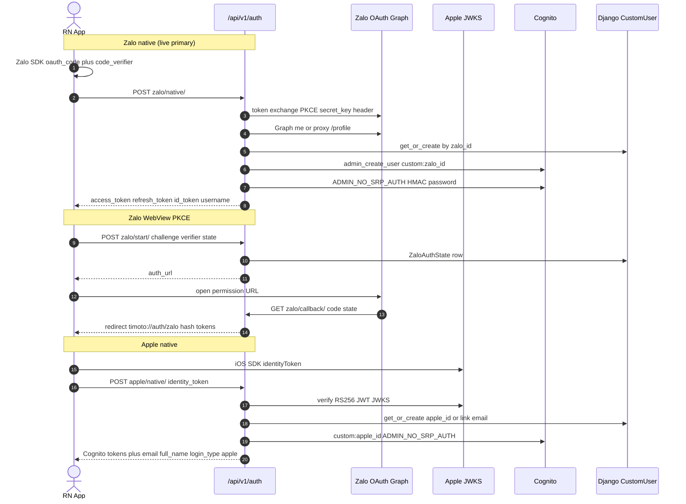
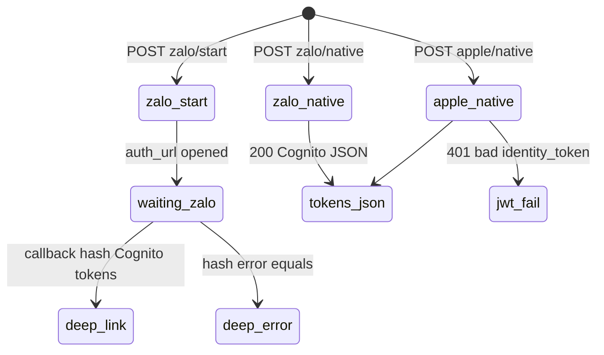

# 1. Overview and Business Intent

Rider social login on TiMoto Mobile App (TMA) issues Cognito tokens without phone SMS. Two providers ship in production code: Zalo Social API v4 (WebView PKCE plus native SDK) and Sign in with Apple (native iOS identity token). Both end in Django `CustomUser` rows plus Cognito `ADMIN_NO_SRP_AUTH`.

Zalo Graph `/v2.0/me` often needs Vietnam egress. Backend therefore supports `ZALO_GRAPH_PROXY_URL` (custom `/profile` and `/token`) and `ZALO_GRAPH_PROXY` (HTTP proxy). Apple verifies `identity_token` against `https://appleid.apple.com/auth/keys` with audience `APPLE_BUNDLE_ID` (default `timotoai.mobile`).

**Actors:** RN `ZaloAuthScreen.tsx`, `zaloNativeService.ts`, `Authen.tsx` (Apple), Django `zalo_views.py` / `apple_views.py`, Cognito user pool, optional Zalo graph proxy.

**Target files:** `backend/apps/users/zalo_views.py`, `apple_views.py`, `urls.py`, `models.py` (`ZaloAuthState`, `zalo_id`, `apple_id`); FE `apps/src/api/endpoints.ts`, `zaloNativeService.ts`, `utils/zaloAuthLink.ts`, `pages/Authen.tsx`.

This page does **not** document phone OTP or SNS. Those live on the mobile SNS OTP doc.

---

# 2. End-to-End Flow and Sequence Diagram





Deep-link prefix default is `timoto://auth/zalo` (`ZALO_APP_REDIRECT_SCHEME`). Fragment carries Cognito tokens on success, or `error=` on failure. Native Zalo and Apple return JSON instead of redirects.

---

# 3. Detailed API Contracts

Mounted under `/api/v1/auth/` via `users/urls.py`. FE constants: `ZALO_START`, `ZALO_NATIVE`, `APPLE_NATIVE` in `endpoints.ts`. Live Zalo login uses native exchange (`zaloNativeExchange` → `POST /auth/zalo/native/`). WebView start/callback remain for PKCE deep-link path. Apple posts from `Authen.tsx` with `skipAuth: true`.

| Method | Path | Body / query | Notes |
| --- | --- | --- | --- |
| POST | `/auth/zalo/start/` | `code_challenge`, `code_verifier`, `state` | AllowAny. Persists verifier; returns `auth_url`, `state`. 503 if `ZALO_APP_ID` empty. Scopes `scope.userInfo`, `scope.userPhonenumber`. |
| GET | `/auth/zalo/callback/` | `code`, `state` or `error` | CSRF-exempt, xframe exempt. Deletes `ZaloAuthState`. Redirects to app scheme with hash. |
| POST | `/auth/zalo/native/` | `oauth_code` or `code`, `code_verifier` | Rate limit 10/m IP `block=True`. JSON Cognito tokens. |
| POST | `/auth/apple/native/` | `identity_token` required; `full_name`, `email` optional | Verifies Apple JWT; `phone_number` always null in response. |

**Zalo native success fields:** `access_token`, `refresh_token`, `id_token`, `expires_in` (default 3600), optional `phone_number`, `username` (required for Cognito refresh).

**Apple native success fields:** same Cognito trio plus `expires_in`, `username`, `phone_number` null, `email`, `full_name`, `is_private_email`, `login_type` set to `apple`.

**Cognito password derivation**

| Provider | Password builder | Cognito attribute |
| --- | --- | --- |
| Zalo | `Zx!` \+ HMAC-SHA256(`SECRET_KEY`, `zalo_cognito:` \+ zalo\_id) hex\[:32\] | `custom:zalo_id` |
| Apple | `Ax!` \+ HMAC-SHA256(`SECRET_KEY`, `apple_cognito:` \+ apple\_sub) hex\[:32\] | `custom:apple_id` |

Username for Cognito is phone-shaped: Zalo uses real normalized phone when Graph returns one, else `+84` \+ last 9 digits of `zalo_id` (padded). Apple uses SHA-256 of `apple:` \+ sub → 9 digits → `+84XXXXXXXXX`. Placeholder phones are stored on `username`, not as real `phone_number` for Zalo.

| HTTP | Error / outcome | Trigger |
| --- | --- | --- |
| 503 | Zalo OAuth chưa cấu hình (ZALO\_APP\_ID) | missing app id on start/native |
| 400 | Thiếu code\_challenge / oauth\_code / code\_verifier | validation |
| 400 | cannot\_get\_zalo\_id / Graph IP messaging | profile missing id |
| 401 | Apple JWT verification failed / expired | bad identity\_token |
| 409 | Không thể tạo tài khoản Apple | IntegrityError on create |
| 429 | ratelimit | zalo\_native only |
| 502 | Zalo service temporarily unreachable | RequestException on native |

Callback never returns JSON errors to the browser; failures become deep-link `error=` fragments (`missing_code_or_state`, `invalid_state`, token source prefixes, Cognito exceptions truncated).

Token exchange prefers direct Zalo `access_token` URL with `secret_key` header; on error `-14004` / invalid secret, retries custom proxy `/token` when configured.

---

# 4. Database Schema and Locks

No `select_for_update` on these paths. Apple create uses `transaction.atomic()` and falls back on `IntegrityError` to email link. Zalo start deletes states older than 15 minutes, then replaces row for the same `state`.

```sql
CREATE TABLE users_zaloauthstate (
    id BIGSERIAL PRIMARY KEY,
    state VARCHAR(64) NOT NULL UNIQUE,
    code_verifier VARCHAR(128) NOT NULL,
    created_at TIMESTAMPTZ NOT NULL
);
CREATE INDEX ON users_zaloauthstate (created_at);

CREATE TABLE users_customuser (
    user_id UUID PRIMARY KEY,
    event_timestamp BIGINT NOT NULL,
    username VARCHAR(150),
    email VARCHAR(254),
    phone_number VARCHAR(20),
    full_name VARCHAR(200),
    avatar_url VARCHAR(500),
    status VARCHAR(20),
    user_type VARCHAR(20),
    deleted_at TIMESTAMPTZ,
    zalo_id VARCHAR(64),
    apple_id VARCHAR(255),
    preferences JSONB,
    UNIQUE (user_id, event_timestamp)
);
```

Soft-deleted Zalo/Apple users call `reactivate_user`. Apple can link an existing row found by case-insensitive email when `apple_id` is new. Apple JWKS cached under key `apple_jwks` for 86400 seconds.

---

# 5. Frontend and UI Logic

**Zalo native:** `ZaloAuthScreen` calls `zaloNativeLogin` / `zaloNativeLogout` from `utils/zaloAuth.ts`, then `zaloNativeExchange` with `oauth_code` and `code_verifier`. Response tokens go into app token storage; `username` must be kept for refresh.

**Zalo deep link:** `zaloAuthLink.ts` parses `timoto://auth/zalo` hash or query for tokens and `error`. Prefix constant `ZALO_DEEP_LINK_PREFIX`.

**Apple:** `Authen.tsx` receives iOS SDK `identityToken`, optional composed `full_name`, optional SDK `email`, posts to `APPLE_NATIVE`, stores Cognito tokens, sets username, fire-and-forget FCM register, analytics `LOGIN_SUCCESS` with flow `apple`.

`app.config.ts` still lists a dealer-style `ZALO_AUTH_PATH` (`/api/auth/zalo/login/`); that path is **not** the mobile Django route set. Mobile routes are under `/api/v1/auth/zalo/...`.

---

# 6. Edge Cases and Resilience

1. Graph may omit `phone_number` even with `scope.userPhonenumber`; Cognito still gets a placeholder username; Django `phone_number` stays null unless a real number is parsed.
2. Missing Zalo user id after Graph\+token merge redirects or returns 400; operators should set VN proxy env vars rather than inventing SMS.
3. Direct token `-14004` triggers proxy retry; proxy response is trusted only if it yields an access\_token or a non-invalid-secret body.
4. Apple email may be private relay; `is_private_email` is echoed from JWT claims.
5. Apple `full_name` is usually only present the first time the user shares it with the SDK; later logins may send empty name while DB keeps prior `full_name`.
6. Cognito `NotAuthorizedException` resets permanent password once then retries `ADMIN_NO_SRP_AUTH`; `NEW_PASSWORD_REQUIRED` is answered with the same HMAC password.
7. `custom:zalo_id` / `custom:apple_id` on Cognito reduce collision with OTP users that share phone-like usernames (resolution lives in authentication middleware, not these views).
8. Callback forces HTTPS on absolute callback URI when host is not localhost (NLB TLS termination).