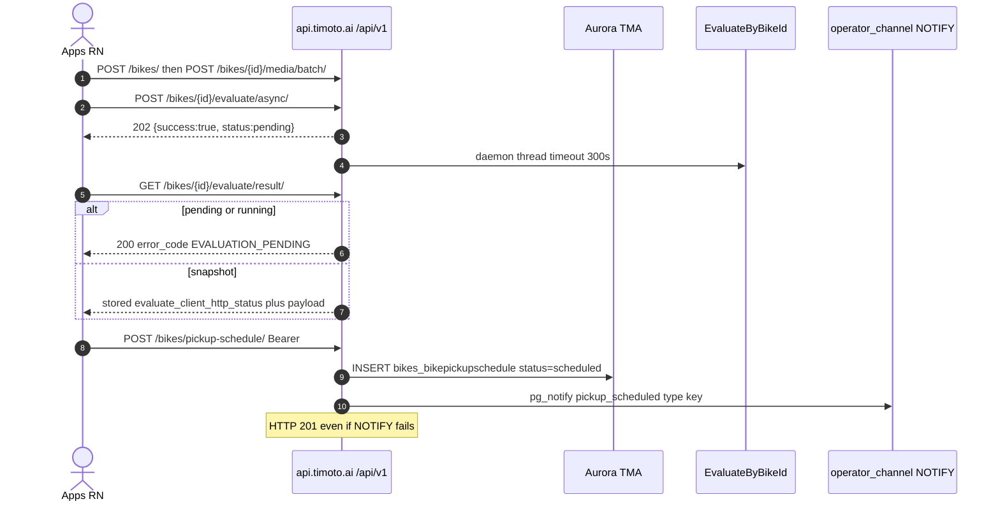
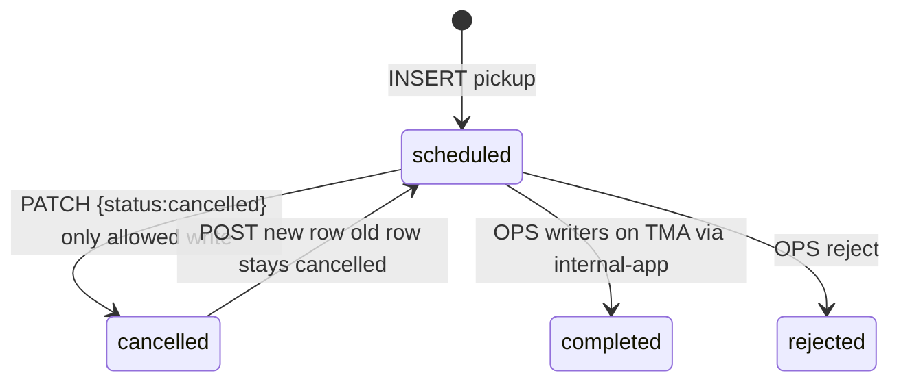

# 1. Overview & Business Intent

Rider app creates bikes, uploads media, runs AI evaluate, books pickup, and browses marketplace. Pickup rows are written with **raw SQL** (not ORM) because schedule\_purpose / extra columns drifted from migrations. OPS is notified via `SELECT pg_notify('operator_channel', payload)`.

**Actors:** RN apps/src, Cognito JWT, gRPC evaluate worker thread, OPS LISTEN on operator\_channel.

**Target files:** backend/apps/bikes/urls.py, views.py, serializers.py, marketplace.py, ops\_events.py, bike\_evaluate\_flow.py. Mount /api/v1/.

BikeViewSet is AllowAny. List with no auth and no device\_id returns all bikes paginated PAGE\_SIZE=20. Retrieve GET has no ownership check.

---

# 2. End-to-End Flow & Sequence Diagram





No production writer sets confirmed or rescheduled. Reschedule = cancel old \+ insert new.

---

# 3. Detailed API Contracts

Time slots exact: 07:00-10:00, 10:00-12:00, 12:00-15:00, 15:00-17:00, 17:00-20:00. Instant purchase date today\+2 max. POST pickup does not cancel prior rows. schedule\_purpose inserted but not returned.

23-column SELECT includes schedule\_id through dp\_listed\_at. user\_id never in HTTP JSON. PATCH terminal completed/rejected/cancelled returns 409. Status write only cancelled.

POST /bikes/{id}/evaluate/async/ always 202. FE BikeDataAnalysis.tsx uses async\+poll only; sync evaluate is never called. GET result pending returns 200 EVALUATION\_PENDING. gRPC DEADLINE\_EXCEEDED is 504. UNAVAILABLE is 503. valuation\_expires\_at = now \+ 10 days on pricing success.

GET /marketplace/listings/?fuel\_type=gas|electric required. POST buy-intents navigation\_route default BuyFlowPlaceholder. FE marketplaceBuyService purchase-order paths are not registered in this URLConf.

pg\_notify pickup\_scheduled uses payload key type. pickup\_cancelled uses event\_type. Sale-history cancel of pickup does not emit NOTIFY.

| HTTP Code | Error | Trigger |
| --- | --- | --- |
| 400 | fuel\_type is required (gas or electric) | marketplace list |
| 400 | Dang nhap de dat lich hen lay xe. | pickup unauthenticated |
| 409 | Evaluation in progress | sale-history cancel |
| 404 | Pickup schedule not found | detail not owner |
| 400 | Maximum 20 media items per batch | media batch |
| 204 | destroy | skips evaluation row |

---

# 4. Database Schema & Raw SQL

```sql
INSERT INTO bikes_bikepickupschedule
(schedule_id, bike_id, user_id, valuation_price, phone_number,
 scheduled_date, scheduled_time_slot, province, ward, address,
 status, notes, created_at, updated_at, date, schedule_purpose)
VALUES (%s, %s, %s, %s, %s, %s, %s, %s, %s, %s, %s, %s, %s, %s, %s, %s)
RETURNING schedule_id;

CREATE TABLE bikes_bikepickupschedule (
    schedule_id UUID PRIMARY KEY,
    bike_id UUID NOT NULL REFERENCES bikes_bike(bike_id) ON DELETE CASCADE,
    status VARCHAR(20) NOT NULL DEFAULT 'scheduled',
    schedule_purpose VARCHAR(32) NOT NULL DEFAULT 'instant_purchase_pickup',
    CONSTRAINT bikes_bikepickupschedule_status_check CHECK (
        status IN ('scheduled','confirmed','completed','cancelled','rescheduled','rejected')
    )
);
```

No SELECT FOR UPDATE on pickup create. Async statuses idle|pending|running|completed|failed.

---

# 5. Frontend & UI Logic

| Backend | FE |
| --- | --- |
| POST /bikes/ | ExpectedPrice.tsx, RegisterConfirm.tsx |
| media batch | Register2ndStep.tsx |
| evaluate async\+result | BikeDataAnalysis.tsx only |
| POST pickup | SetScheduleToShip.tsx |
| PATCH cancel | utils/pickupScheduleCancel.ts |
| marketplace | BuyBike.tsx, GasBikeDetail.tsx, EVBikeDetail.tsx |

---

# 6. Edge Cases & Resilience

1. NOTIFY failure does not fail HTTP 201.
2. destroy leaves bikes\_bikeevaluationresult; delete\_bike\_record does not.
3. Payload key mismatch type vs event\_type can break OPS listeners.
4. Anonymous list leaks all bikes unless nginx blocks it.
5. Worker thread is in-process daemon, not Celery. Process death loses in-flight jobs.