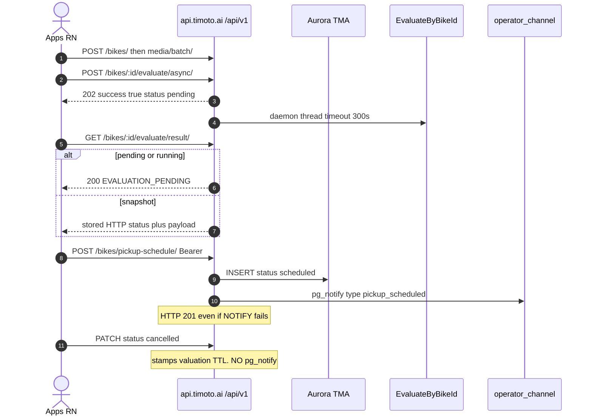
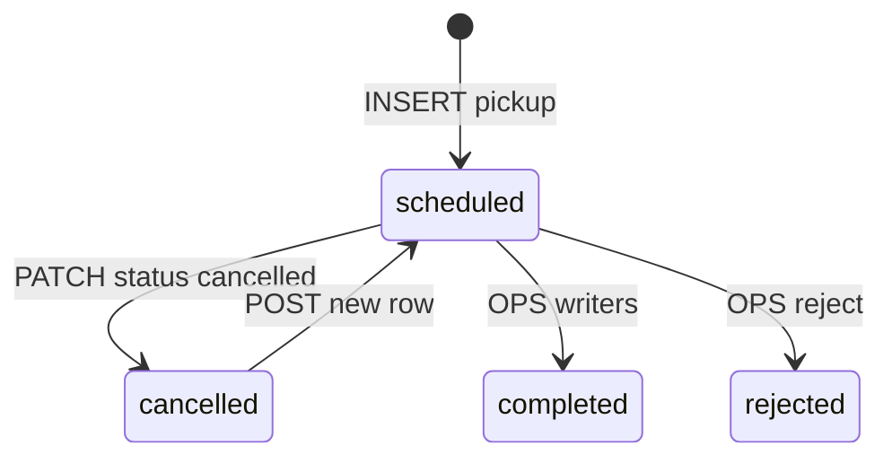

# 1. Overview and Business Intent

Rider app creates bikes, uploads media, runs AI evaluate, books pickup, browses marketplace. Pickup rows use **raw SQL** because columns drifted from migrations. OPS notified via `pg_notify('operator_channel', payload)` on **create only**.

**Actors:** RN `apps/src`, Cognito JWT, in-process evaluate daemon thread (not Celery), OPS LISTEN.

**Target files:** `bikes/urls.py`, `views.py`, `serializers.py`, `marketplace.py`, `ops_events.py`, `bike_evaluate_flow.py`, `sale_history.py`.

Global auth CognitoAuthentication; `BikeViewSet` is **AllowAny**. List with no auth and no `device_id` returns **all bikes** (`PAGE_SIZE=20`). Retrieve GET has **no ownership check**.

---

# 2. End-to-End Flow and Sequence Diagram





No production writer sets `confirmed` or `rescheduled` though CHECK allows them. Reschedule = cancel old \+ insert new.

---

# 3. Detailed API Contracts

Time slots exact: `07:00-10:00`, `10:00-12:00`, `12:00-15:00`, `15:00-17:00`, `17:00-20:00`. Phone normalized to `+84...`.

**There is no `INSTANT_PURCHASE_MAX_DAYS_AHEAD` constant.** Create/update serializers reject **past** dates only; they do not enforce today-plus-2.

POST pickup does **not** cancel prior rows. Status hardcoded `scheduled`. `schedule_purpose` may be inserted if column exists but is **not** selected/returned.

23-column SELECT includes schedule\_id, bike\_id, user\_id, valuation\_price, phone\_number, scheduled\_date, scheduled\_time\_slot, province, ward, address, status, notes, created\_at, updated\_at, actual\_odometer, inspection\_notes, inspection\_checklist, completed\_at, completed\_by\_ops\_user\_id, rejected\_at, rejected\_by\_ops\_user\_id, rejection\_reason, dp\_listed\_at. `user_id` never in HTTP JSON.

Enrichment via `enrich_pickup_schedule_response`: operator\_review\_request\_id, bike\_name, bike\_year\_text, bike\_image\_uri, valuation TTL fields. Field **`can_reschedule`** is set **true only when** `status == 'cancelled'` **and** valuation still valid **and** price present. Then `seller_next_action` = `reschedule_pickup`. There is **no** `reschedule_allowed` field and **no** 24h-before-appointment gate in this enrichment.

PATCH: terminal completed/rejected/cancelled → 409. Status write only `cancelled`. Cancel path stamps valuation expiry; **does not** call `pg_notify`.

### Evaluate

POST `/bikes/:id/evaluate/async/` AllowAny with owner 403. Media gate: `bike.media.count() == 0` → error\_code 3 (any media including video-only passes). Always **202**. Sync POST `/evaluate/` exists; FE BikeDataAnalysis uses async\+poll only.

GET result: no row 404 EVALUATION\_NOT\_STARTED; pending/running 200 EVALUATION\_PENDING; snapshot uses stored HTTP status. Success `data.output_jsons` exterior → engine → pricing. Pricing success sets valuation\_expires\_at = now \+ 10 days.

### Marketplace AllowAny

GET `/marketplace/listings/?fuel_type=gas|electric` required.

Gas eligibility (`_apply_gas_buy_tab_eligibility`): exclude sold/delisted; require `pricing_entries.status = SUBMITTED`; exclude ORR CANCELLED/REJECTED; exclude pickup rejected; exclude bike\_sale\_records failed. **No** SellerListing `waiting_buyer` OR branch.

Electric: marketplace\_status listed \+ image.

### NOTIFY

`pickup_scheduled` payload key **`type`** (value `pickup_scheduled`). Emitted on POST create via `emit_pickup_scheduled_operator_event`.

**There is no `pickup_cancelled` pg\_notify and no `event_type` key on cancel.** Sale-history cancel returns HTTP JSON `action: pickup_cancelled` — that is a **response field**, not a Postgres NOTIFY.

| HTTP Code | Error | Trigger |
| --- | --- | --- |
| 400 | fuel\_type is required | marketplace |
| 409 | Pickup schedule cannot be updated... | terminal PATCH |
| 404 | Pickup schedule not found | detail not owner |
| 400 | Maximum 20 media items per batch | media batch |
| 204 | destroy | deletes pickup\+media\+bike; may skip evaluation row |

---

# 4. Database Schema and Raw SQL

```sql
INSERT INTO bikes_bikepickupschedule
(schedule_id, bike_id, user_id, valuation_price, phone_number,
 scheduled_date, scheduled_time_slot, province, ward, address,
 status, notes, created_at, updated_at, date, schedule_purpose)
VALUES (...) RETURNING schedule_id;

CREATE TABLE bikes_bikepickupschedule (
    schedule_id UUID PRIMARY KEY,
    bike_id UUID NOT NULL REFERENCES bikes_bike(bike_id) ON DELETE CASCADE,
    status VARCHAR(20) NOT NULL DEFAULT 'scheduled',
    schedule_purpose VARCHAR(32) NOT NULL DEFAULT 'instant_purchase_pickup',
    CONSTRAINT bikes_bikepickupschedule_status_check CHECK (
        status IN ('scheduled','confirmed','completed','cancelled','rescheduled','rejected')
    )
);
```

No SELECT FOR UPDATE on pickup create. Async statuses on BikeEvaluationResult: idle|pending|running|completed|failed.

---

# 5. Frontend and UI Logic

| Backend | FE |
| --- | --- |
| POST /bikes/ | ExpectedPrice, RegisterConfirm |
| media batch | Register2ndStep |
| evaluate async\+result | BikeDataAnalysis only |
| POST pickup | SetScheduleToShip |
| PATCH cancel | pickupScheduleCancel.ts |
| sale-history | loadProcessingItems / cancelProcessingItem |
| marketplace | BuyBike, GasBikeDetail, EVBikeDetail |
| ORR | realtimeOperatorReview.ts |

Do not confuse `GET /bikes/:id/evaluate/result/` (AI poll) with `GET /evaluation/result/` (OPS dual price after WS).

---

# 6. Edge Cases and Resilience

1. NOTIFY failure does not fail HTTP 201.
2. Anonymous list leaks all bikes unless nginx blocks.
3. Async media gate accepts video-only; sync `/evaluation/bike/` does not (pictures or audio required) — see evaluation-upload page.
4. Worker thread is in-process daemon — process death loses in-flight jobs.
5. Sale-history `action: pickup_cancelled` is HTTP JSON, not pg\_notify.
6. Custom exception handler: 429 Vietnamese rate\_limited; missing asked\_price column → 500 migrate.